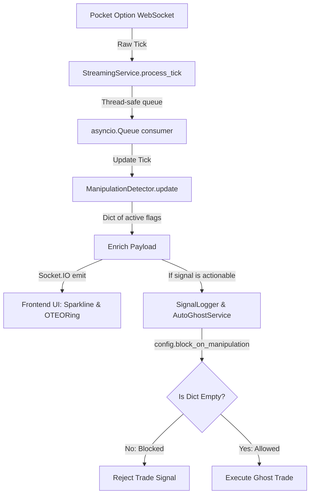

# Assessment & Implementation Proposal: Market Manipulation Detection Evolution

This document presents a comprehensive review of the current implementation of the `ManipulationDetector` in the `OTC_SNIPER` codebase and outlines a detailed, low-risk plan to evolve the detection flags into continuous severity scores ($0.0 - 1.0$).

---

## 1. Executive Summary
The `ManipulationDetector` plays a critical role in preserving capital by filtering out erratic broker movements (Push & Snap) and frozen prices (Pinning). However, its current binary classification limits granular risk management and contains a math-logical flaw in velocity baseline calculation. 

We propose moving to **Severity Scores (0.0 - 1.0)** with **linear/exponential decay** over shock memory windows. This proposal ensures:
- **Zero Regression**: Empty dict outputs `{}` are retained for non-manipulative phases, preserving current boolean logic in `auto_ghost.py` and `streaming.py`.
- **Improved Accuracy**: Replacing the signed average velocity with a rolling Mean Absolute Velocity (MAV).
- **Nuanced Control**: Providing a configurable block threshold in Auto-Ghost instead of an all-or-nothing binary trigger.

---

## 2. Current Implementation Assessment

### Strengths and Limitations

| Metric / Feature | Current Implementation (`app/backend/services/manipulation.py`) | Strengths | Limitations / Flaws |
| :--- | :--- | :--- | :--- |
| **Performance & Resource Footprint** | Bounded `deque` objects (`maxlen=300`) for velocities and prices. | $O(1)$ updates and constant memory footprint. Will not degrade under high-throughput tick streams. | None. This structure is highly efficient. |
| **Push & Snap Algorithm** | Checks `abs(vel) > 3 * max(abs(avg_vel), 0.0001)`. Remembers spikes for 15 seconds. | The 15s memory window prevents trading during post-spike consolidation noise. | **Critical Math Flaw**: `avg_vel` uses `np.mean(self.velocities)`, which is the arithmetic mean of *signed* values. Normal price noise up and down cancels out to near zero, making the spike threshold abnormally low (effectively `0.0003`) and causing frequent false positives. |
| **Pinning Algorithm** | Checks if range of last 20 ticks is `< 0.005%` of the average price. | Percentage-based thresholding scales automatically with the asset's price level. | Hard threshold makes it vulnerable to boundary noise. Does not account for tick frequency or age of the 20 ticks. |
| **System Integration** | Binary dictionary output (e.g. `{"push_snap": True}`). | Simple, easily understood flag checks. | All-or-nothing blocking. No decay of risk over the 15-second memory window. |

---

## 3. Data Flow & Propagation Architecture

The following diagram illustrates how tick data enters the system, is analyzed by the manipulation engine, and propagates down to the auto-trading decisions:



### Key Integration Points
* **`app/backend/services/streaming.py`**: Instantiates a `ManipulationDetector` per asset. Every tick updates the detector. If the tick triggers a signal, the detector's output dictionary is passed as the `manipulation` argument to `auto_ghost.consider_signal()`.
* **`app/backend/services/auto_ghost.py`**: If `config.block_on_manipulation` is enabled, any truthy (non-empty) dictionary returned by the manipulation detector blocks execution:
  ```python
  if self.config.block_on_manipulation and manipulation:
      return self._reject(asset)
  ```
* **Frontend Web Application**: Extracts `manipulation.flags` and checks for the existence of keys like `push_snap` or `pinning` to trigger warning badges on `OTEORing.jsx` and `MultiChartView.jsx`.

---

## 4. Proposed Severity Score Math (0.0 to 1.0)

To transition to severity scores, the detector will return a dictionary containing only the keys that have a severity **greater than 0.0**. If no manipulation is active, it returns `{}`. This guarantees full backward compatibility with the existing truthy checks in Python and Javascript.

### 4.1 Push & Snap Severity with Time Decay
Instead of a binary flag that stays at `True` for 15 seconds, the severity score will spike upon detection and decay smoothly to `0.0` over the cooldown window.

1. **Spike Magnitude Ratio ($R$):**
   $$R = \frac{|vel|}{\max(MAV, 0.0001)}$$
   where $MAV$ is the rolling Mean Absolute Velocity (correcting the signed mean flaw).
   
2. **Initial Severity ($S_{\text{init}}$):**
   Spikes are triggered when $R > 3.0$. We scale the initial severity based on the magnitude of the spike:
   $$S_{\text{init}} = \text{clamp}\left(\frac{R}{10.0}, 0.3, 1.0\right)$$
   *(Ensures a minimum initial severity of 0.3 and caps at 1.0).*

3. **Time Decay ($S_t$):**
   We implement a linear decay over the 15-second block window:
   $$S_t = S_{\text{init}} \times \max\left(0.0, 1.0 - \frac{t - t_{\text{spike}}}{15.0}\right)$$

### 4.2 Pinning Severity Score
Instead of a hard cutoff, pinning severity increases as the price range of the last 20 ticks approaches zero (perfect flatline).

Let $T$ be the threshold range:
$$T = \text{avg\_price} \times 0.00005$$

If $\text{price\_range} < T$:
$$S_{\text{pinning}} = 1.0 - \frac{\text{price\_range}}{T}$$
*(If the price range is 0.0, severity is 1.0. If the price range is right at the threshold, severity is 0.0).*

---

## 5. Technical Modifications

### 5.1 `app/backend/services/manipulation.py`
We will rewrite the `update` method to implement the MAV baseline and severity formulas:

```python
class ManipulationDetector:
    def __init__(self):
        self.velocities: deque = deque(maxlen=300)
        self.price_history: deque = deque(maxlen=300)
        self._last_timestamp: float = 0.0
        self._push_snap_trigger_time: float = 0.0
        self._push_snap_initial_severity: float = 0.0

    def update(self, timestamp: float, price: float) -> Dict[str, float]:
        if not np.isfinite(price):
            return {}

        self.price_history.append(price)
        if len(self.price_history) < 2:
            self._last_timestamp = timestamp
            return {}

        dt = max(timestamp - self._last_timestamp, 0.001)
        vel = (price - self.price_history[-2]) / dt
        self._last_timestamp = timestamp
        self.velocities.append(vel)

        # MAV Fix: average of absolute velocities
        mav = np.mean([abs(v) for v in self.velocities]) if self.velocities else 0.0
        flags = {}

        # 1. Push & Snap Calculation
        ratio = abs(vel) / max(mav, 0.0001)
        if ratio > 3.0:
            self._push_snap_trigger_time = timestamp
            self._push_snap_initial_severity = max(0.3, min(1.0, ratio / 10.0))

        # Check decay window
        time_elapsed = timestamp - self._push_snap_trigger_time
        if time_elapsed < 15.0:
            decay_factor = 1.0 - (time_elapsed / 15.0)
            severity = self._push_snap_initial_severity * decay_factor
            if severity > 0.01:
                flags["push_snap"] = round(severity, 3)

        # 2. Pinning Calculation
        recent_prices = list(self.price_history)[-20:]
        if len(recent_prices) >= 20:
            price_range = max(recent_prices) - min(recent_prices)
            avg_price = np.mean(recent_prices)
            threshold = avg_price * 0.00005
            if price_range < threshold:
                pinning_severity = 1.0 - (price_range / threshold)
                if pinning_severity > 0.01:
                    flags["pinning"] = round(pinning_severity, 3)

        return flags
```

### 5.2 Auto-Ghost Configuration Addition
To allow granular control without breaking backward compatibility, we add a configurable severity threshold to `AutoGhostConfig`:

```python
# app/backend/services/auto_ghost.py
@dataclass(frozen=True)
class AutoGhostConfig:
    # ... other settings
    block_on_manipulation: bool = True
    manipulation_severity_threshold: float = 0.0  # Block on any severity > 0.0 (default behavior)
```
And inside `consider_signal()`:
```python
        if self.config.block_on_manipulation and manipulation:
            # Block only if any manipulation exceeds the threshold
            if any(score >= self.config.manipulation_severity_threshold for score in manipulation.values()):
                return self._reject(asset)
```

---

## 6. Implementation & Roadmap

We propose a phased, low-risk approach to rollout these improvements.

```
┌────────────────────────────────────────────────────────────────────────┐
│                                ROADMAP                                 │
└────────────────────────────────────────────────────────────────────────┘
     │
     ├── Phase 1: MAV Fix & Severity Algorithm (Backend Only)
     │   └── Risk: Low | Goal: Correct baseline math, verify unit tests.
     │
     ├── Phase 2: Auto-Ghost Threshold Configuration
     │   └── Risk: Low | Goal: Allow granular bypass thresholds.
     │
     ├── Phase 3: Frontend Severity Gauge Updates
     │   └── Risk: Very Low | Goal: Render actual severity values in UI.
     │
     └── Phase 4: Active Session Validation & Dry Runs
         └── Risk: Medium | Goal: Monitor under real volatile conditions.
```

### Prioritized Phases

| Phase | Tasks | Risk Level | Target Verification |
| :--- | :--- | :--- | :--- |
| **Phase 1: Backend Severity & MAV Fix** | - Update `ManipulationDetector` in `manipulation.py`. - Add unit tests asserting decay rates and pinning score scaling. | **Low** | Run `test_auto_ghost.py` and new unit tests inside conda env `QuFLX-v2`. |
| **Phase 2: Configuration & Auto-Ghost Tuning** | - Add `manipulation_severity_threshold` to `AutoGhostConfig`. - Update `consider_signal()` blocking checks. | **Low** | Assert that trades are blocked on score $\ge$ threshold and passed on score $<$ threshold. |
| **Phase 3: Frontend Visualization** | - Update `useStreamConnection.js` to parse floats instead of boolean keys. - Enhance `OTEORing.jsx` tooltips to display severity percentage. | **Very Low** | Visual check of gauges and tooltips during simulated tick streaming. |
| **Phase 4: Simulated Streaming & Telemetry** | - Monitor live tick intake streams. - Verify Socket.IO payloads propagate correct severity floats. | **Medium** (Live dependency) | Check Performance Telemetry and terminal logs under high-speed tick rate. |

---

## 7. Verification Plan

### Automated Tests
1. **New Unit Tests (`test_manipulation_severity.py`)**:
   - Verify that Push & Snap triggers correctly when MAV threshold is exceeded.
   - Verify that severity decays linearly to near zero over 15 seconds.
   - Verify that Pinning severity scales correctly between $0.0$ and $1.0$.
2. **Existing Regression Tests**:
   - Run `test_auto_ghost.py` to confirm mock signals with manipulation remain blocked.
   - Run Level 3 tests: `test_level3_phase1.py`, `test_level3_phase2.py`, `test_level3_phase3.py`.

### Manual Verification
1. Start the backend developer server:
   ```powershell
   conda run -n QuFLX-v2 python -m uvicorn app.backend.main:app --host 0.0.0.0 --port 8000 --reload
   ```
2. Trigger simulated ticks to observe the severity values directly on the frontend Explainability Gauge.
