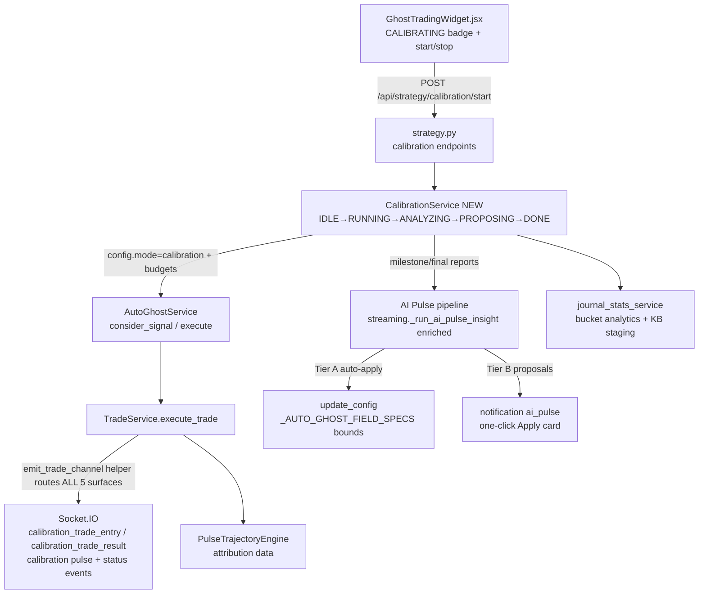

# Auto-Ghost Calibration Mode Plan

**Date:** 2026-08-26
**Status:** APPROVED (Tiered Autonomy selected by user) — **REV1 (2026-08-26): post-approval forensic review amendments incorporated (C1–C5, M1–M11, A1–A2). All 23 review claims verified against source by @Investigator. Do not implement from the pre-REV1 text.**
**Protocol:** Incremental Phase Review & Delegation Protocol (`.agents/PHASE_REVIEW_PROTOCOL.md`) — @Reviewer sign-off required after EVERY phase; no phase proceeds without explicit user command.
**Environment:** conda `QuFLX-v2`; PowerShell (`;` separators, no `&&`).
**Source discussions:** 2026-08-26 session (user proposal + investigation findings).

---

## Executive Summary

Implement an official **Auto-Ghost Calibration Mode**: a deliberate, user-initiated operating mode in which the Ghost Trader executes trades **silently** (invisible to the live trading UI) for a specified duration/trade budget, gathering statistically sufficient labeled outcome data. At milestones and completion, the AI (via the AI Pulse pipeline) analyzes the data and — under **tiered autonomy** — automatically tightens statistical gates (Tier A) and proposes capital-affecting settings for one-click approval (Tier B). The result: when the user starts live trading, Controller settings are evidence-calibrated rather than guessed.

**Problem solved today:** users manually calibrate while tempted to execute trades before settings are ready, causing substantial unnecessary losses. During calibration, ghost trades must be invisible so there is nothing to react to.

**Secondary goals delivered by the same architecture:**
1. Strengthen the AI Knowledge Base with favorable/unfavorable market-condition data.
2. Introduce a `NotificationSink` abstraction (Socket.IO now, Discord webhook later — deferred to Phase 6).
3. Give the AI a bounded self-improvement channel (`USER_SUGGESTION` / `DEV_SUGGESTION`).
4. Fix the AI Pulse prompt blindness gaps discovered during investigation (payout % missing being the most critical).

**Historical lesson honored:** the deprecated 2026-06-16 calibration feature (`ai_calibration_phase`) failed because its state was smeared across five files with no backend owner. This plan centralizes ALL calibration state in one new module (`CalibrationService`). The UI only observes and controls.

---

## Architecture Context



### New module: `CalibrationService` (`app/backend/services/calibration_service.py`)
Single owner of all calibration state:
- **State machine:** `IDLE → RUNNING → ANALYZING → PROPOSING → DONE` (+ `ABORTED`).
- **Budgets (REV2 — Bootstrap & Guardian model):** trade budget (default **24**), time budget (default **~25 min**), drawdown kill-switch (default 25 × amount → loud abort). Calibration is a **fast bootstrap, not a complete statistical calibration** — rigor accumulates post-calibration via the Session Guardian (Phase 3).
- **Persistence:** `app/data/calibration_sessions/<id>.json` — config snapshot, changelog epochs, milestone reports, final report.
- **Event channeling:** sets `mode="calibration"` on AutoGhostConfig; TradeService routes emissions to `calibration_*` Socket.IO events while mode active.
- **Milestones (REV2):** health checkpoint every 4 trades (telemetry only); Tier A review every 12 trades (catastrophic-evidence rule); budgets 24 trades / ~25 min → snapshot stats → hand to AI Pulse enrichment → Tier A review (max ONE gate-family change per milestone) → journal epoch record.

### Silent execution contract (REV1 — amended per review finding C1)
Calibration trades execute fully (Ghost kind only — see Decision D1), persist to session JSONL tagged `"is_calibration": true, "calibration_id": <id>`, but emit ONLY on `calibration_*` channels.

**The live UI listens on FIVE surfaces, not two** (verified: `App.jsx:43,58,132,205`; `GhostTradingWidget.jsx:185–187`). All five must be routed:

| Live event | Live consumer | Calibration replacement |
|---|---|---|
| `trade_entry` | `App.jsx:58`, `GhostTradingWidget.jsx:187` — markers, toasts, **execute sound**, pending-card clear | `calibration_trade_entry` |
| `trade_result` (⚠ plan previously said `trade_closed` — wrong name; actual emit is `trade_service.py:196` `"trade_result"`) | `App.jsx:132` — WIN/LOSS toasts, sounds, risk P/L | `calibration_trade_result` |
| `status_update.auto_ghost` (5s poll) | `App.jsx:43` → risk store — widget PnL/WR/drawdown even with trade events silenced | Metrics namespaced under `calibration` key or suppressed |
| `notification` (`type: ai_pulse`) | `App.jsx:205` — pulse cards, toasts, sound | `calibration_milestone` / `calibration_final` |
| `ai_pulse_pending` / `ai_pulse_aborted` | `GhostTradingWidget.jsx:185–186` — countdown card | `calibration_pulse_pending` / `calibration_pulse_aborted` |

**Implementation:** one backend helper `emit_trade_channel(event, payload, *, calibration)` used by `_emit_trade_entry`, `_emit_trade_result`, all pulse pending/abort sites, and pulse notifications. Contract test asserts **zero** live-surface emissions during calibration (see test list).

**⚠ Highest-severity leak:** `App.jsx:113–117` — if `autoGhostCopyMode === 'execute'`, a leaked ghost `trade_entry` toast double-click **fires a live Pocket Option trade**. Copy-mode execute must be hard-blocked while calibration is RUNNING (Decision D2, Phase 2).

Normal UI listeners are never modified — silence comes from routing, not from suppression logic. Visible afterwards in Trading Journal under a "Calibration" tag filter.

## Current State Map

| ID | Existing Asset / Gap | File(s) | Relevance | Status |
|---|---|---|---|---|
| EX-1 | `_AUTO_GHOST_FIELD_SPECS` declarative config table (~43 fields, casters+bounds) | `auto_ghost.py:93–136` | Validation surface for ALL AI mutations — bounds enforced by construction | ✅ Reuse |
| EX-2 | `update_config` spec-table loop; unknown fields logged+ignored | `auto_ghost.py:209–230` | Single mutation path for Tier A auto-apply | ✅ Reuse |
| EX-3 | `_emit_trade_entry` emitting `trade_entry` (:298, :364) — **but this is NOT the only leak surface** (see REV1 contract: `trade_result`, `status_update`, `notification`, pulse pending/abort also leak) | `trade_service.py:226–233, 189–196` | Location of `emit_trade_channel` helper — 🔧 Extend (Phase 1, C1 amendment) | 🔧 Extend (Phase 1) |
| EX-4 | ~~`_session_trades` deque + append at :360~~ **Persistent truth is `TradeService.repository.write_trade` → session JSONL (`trade_service.py:287,363`)**; `_session_trades` is only the in-memory AI Pulse cache. Also: `report_outcome` increments `_session_trade_count` **unconditionally at :352 — voids are counted** | `auto_ghost.py:191,352,360`; `trade_service.py:287,363` | Tag `TradeRecord.entry_context` BEFORE `write_trade`; budget counts settled win/loss only | 🔧 Extend (Phase 1, M1 amendment) |
| EX-5 | AI Pulse abort/pending emissions (`ai_pulse_aborted` ×12, `ai_pulse_pending`) | `auto_ghost.py:887–1104` | Route to `calibration_*` variants during mode | 🔧 Extend (Phase 1) |
| EX-6 | Frontend listeners `ai_pulse_pending`/`ai_pulse_aborted`/`trade_entry` | `GhostTradingWidget.jsx:185–187`; notification store :142–145 | Untouched — zero regression risk; new `calibration_status` listener added alongside. **But 5 leak surfaces exist (see contract) — routing required, not listener edits** | ✅ Leave as-is + route backend |
| EX-7 | `RuntimeStrategyConfigRequest` (~48 fields) + `update_runtime_settings` forwarding | `strategy.py:16–63`, streaming forward map | Add 4 calibration config fields through same pipeline | 🔧 Extend (Phase 1) |
| EX-8 | AI Pulse prompt pipeline `_run_ai_pulse_insight` | `streaming.py:872–1087` | Phase 0 enrichment target; Phase 3 milestone/final report emitter | 🔧 Extend |
| EX-9 | **PAYOUT GAP:** asset summaries omit payout % despite `_payout_cache`/`_resolve_asset_payout_pct` in same class (:464) | `streaming.py:912–929` | Critical — AI cannot reason about `minimum_payout_pct` gate today | 🔴 Fix (Phase 0) |
| EX-10 | Regex fallback fabricates `confidence: 85` | `streaming.py:1038,1053` | Same fabrication class as M5 payout bug already fixed | 🔴 Fix (Phase 0) |
| EX-11 | Prompt omits Bayesian WP cache, HTF verdicts, volatility/liquidity readings, trajectory attribution, rolling WR | `streaming.py:898–989` | 6 additional blindness fixes | 🔴 Fix (Phase 0) |
| EX-12 | Journal analytics engine (buckets, manipulation profiling, Favoured Regimes, expiries) | `journal_stats_service.py:173–944` | Milestone + final analysis machinery | ✅ Reuse |
| EX-13 | Transactional KB staging with N≥5/N≥20 guards, `.bak` backups | `journal_stats_service.py:1114–1397` | Calibration KB writes MUST go through staging (silent live KB auto-writes disabled since 2026-08-17) | ✅ Reuse |
| EX-14 | Historical corpus: 135 session JSONs (~13,400×60s + 1,005×300s), priors READY per horizon; 1,029 KB patterns (stale ~2.5 months) | `app/data/ghost_trades/`, KB json | Phase 4 recency-weighted backfill source | ✅ Available |
| EX-15 | Named Ghost Protocol presets via `loadGhostProtocol` — **⚠ verified: loads ONLY z-score + regime fields (`useSettingsStore.js:412+`); vol/liq/Bayesian/amount/concurrency/payout are NOT in the protocol object** | `useSettingsStore.js` | Vehicle for Relaxed/Conservative/Strict presets (Phase 5) — **requires schema expansion or presets silently no-op for most gates (M8)** | 🔧 Extend (Phase 5) |
| EX-16 | Developer Mode toggle | settings store / TopBar | Surface for DEV_SUGGESTION observations | ✅ Reuse |
| EX-17 | Notification sink = Socket.IO only; no webhook code anywhere | repo-wide grep confirmed | Greenfield for Discord (Phase 6) behind `NotificationSink` | 🆕 New (Phase 6) |
| EX-18 | **Drawdown is a 300s cooldown, NOT a kill-switch** — `:407` sets `_drawdown_cooldown_until`; `_session_halted` is read (`:336,502`) but **never set anywhere** (dead flag) | `auto_ghost.py:406–409` | CalibrationService must OWN the kill-switch → ABORTED after every settlement; do NOT reuse drawdown cooldown (C4) | 🔧 Extend (Phase 1) |
| EX-19 | **App.jsx 400ms debounced settings sync POSTs `/api/strategy/runtime-config` on every change AND on mount; `update_config` wipes the session when `enabled and (not previous_enabled or not _session_id)`** (`auto_ghost.py:233–254`) | `App.jsx:301–306` | Runtime-config writes MUST be refused (409) while calibration RUNNING — otherwise frontend sync overwrites the preset mid-run and can wipe the sample (C3 — repeats 2026-06-16 failure mode) | 🔧 Extend (Phase 1) |
| EX-20 | Fabricated `confidence: 85` exists in THREE sites: regex fallbacks `:1038, :1053` **and the system prompt JSON example `:964`** | `streaming.py:964,1038,1053` | All three must be fixed in Phase 0 — fixing only the regex leaves the model instructed to emit 85 (M7) | 🔴 Fix (Phase 0) |
| EX-21 | `_AUTO_GHOST_FIELD_SPECS["bayesian_min_probability"]` = `(float, None, None)` — **no bounds** on the direct `update_config` path (API path is bounded `ge=0.50, le=0.90` at `strategy.py:58`); a model emitting `53.5` (percent form) would set an impossible floor | `auto_ghost.py:135` | Clamp to `(float, 0.50, 0.90)` in Phase 0 — production footgun even without calibration (M6) | 🔴 Fix (Phase 0) |
| EX-22 | **No HTF confluence cache exists** — confluence is computed only inside `schedule_candle_open_pulse_execution` at T−5s; no `_last_htf` per-asset field in `streaming.py` | `streaming.py` (grep: zero `_last_htf` matches) | Phase 0 P0-3 must compute on demand or add a cache — do NOT assume a field (M5) | 🔧 Extend (Phase 0) |
| EX-23 | **Pulse-path manipulation veto is INERT in production**: `streaming.py:1064` requires `manipulation_severity_threshold > 0`, but the default is `0.0` (`auto_ghost.py:44`) — the veto never fires today. Also inconsistent with `consider_signal` path (`:558–559`, `any(sev >= threshold)` blocks on ANY manipulation when threshold=0) | `streaming.py:1064`, `auto_ghost.py:44,558–559` | Baseline preset 0.35 would ACTIVATE a currently-dead gate — intentional behavior change, must be journaled/documented (A1). Inconsistency logged as report-only observation | 📋 Document (Phase 1) |

## Calibration Baseline Preset (Official Spec)

**Design principle:** Safety rails ON, learning gates OPEN. Every filter active from trade #1 censors outcomes and hides the evidence needed to justify that filter later. Tier A tightening is monotone and evidence-driven.

### Locked safety rails (NOT AI-tunable)

| Setting | Default | Rationale |
|---|---|---|
| `amount` | `1.0` | Minimal stake; win-rate stats are stake-invariant |
| `expiration_seconds` | `60` | Primary horizon; richest prior support (13,400 historical trades) |
| `max_concurrent_trades` | `2` | Diversifies observations, limits correlated simultaneous outcomes |
| `max_drawdown_amount` | `25.0` (=25 × amount) | Kill-switch → loud ABORTED transition + notification |
| `block_on_manipulation` | `true` @ threshold `0.35` | ⚠ REV1 (A1): the pulse-path veto (`streaming.py:1064`) is currently **inert in production** (default threshold `0.0` fails its `> 0` guard) — setting 0.35 here **activates a currently-dead gate**. This is an intentional, journaled behavior change. `block_on_manipulation` stays LOCKED true; Tier A may only **raise** the threshold (monotone), never lower it or disable the block (M2) |
| `minimum_payout_pct` | **`85.0` (PERCENT — unit enforced)** | ⚠ REV1 (C2): `AutoGhostConfig.minimum_payout_pct` is 0–100 percent (default `88.0`, spec bounds `(float, 0.0, 100.0)`, gate `auto_ghost.py:550`). **NEVER write `0.85`** — the frontend's `state/100` → API `*100` conversion (`App.jsx:258`, `strategy.py:98`) applies only to the REST path. CalibrationService writes 85.0 directly via `update_config`. Contract test: 80% payout rejected, 90% accepted. Breakeven @85% ≈ 54.05% |
| `max_session_trades` | `100` | Hard budget; statistical sufficiency |
| `drawdown_cooldown_seconds` | `300` | Standard cool-off after kill-switch. ⚠ REV1 (C4): cooldown is NOT the kill-switch — CalibrationService owns a separate drawdown check → ABORTED (see EX-18) |
| `adaptive_expiry_enabled` | **`false` (LOCKED — moved from learning gates per M4)** | Plugin `override_expiration_seconds` (`auto_ghost.py:695`) or adaptive logic (`:907–918`) could push trades to 120/180/300s, contaminating the 60s prior the calibration is designed to match. Expiry stays at 60s for the whole run |
| `auto_execute_ai_pulse` | **`false` (LOCKED — C5)** | Prevents AI-chosen trades from injecting into the open-learning sample, emitting pending cards, and mixing PulseTrajectoryEngine rows with OTEO ghost trades. Regular AI Pulse loop pauses or switches to report-only during calibration |

### Open learning gates (Tier A tightens with evidence)

| Setting | Start value | Why |
|---|---|---|
| `bayesian_filter_enabled` | `true` @ `bayesian_min_probability: 0.50` | Loosest floor via READY priors; blocks only known-bad setups; Tier A raises toward calibrated 53.5%+. ⚠ REV1 (M6): Tier A must write **0.535-form floats** (0.50–0.90), never percent (53.5); spec-table clamp `(float, 0.50, 0.90)` added in Phase 0 |
| `min/max_zscore_enabled` | `true` @ `-2.5 / +2.5` | Gate exists and reports but ≈ no-op; tightening later is measurable and monotone |
| `regime_gate_enabled` | `false` (all regimes) | Favoured-Regimes ranking needs outcomes across ALL regimes. Tier A whitelist rules in Tiered Autonomy spec |
| `volatility/liquidity_gate_enabled` | `false` (bands 0–100) | Full distribution needed for bucket analysis |
| `adx_gate / cci_gate / rsi_cci_enabled` | `false` | Secondary confluences introduced only if buckets show need |
| ~~`require_regime_stable`~~ | **REMOVED from baseline (M3)** | Verified no-op: stability check fires only when `regime_gate_enabled and require_regime_stable` (`auto_ghost.py:605`) — with the regime gate off it does nothing. Either a stability-only check is implemented first or it stays out of the preset |
| `per_asset_cooldown_seconds` | `45` | Prevents correlated rapid-fire re-entries |
| `allowed_regimes` / `blacklist_assets` | empty (= everything) | Maximum condition coverage |

### Session parameters (Phase 1 — REV2: Bootstrap & Guardian model)
User constraint: binary-options ideal windows are short (15–30 min); a long calibration finishing after the window closes is worthless. Calibration is therefore a **fast bootstrap** producing a *safe starting preset* — statistical depth accumulates afterwards via the Session Guardian.

| Parameter | REV1 | **REV2** |
|---|---|---|
| Trade budget | 100 trades | **24 trades** |
| Time budget | 90 minutes | **~25 minutes** (whichever comes first vs trade budget) |
| Tier A review milestone | every 20 trades | **every 12 trades** (2 review cycles; catastrophic-evidence rule — see Tier A row) |
| Health checkpoint | — | **every 4 trades** — telemetry only (budget pacing, drawdown, reject-rate anomaly); **no AI changes** |
| Post-calibration awareness | — | **Session Guardian** (Phase 3): continuous AI monitoring of the live session with Tier B one-click suggestions as per-bucket evidence crosses N≥20 |

**REV2 statistical basis (honest constraint):** N≥20-per-bucket rigor CANNOT be met within 24 trades, so it is deliberately NOT attempted before trading. Rigor arrives instead via: (a) **Session Guardian** applying the N≥20 rule against the *growing live session*; (b) **KB warm-start** — the AI begins from recency-weighted historical priors (Phase 4 backfill) and the 24-trade run acts as *validation* that historical priors transfer to current conditions; (c) final report recommends accumulating **2–3 bootstrap sessions** before locking Relaxed/Conservative/Strict presets (epochs journal cleanly across sessions). At 12-trade milestones Tier A acts ONLY on catastrophic, unambiguous evidence — modest adjustments go out as Tier B proposals, never auto-applied from thin data.

---

## Tiered Autonomy Specification (user-approved)

| Tier | Fields | Behavior |
|---|---|---|
| **A — auto-apply** | z-score bounds (+enables), volatility/liquidity bands (+enables), confidence bounds, allowed regimes, manipulation threshold (**raise-only, monotone** — see M2), per-asset cooldown, bayesian_min_probability (**0.50–0.90 float clamp** — see M6) | Applied automatically at milestones through `update_config` (spec-table bounds enforced). Journaled `{field, old, new, trade_index, rationale, evidence_n}`. Max ONE gate-family change per milestone. Monotone-tightening bias. **Regime whitelist rule (REV1):** `regime_gate_enabled` may only be switched on after **N ≥ 20 outcomes per regime in the current epoch**, and only to drop AVOID regimes — never at the first milestone (introducing a whitelist censors all later observation of dropped regimes). **REV2 catastrophic-evidence rule:** at REV2's 12-trade milestones, Tier A auto-applies ONLY changes supported by catastrophic, unambiguous evidence (bucket at 0–2/12, reject-rate spike, kill-switch-adjacent behavior); all modest adjustments become Tier B proposals — thin data never auto-tightens gates |
| **B — propose-only** | `amount`, `max_concurrent_trades`, `max_drawdown_amount`, `expiration_seconds`, `enabled` | Delivered as AI Pulse notification with structured suggestions payload → existing "Update Ghost Protocol" one-click Apply card. **Unit contract:** Tier B models must emit payout/probability in the backend's native units (percent for `minimum_payout_pct`; 0–1 float for `bayesian_min_probability`) — Phase 0 prompt states this explicitly to prevent the C2 unit mismatch |
| **Locked** | Calibration-mode internals (`mode`, budgets, kill-switch), `block_on_manipulation=true`, `adaptive_expiry_enabled=false`, `auto_execute_ai_pulse=false`, `amount` floor, `expiration_seconds=60` | Never AI-writable |

**Epoch/changelog contract:** every mutation creates an epoch record in the calibration session file so post-hoc analysis can segment trades between changes — this is what keeps the non-stationary dataset scientifically usable.

### Open decisions resolved (REV1)
| # | Decision | Resolution |
|---|---|---|
| D1 | Ghost or live-demo execution? | **Ghost kind (`TradeKind.GHOST`) ONLY.** Calibration never touches the live/demo broker execution path. Broker connection stays up for tick data only |
| D2 | May the user trade manually during calibration? | Auto-Ghost copy-mode `execute` is **hard-blocked** while RUNNING (kill the `App.jsx:113–117` live-trade double-click path for calibration-tagged toasts — moot if C1 routing is perfect, but enforced defensively). Manual TradePanel submits get a warning toast; broker connection is never blocked (SSID must stay up for ticks) |
| D3 | Tier A vs "learn all regimes" conflict | Whitelist only after N≥20 per regime per epoch, AVOID-drops only, never milestone 1 (see Tier A row) |
| D4 | Who restores the user's protocol? | **Auto-restore the pre-calibration snapshot on DONE/ABORTED**; the calibrated Relaxed/Conservative/Strict presets are then offered as Tier B-style Apply cards |
| D5 | Phase 0 vs Phase 1 coupling | Phase 0 ships independently (payout/WP/HTF/vol/liq/attribution/rolling-WR + confidence fix + Bayesian clamp) but must NOT teach the model to emit `min_payout_pct` in 0–1 units |
| D6 | 24-trade budget vs N≥20 statistical rigor (REV2) | Bootstrap & Guardian model: calibration = safe bootstrap only (catastrophic-evidence Tier A); full rigor accumulates post-calibration via Session Guardian + KB warm-start; 2–3 sessions recommended before locking presets |
| D7 | KB warm-start (REV2) | Session Guardian and calibration AI begin from recency-weighted historical priors/patterns (Phase 4 backfill), not cold; the 24-trade bootstrap validates prior transfer to current conditions |

## Implementation Phases

### Phase 0 — [ ] AI Pulse Enrichment Quick Wins (independently valuable)
All changes in `streaming.py::_run_ai_pulse_insight` (+ tests in `test_preflight_gate_contracts.py` or new `test_ai_pulse_prompt.py`).

- **P0-1 Payout surfacing (EX-9):** In the asset-summary loop, resolve payout via existing cache:
  ```python
  payout = self._payout_cache.get(asset, (None,))[0]
  # render as f"Payout={payout:.1f}%" if payout is not None else "Payout=UNAVAILABLE"
  ```
  Add to each trade line too (`entry_context.payout_pct`). Surface controller context line: `- Minimum Payout Gate: {config.minimum_payout_pct}`.
- **P0-2 Bayesian WP:** merge from `self._latest_bayesian_wp.get(asset, {})` → `WP60/WP300` per asset summary (values already cached since C2 remediation).
- **P0-3 HTF verdicts (REV1 — M5):** there is **no** per-asset HTF cache in `streaming.py` (confluence is computed only inside `schedule_candle_open_pulse_execution` at T−5s). Implementation must EITHER compute confluence on demand per asset-summary OR add an explicit `_last_htf: Dict[str, dict]` cache written on that path. Do not assume a field exists.
- **P0-4 Volatility/Liquidity readings:** from `mc_engine._cached_context` → so Tier A can tune those bands against real numbers.
- **P0-5 Trajectory attribution:** last N settled trajectory attributions (PREMATURE_EXPIRATION / MOMENTUM_EXHAUSTION / STRUCTURAL_TRAP / CLEAN_WIN counts) from `PulseTrajectoryEngine`.
- **P0-6 Remove fabricated confidence (REV1 — M7, THREE sites):** regex fallbacks `streaming.py:1038, 1053` set `"confidence": None`, **and the system-prompt JSON example at `:964` must also drop the `"confidence": 85` line** — otherwise the model remains instructed to emit 85. Scheduler must treat missing confidence as "unspecified", never 85.
- **P0-7 Rolling stats:** add rolling last-20 WR alongside session-lifetime stats; tell the AI explicitly what sample sizes milestones require.
- **P0-8 Bayesian spec clamp (REV1 — M6):** change `_AUTO_GHOST_FIELD_SPECS["bayesian_min_probability"]` from `(float, None, None)` to `(float, 0.50, 0.90)` (`auto_ghost.py:135`). Production footgun even without calibration — a model emitting percent-form `53.5` via the direct `update_config` path would set an impossible floor. (API path is already bounded at `strategy.py:58`.)
- **Prompt contract update:** instruct AI that assets below `minimum_payout_pct` must not receive signals; JSON schema gains optional `"min_payout_pct"` suggestion field — **expressed in PERCENT (85.0-form) to match `AutoGhostConfig`, never 0–1** (C2 unit contract); controller context line shows the gate and live payouts in the SAME unit.
- **Verification:** new prompt-contract unit test asserting every section label appears in built user_msg for a seeded harness; full suite green; Vite build untouched.

### Phase 1 — [ ] Backend Core: CalibrationService + Silent Channels (REV1 — substantially expanded per review)
- **New file:** `app/backend/services/calibration_service.py`
  - State machine `IDLE→RUNNING→ANALYZING→PROPOSING→DONE|ABORTED`; singleton accessor pattern consistent with other services.
  - `start()` snapshots the full user config (for auto-restore per D4), **mints a dedicated session_id `auto_ghost_calib_{epoch}`** (M1/M9 — isolates milestones and journal stats from live history), applies the Calibration Baseline Preset via `update_config`, arms budgets, sets `config.mode="calibration"`, forces `auto_execute_ai_pulse=False` (C5), and **pushes the frozen preset snapshot back to the frontend via `calibration_status`** so the widget cannot present stale/editable values (C3).
  - `stop()`/abort: **freeze new entries immediately, let in-flight trades settle on calibration channels, then transition** (M10 — in-flight drain is a contract, not an afterthought).
  - Trade/settlement hooks increment counters — **budget counts settled win/loss ONLY; voids are not evidence** (M1, `report_outcome` counts voids today at `auto_ghost.py:352`). Kill-switch: CalibrationService checks drawdown after EVERY settlement → loud ABORTED + notification; **do NOT reuse the drawdown cooldown** (`:407` is a 300s resume-after, and `_session_halted` is never set — EX-18/C4).
  - Persists `app/data/calibration_sessions/<epoch_id>.json` (config snapshot, changelog epochs, milestone/final reports).
- **Silent channels (REV1 — C1, five surfaces, one helper):** `emit_trade_channel(event, payload, *, calibration)` used by `_emit_trade_entry` AND `_emit_trade_result` (**actual event name is `"trade_result"`, not `trade_closed`** — `trade_service.py:196`), all pulse pending/abort sites (`auto_ghost.py:887–1104`), and pulse notifications. `status_update.auto_ghost` metrics namespaced or suppressed during RUNNING. Report payloads go out as `calibration_milestone`/`calibration_final`, never `notification type=ai_pulse` (C5).
- **Runtime-config lock (REV1 — C3, non-negotiable):** while state ∈ {RUNNING, ANALYZING, PROPOSING}, `update_runtime_settings` **refuses AutoGhost field writes** with 409 + log (fail loud), except writes originating from CalibrationService. Prevents the App.jsx 400ms debounced sync (and mount-time sync) from overwriting the preset mid-run or triggering the `update_config` session wipe (`auto_ghost.py:233–254`) that would silently destroy the sample.
- **Tagging (REV1 — M1):** `is_calibration` + `calibration_id` set on `TradeRecord.entry_context` BEFORE `repository.write_trade` (`trade_service.py:287,363`) — the persistent truth — not merely the in-memory `_session_trades` cache.
- **API:** strategy.py adds `auto_ghost_calibration_enabled/duration_minutes/target_trades/autonomy_tier` fields + `POST /api/strategy/calibration/start|stop`, `GET /api/strategy/calibration/status`; forwarded through existing runtime-settings pipeline.
- **Ghost-only execution (D1):** calibration routes `TradeKind.GHOST` only; never live/demo broker execution.
- **Document A1 (EX-23):** the 0.35 manipulation threshold activates a currently-inert pulse-path veto — intentional, journaled; the `>0`-guard vs `any(>=threshold)` inconsistency between the two paths is logged as a report-only observation (no silent fix).
- **Tests (REV1 — expanded):** `test_calibration_no_live_ui_leak` (fake sio records ALL event names across a 3-trade harness — zero `trade_entry`/`trade_result`/`ai_pulse_pending`/`ai_pulse_aborted`/`notification type=ai_pulse`); `test_calibration_preset_payout_units` (post-start `config.minimum_payout_pct == 85.0`; 80% rejected, 90% accepted; literal `0.85` must never appear); `test_calibration_runtime_config_locked` (POST during RUNNING → 409, config unchanged); `test_calibration_drawdown_aborts_not_cools` (large loss → ABORTED, no further executions); `test_calibration_session_id_isolated` (JSONL path contains `calib`); `test_calibration_settings_restore` (DONE restores pre-start snapshot); `test_calibration_in_flight_drain` (stop freezes entries, in-flight settle on calibration channels, then terminal state); `test_calibration_budget_counts_settled_only` (voids don't consume the 100-trade budget); state-machine transition tests.

### Phase 2 — [ ] Frontend: Calibration UX + Visual Suppression
- `GhostTradingWidget.jsx`: new `calibration_status` Socket.IO listener; render **CALIBRATING** badge + progress ring (trades/target, elapsed/budget, live WR, sufficiency meter). Start/stop controls with explicit confirmation dialog (calibration overrides manual Ghost-enabled state; stopping early requires confirm). **REV1 (C3/C1): freeze gate sliders to read-only while the frozen preset is active; hide/disable copy-mode `execute` (D2).**
- Normal listeners (:185–187) untouched. Because calibration events arrive on different event names, no suppression logic is even needed in existing paths — **but REV1: silence is verified by the five-surface contract test, not assumed** (see C1).
- `JournalView.jsx`: "Calibration" session tag/filter so tagged sessions are reviewable post-hoc but excluded from default live stats views. **REV1 (M1/M9): default journal views EXCLUDE `auto_ghost_calib_*` sessions unless the Calibration filter is on** (journal reads session files — the dedicated session_id is what makes this clean).
- Zustand settings store: 4 new calibration fields with validation + sync (pattern identical to prior gate fields).
- **Verification:** Vite production build clean; manual browser pass: badge renders, no trade cards/markers/sounds during a test calibration, journal filter works.

### Phase 3 — [ ] AI Autonomy Engine (Tier A/B) + Milestone Reports
- Tier tables (`_CALIBRATION_TIER_A_FIELDS`, `_CALIBRATION_TIER_B_FIELDS`) defined next to `_AUTO_GHOST_FIELD_SPECS`.
- Milestone flow: at each 20-trade mark → `JournalStatsService.compute_journal_stats` on the calibration epoch → enriched AI Pulse prompt ("calibration report" mode) → AI returns:
  ```json
  {
    "tier_a_changes": [{"field": "bayesian_min_probability", "new": 0.535,
                         "rationale": "...", "evidence_n": 20}],
    "tier_b_proposals": [{"field": "max_concurrent_trades", "new": 1, "rationale": "..."}],
    "observations": [{"kind": "USER_SUGGESTION|DEV_SUGGESTION", "text": "..."}]
  }
  ```
- Enforcement: server-side whitelist per tier; max ONE gate-family change applied per milestone; every application through `update_config`; changelog appended + emitted.
- Final report → full preset recommendation incl. proposed Relaxed/Conservative/Strict values (Phase 5 consumes), staged KB updates proposal. Milestone analytics MUST be called with the dedicated `auto_ghost_calib_{epoch}` session_id, never `ALL` (M9 — `JournalStatsService` reads session files).
- Observation queue: `USER_SUGGESTION` → AI Pulse card; `DEV_SUGGESTION` → rendered only when Developer Mode active; persisted to `reports/analysis/ai_observations.json`. Never self-applied.
- **REV2 — Session Guardian (post-calibration awareness, the core of the Bootstrap & Guardian model):** after DONE, a lightweight continuous loop (reusing the existing AI Pulse interval loop infrastructure — no new scheduler) monitors the LIVE ghost session's rolling stats: last-20 WR, reject-reason distribution, per-regime / per-z-bucket / per-UTC-hour outcome counts, trajectory attributions, and KB warm-start expectation vs actual. When any bucket's evidence crosses **N≥20**, the Guardian posts a Tier B one-click suggestion ("Tighten z-score to 1.8 — 3/15 losses all at z<−1.9"); when live WR diverges materially from KB warm-start expectation, it flags prior-transfer failure. All Guardian output is **propose-only** (user applies) — this is the mechanism that delivers the N≥20 rigor the 24-trade bootstrap deliberately defers.
- **REV2 (A3) — Suggestion-effectiveness ledger:** every applied Tier B change (calibration milestones, Guardian suggestions, one-click Apply cards) is journaled with a pre/post 20-trade WR delta in the calibration/Guardian session file. Aggregated deltas are injected into AI prompts ("your last 3 z-score suggestions averaged +2.1pp WR") so the AI learns which of its own recommendation types actually work.

### Phase 4 — [ ] KB Health Audit + Historical Backfill (+ REV2 AI-Decision Optimizers)
- Audit report: pattern coverage vs last 30 days of sessions; prior sample freshness per horizon; horizon-isolation integrity check.
- Backfill job (script or service task): re-run analyzer join over ~8 recent weeks with recency weighting → outputs STAGED pattern/prior updates only.
- All master-KB writes via existing staging modal commit path (guards N≥5/N≥20, `.bak` backups). No silent auto-writes — Core Principle #8.
- **REV2 (A1) — UTC-hour dimension:** add 4-hour UTC time-block bucketing to condition patterns (analyzer + pattern schema + loader similarity). Grounded in our own backtests: 18:00–22:00 UTC = 52.23% WR vs 22:00–02:00 = 48.54% (rollover effect); top pocket `Vol:HIGH | Liq:HIGH | Manip:LOW` = 78.95%. The AI currently CANNOT advise on time-of-day edges because the KB has no time dimension — this is the cheapest available decision-quality upgrade.
- **REV2 (A2) — Recency decay in Bayesian priors:** `BayesianPriorUpdater` gains exponential recency weighting (half-life ~2–4 weeks, configurable) so 4-month-old trades count less than last week's. Applied in the backfill re-seed; runtime updates (when they occur via approved paths) inherit the same decay.
- **REV2 (D7) — Warm-start output:** the backfilled, recency-weighted priors/patterns become the KB warm-start baseline the Session Guardian compares live performance against (prior-transfer validation).

### Phase 5 — [ ] Strictness Profiles + Condition-Alignment Notifier
- Three named Ghost Protocol presets (Relaxed / Conservative / Strict) as concrete gate-delta sets, seeded from calibration final-report output. **REV1 (M8): `loadGhostProtocol` currently loads ONLY z-score + regime fields (`useSettingsStore.js:412+`) — the protocol schema MUST be expanded to carry vol/liq bands, Bayesian floor, payout gate, amount, and concurrency, or the presets silently no-op for most gates.** On DONE, the pre-calibration snapshot is auto-restored (D4) and the three presets are offered as one-click Apply cards.
  - **Relaxed:** conditions match proven favorable pockets (e.g., Vol:HIGH | Liq:HIGH | Manip:LOW @ 78.95% historical WR) → wider z-score band, higher concurrency, lower confidence floor.
  - **Conservative:** mixed readings → near-baseline gates.
  - **Strict:** high manipulation regime / thin liquidity / adverse HTF → tight z-score, 1 concurrent trade, elevated Bayesian floor, short whitelist.
- Condition-alignment watcher: low-frequency evaluation of live readings against KB buckets → notification of justified level ("🟢 Conditions aligned — Relaxed justified") via NotificationSink.
- **REV2 (A4) — Market-drift detector:** the watcher additionally compares rolling live feature distributions (vol/liq/manipulation/z-score, per 4h UTC block) against the KB bucket centroids from the recency-weighted backfill. Sustained out-of-distribution drift → loud notification ("⚠ Market has drifted from calibrated conditions — re-run calibration advised") via NotificationSink. This closes the "market changes after calibration" gap structurally: presets are never treated as static.

### Phase 6 — [ ] Discord Notification Sink (deferred by user)
- `NotificationSink` interface; Socket.IO becomes sink #1 (behavior unchanged), Discord webhook sink #2 (~30 lines, no bot required). User-configurable webhook URL in settings. Same abstraction later carries signal broadcasting.

---

## Verification Checklist

- [ ] Phase 0: prompt-contract test asserts payout/WP/HTF/volatility/liquidity/attribution/rolling-WR sections present; no fabricated `confidence` values **in regex output OR prompt example (`:964`)**; `bayesian_min_probability` spec bounds `(0.50, 0.90)` enforced (53.5-form rejected/clamped); payout suggestions in percent; full suite green
- [ ] Phase 1 (REV1 — full contract-test battery): `test_calibration_no_live_ui_leak` (all 5 surfaces), `test_calibration_preset_payout_units`, `test_calibration_runtime_config_locked` (409), `test_calibration_drawdown_aborts_not_cools`, `test_calibration_session_id_isolated`, `test_calibration_settings_restore`, `test_calibration_in_flight_drain`, `test_calibration_budget_counts_settled_only`, state-machine transitions; preset application correctness; **REV2: 24-trade/25-min budgets + 4-trade checkpoints + 12-trade milestones enforced**
- [ ] Phase 3 (REV2 — Session Guardian): bucket crossing N≥20 produces exactly one Tier B suggestion; warm-start divergence flagged; suggestion-effectiveness ledger records pre/post WR delta; all Guardian output propose-only
- [ ] Phase 4 (REV2): backfill staged-only; UTC-hour 4h-block dimension present in pattern schema + loader query (A1); recency decay applied (90-day-old trade contributes <50% of a 10-day-old trade at default half-life — A2); warm-start baseline emitted for Guardian (D7)
- [ ] Phase 5 (REV2): drift detector fires on synthetic out-of-distribution feature stream (A4); protocol schema expansion loads all gate families (M8)
- [ ] Each phase: `conda run -n QuFLX-v2 python -m pytest <phase tests> test_preflight_gate_contracts.py test_auto_ghost.py -v` green
- [ ] End of plan: full suite (85+ new tests) green; `npm --prefix app/frontend run build` clean
- [ ] Manual: live paper calibration run — badge progress correct; UI shows NO trades, NO sounds, NO pending cards during run; copy-mode execute blocked; journal shows tagged session after (excluded by default); milestone AI Pulse reports arrive; Tier A changelog entries present in session file; pre-calibration settings restored on DONE
- [ ] No behavioral regressions in existing pre-flight gates (z-score, regime, manipulation, proximity, Bayesian floor)

## Files Touched Summary

| Phase | Files |
|---|---|
| 0 | `app/backend/services/streaming.py`, new `test_ai_pulse_prompt.py` |
| 1 | NEW `app/backend/services/calibration_service.py`, `app/backend/services/auto_ghost.py`, `app/backend/services/trade_service.py`, `app/backend/api/strategy.py`, `app/backend/services/streaming.py`, new contract tests |
| 2 | `GhostTradingWidget.jsx`, `JournalView.jsx`, `useSettingsStore.js`, `App.jsx` sync |
| 3 | `calibration_service.py`, `auto_ghost.py` (tier tables), `streaming.py` (report mode + Session Guardian loop), new `reports/analysis/ai_observations.json` writer, **REV2:** suggestion-effectiveness ledger store |
| 4 | `journal_stats_service.py` or new backfill script, `scripts/analyze_trade_intelligence.py` (**REV2 A1: UTC-hour bucketing**), `shared/bayesian_prior_store.py` / updater (**REV2 A2: recency decay**), staging modal (minor) |
| 5 | presets storage (`useSettingsStore.js`), new alignment watcher module, notifications |
| 6 | NEW `notification_sink.py` + settings field |

## Risk Assessment

| Risk | Likelihood | Impact | Mitigation |
|---|---|---|---|
| Silent-channel leak → user sees calibration trade in live UI | Low | High | REV1: one `emit_trade_channel` helper routing ALL FIVE surfaces (`trade_entry`, `trade_result`, `status_update` metrics, `notification type=ai_pulse`, pulse pending/abort); contract test asserts zero live-surface emissions — silence is verified, never assumed by "different event names" |
| **Leaked ghost toast double-click fires a LIVE broker trade (copy-mode `execute`, `App.jsx:113–117`)** | Low | **Critical** | REV1: copy-mode execute hard-blocked during calibration (D2) — defense-in-depth on top of C1 routing |
| **Frontend settings sync overwrites calibration preset mid-run (400ms debounced runtime-config POST)** | High if unlocked | High | REV1 (C3): runtime-config lock (409) while RUNNING/ANALYZING/PROPOSING; frozen snapshot pushed to frontend; sliders read-only. Without this the 2026-06-16 smeared-state failure recurs |
| **Payout/probability unit mismatch (0.85 vs 85.0; 53.5 vs 0.535)** | Med | High | REV1 (C2/M6): percent units enforced in preset + prompt contract; Bayesian clamp `(0.50, 0.90)` in spec table; dedicated unit tests |
| Kill-switch fails to abort on drawdown | Low | High | REV1 (C4): CalibrationService-owned check after EVERY settlement → ABORTED; drawdown cooldown explicitly NOT reused (it resumes after 300s; `_session_halted` is dead code) |
| AI Tier A change degrades performance mid-run | Med | Med | Max ONE change/milestone; epoch journaling enables revert; monotone-tightening bias; kill-switch independent of AI |
| Milestone analytics slow the tick loop | Low | Med | Analytics off-loop via existing async patterns (to_thread); milestones are infrequent; called with dedicated calibration session_id (M9) |
| Backfill contaminates master KB | Low | High | Staging-only writes; N-guards; `.bak` backups; human commit |
| Calibration data non-stationary confounds analysis | Med | Med | Epoch changelog segments trades between changes |
| **Baseline 0.35 activates the currently-inert pulse-path manipulation veto (A1)** | Certain (by design) | Low | Documented intentional change in preset rationale (EX-23); journaled in calibration changelog; path inconsistency logged report-only, not silently fixed |
| **REV2: 24-trade bootstrap overfits gates to noise** | Med | Med | Catastrophic-evidence rule (Tier A acts only at 0–2/12-class evidence); modest adjustments Tier B-only; Guardian enforces N≥20 post-calibration; 2–3 sessions before presets lock |
| **REV2: KB warm-start priors stale/misleading for current market** | Med | Med | Recency decay (A2) downweights old evidence; 24-trade run explicitly validates prior transfer; Guardian flags divergence; drift detector (A4) triggers re-calibration |
| **REV2: Guardian suggestion spam annoys user** | Low | Low | Suggestions fire only at N≥20 bucket crossings; max ONE pending suggestion per gate family; user can silence per-family |
| Prompt growth raises token cost | Med | Low | Concise section formats; measure before/after; cap recent-trade lines |

---

*Plan produced per workspace conventions. Handoff: @Investigator (this document) → @Coder for implementation. PHASE_REVIEW_PROTOCOL applies between all phases.*


