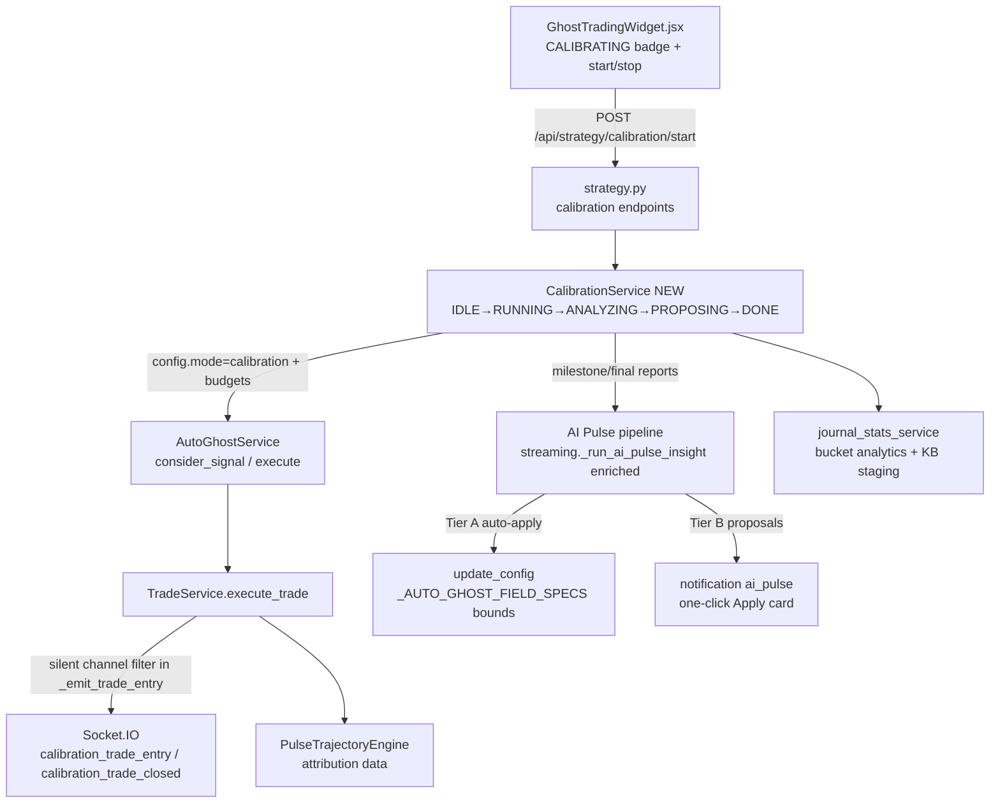

# Auto-Ghost Calibration Mode Plan

**Date:** 2026-08-26
**Status:** APPROVED (Tiered Autonomy selected by user)
**Protocol:** Incremental Phase Review & Delegation Protocol (`.agents/PHASE_REVIEW_PROTOCOL.md`) — @Reviewer sign-off required after EVERY phase; no phase proceeds without explicit user command.
**Environment:** conda `QuFLX-v2`; PowerShell (`;` separators, no `&&`).
**Source discussions:** 2026-08-26 session (user proposal + investigation findings).

---

## Executive Summary

Implement an official **Auto-Ghost Calibration Mode**: a deliberate, user-initiated operating mode in which the Ghost Trader executes trades **silently** (invisible to the live trading UI) for a specified duration/trade budget, gathering statistically sufficient labeled outcome data. At milestones and completion, the AI (via the AI Pulse pipeline) analyzes the data and — under **tiered autonomy** — automatically tightens statistical gates (Tier A) and proposes capital-affecting settings for one-click approval (Tier B). The result: when the user starts live trading, Controller settings are evidence-calibrated rather than guessed.

**Problem solved today:** users manually calibrate while tempted to execute trades before settings are ready, causing substantial unnecessary losses. During calibration, ghost trades must be invisible so there is nothing to react to.

**Secondary goals delivered by the same architecture:**
1. Strengthen the AI Knowledge Base with favorable/unfavorable market-condition data.
2. Introduce a `NotificationSink` abstraction (Socket.IO now, Discord webhook later — deferred to Phase 6).
3. Give the AI a bounded self-improvement channel (`USER_SUGGESTION` / `DEV_SUGGESTION`).
4. Fix the AI Pulse prompt blindness gaps discovered during investigation (payout % missing being the most critical).

**Historical lesson honored:** the deprecated 2026-06-16 calibration feature (`ai_calibration_phase`) failed because its state was smeared across five files with no backend owner. This plan centralizes ALL calibration state in one new module (`CalibrationService`). The UI only observes and controls.

---

## Architecture Context



### New module: `CalibrationService` (`app/backend/services/calibration_service.py`)
Single owner of all calibration state:
- **State machine:** `IDLE → RUNNING → ANALYZING → PROPOSING → DONE` (+ `ABORTED`).
- **Budgets:** trade budget (default 100), time budget (default 90 min), drawdown kill-switch (default 25 × amount → loud abort).
- **Persistence:** `app/data/calibration_sessions/<id>.json` — config snapshot, changelog epochs, milestone reports, final report.
- **Event channeling:** sets `mode="calibration"` on AutoGhostConfig; TradeService routes emissions to `calibration_*` Socket.IO events while mode active.
- **Milestones:** every 20 trades → snapshot stats → hand to AI Pulse enrichment → Tier A review (max ONE gate-family change per milestone) → journal epoch record.

### Silent execution contract
Calibration trades execute fully (real data), persist to session JSONL tagged `"is_calibration": true, "calibration_id": <id>`, but emit ONLY on `calibration_*` channels. Normal UI listeners (`trade_entry`, `ai_pulse_pending`, `ai_pulse_aborted`) never receive them → no cards, no markers, no sounds. Visible afterwards in Trading Journal under a "Calibration" tag filter.

## Current State Map

| ID | Existing Asset / Gap | File(s) | Relevance | Status |
|---|---|---|---|---|
| EX-1 | `_AUTO_GHOST_FIELD_SPECS` declarative config table (~43 fields, casters+bounds) | `auto_ghost.py:93–136` | Validation surface for ALL AI mutations — bounds enforced by construction | ✅ Reuse |
| EX-2 | `update_config` spec-table loop; unknown fields logged+ignored | `auto_ghost.py:209–230` | Single mutation path for Tier A auto-apply | ✅ Reuse |
| EX-3 | `_emit_trade_entry` single choke point emitting `trade_entry` (called at :298, :364) | `trade_service.py:226–233` | Silent-channel filter location — ONE method touched | 🔧 Extend (Phase 1) |
| EX-4 | `_session_trades` deque + append at :360 | `auto_ghost.py:191,360` | Tag calibration trades here | 🔧 Extend (Phase 1) |
| EX-5 | AI Pulse abort/pending emissions (`ai_pulse_aborted` ×12, `ai_pulse_pending`) | `auto_ghost.py:887–1104` | Route to `calibration_*` variants during mode | 🔧 Extend (Phase 1) |
| EX-6 | Frontend listeners `ai_pulse_pending`/`ai_pulse_aborted`/`trade_entry` | `GhostTradingWidget.jsx:185–187`; notification store :142–145 | Untouched — zero regression risk; new `calibration_status` listener added alongside | ✅ Leave as-is |
| EX-7 | `RuntimeStrategyConfigRequest` (~48 fields) + `update_runtime_settings` forwarding | `strategy.py:16–63`, streaming forward map | Add 4 calibration config fields through same pipeline | 🔧 Extend (Phase 1) |
| EX-8 | AI Pulse prompt pipeline `_run_ai_pulse_insight` | `streaming.py:872–1087` | Phase 0 enrichment target; Phase 3 milestone/final report emitter | 🔧 Extend |
| EX-9 | **PAYOUT GAP:** asset summaries omit payout % despite `_payout_cache`/`_resolve_asset_payout_pct` in same class (:464) | `streaming.py:912–929` | Critical — AI cannot reason about `minimum_payout_pct` gate today | 🔴 Fix (Phase 0) |
| EX-10 | Regex fallback fabricates `confidence: 85` | `streaming.py:1038,1053` | Same fabrication class as M5 payout bug already fixed | 🔴 Fix (Phase 0) |
| EX-11 | Prompt omits Bayesian WP cache, HTF verdicts, volatility/liquidity readings, trajectory attribution, rolling WR | `streaming.py:898–989` | 6 additional blindness fixes | 🔴 Fix (Phase 0) |
| EX-12 | Journal analytics engine (buckets, manipulation profiling, Favoured Regimes, expiries) | `journal_stats_service.py:173–944` | Milestone + final analysis machinery | ✅ Reuse |
| EX-13 | Transactional KB staging with N≥5/N≥20 guards, `.bak` backups | `journal_stats_service.py:1114–1397` | Calibration KB writes MUST go through staging (silent live KB auto-writes disabled since 2026-08-17) | ✅ Reuse |
| EX-14 | Historical corpus: 135 session JSONs (~13,400×60s + 1,005×300s), priors READY per horizon; 1,029 KB patterns (stale ~2.5 months) | `app/data/ghost_trades/`, KB json | Phase 4 recency-weighted backfill source | ✅ Available |
| EX-15 | Named Ghost Protocol presets via `loadGhostProtocol` | `useSettingsStore.js` | Vehicle for Relaxed/Conservative/Strict presets (Phase 5) | ✅ Reuse |
| EX-16 | Developer Mode toggle | settings store / TopBar | Surface for DEV_SUGGESTION observations | ✅ Reuse |
| EX-17 | Notification sink = Socket.IO only; no webhook code anywhere | repo-wide grep confirmed | Greenfield for Discord (Phase 6) behind `NotificationSink` | 🆕 New (Phase 6) |

## Calibration Baseline Preset (Official Spec)

**Design principle:** Safety rails ON, learning gates OPEN. Every filter active from trade #1 censors outcomes and hides the evidence needed to justify that filter later. Tier A tightening is monotone and evidence-driven.

### Locked safety rails (NOT AI-tunable)

| Setting | Default | Rationale |
|---|---|---|
| `amount` | `1.0` | Minimal stake; win-rate stats are stake-invariant |
| `expiration_seconds` | `60` | Primary horizon; richest prior support (13,400 historical trades) |
| `max_concurrent_trades` | `2` | Diversifies observations, limits correlated simultaneous outcomes |
| `max_drawdown_amount` | `25.0` (=25 × amount) | Kill-switch → loud ABORTED transition + notification |
| `block_on_manipulation` | `true` @ threshold `0.35` | Proven pre-flight value; manipulation-poisoned trades add noise |
| `minimum_payout_pct` | `0.85` | Breakeven @85% ≈ 54.05%; prunes junk-payout assets without starving the pool |
| `max_session_trades` | `100` | Hard budget; statistical sufficiency |
| `drawdown_cooldown_seconds` | `300` | Standard cool-off after kill-switch |

### Open learning gates (Tier A tightens with evidence)

| Setting | Start value | Why |
|---|---|---|
| `bayesian_filter_enabled` | `true` @ `bayesian_min_probability: 0.50` | Loosest floor via READY priors; blocks only known-bad setups; Tier A raises toward calibrated 53.5%+ |
| `min/max_zscore_enabled` | `true` @ `-2.5 / +2.5` | Gate exists and reports but ≈ no-op; tightening later is measurable and monotone |
| `regime_gate_enabled` | `false` (all regimes) | Favoured-Regimes ranking needs outcomes across ALL regimes |
| `volatility/liquidity_gate_enabled` | `false` (bands 0–100) | Full distribution needed for bucket analysis |
| `adx_gate / cci_gate / rsi_cci_enabled` | `false` | Secondary confluences introduced only if buckets show need |
| `require_regime_stable` | `true` | Cheap safety, minimal censoring |
| `adaptive_expiry_enabled` | `true` @ `min_adaptive_expiry: 60` | Keeps horizon data comparable to existing corpus |
| `per_asset_cooldown_seconds` | `45` | Prevents correlated rapid-fire re-entries |
| `allowed_regimes` / `blacklist_assets` | empty (= everything) | Maximum condition coverage |

### Session parameters (Phase 1)

| Parameter | Default |
|---|---|
| Time budget | 90 minutes (whichever comes first vs trade budget) |
| Trade budget | 100 trades |
| Tier A review milestone | every 20 trades |
| Milestone policy | Max ONE gate-family change per milestone (multiple simultaneous changes confound attribution). Every change journaled as an epoch boundary |

**Statistical basis:** N≥20 per bucket is the established pattern-scoring minimum; N≥5 the KB-commit minimum. 100 trades ÷ 20-trade milestones = 5 full review cycles per session.

---

## Tiered Autonomy Specification (user-approved)

| Tier | Fields | Behavior |
|---|---|---|
| **A — auto-apply** | z-score bounds (+enables), volatility/liquidity bands (+enables), confidence bounds, allowed regimes, manipulation threshold, per-asset cooldown, bayesian_min_probability | Applied automatically at milestones through `update_config` (spec-table bounds enforced). Journaled `{field, old, new, trade_index, rationale, evidence_n}`. Max ONE gate-family change per milestone. Monotone-tightening bias |
| **B — propose-only** | `amount`, `max_concurrent_trades`, `max_drawdown_amount`, `expiration_seconds`, `enabled` | Delivered as AI Pulse notification with structured suggestions payload → existing "Update Ghost Protocol" one-click Apply card |
| **Locked** | Calibration-mode internals (`mode`, budgets, kill-switch) | Never AI-writable |

**Epoch/changelog contract:** every mutation creates an epoch record in the calibration session file so post-hoc analysis can segment trades between changes — this is what keeps the non-stationary dataset scientifically usable.

## Implementation Phases

### Phase 0 — [ ] AI Pulse Enrichment Quick Wins (independently valuable)
All changes in `streaming.py::_run_ai_pulse_insight` (+ tests in `test_preflight_gate_contracts.py` or new `test_ai_pulse_prompt.py`).

- **P0-1 Payout surfacing (EX-9):** In the asset-summary loop, resolve payout via existing cache:
  ```python
  payout = self._payout_cache.get(asset, (None,))[0]
  # render as f"Payout={payout:.1f}%" if payout is not None else "Payout=UNAVAILABLE"
  ```
  Add to each trade line too (`entry_context.payout_pct`). Surface controller context line: `- Minimum Payout Gate: {config.minimum_payout_pct}`.
- **P0-2 Bayesian WP:** merge from `self._latest_bayesian_wp.get(asset, {})` → `WP60/WP300` per asset summary (values already cached since C2 remediation).
- **P0-3 HTF verdicts:** pull latest directional confluence result per asset (engine already evaluated) → `HTF=<ALIGNED|ADVERSE|NEUTRAL>`.
- **P0-4 Volatility/Liquidity readings:** from `mc_engine._cached_context` → so Tier A can tune those bands against real numbers.
- **P0-5 Trajectory attribution:** last N settled trajectory attributions (PREMATURE_EXPIRATION / MOMENTUM_EXHAUSTION / STRUCTURAL_TRAP / CLEAN_WIN counts) from `PulseTrajectoryEngine`.
- **P0-6 Remove fabricated confidence:** regex fallback paths set `"confidence": None` instead of hardcoded `85` (M5-class fix; downstream must None-handle).
- **P0-7 Rolling stats:** add rolling last-20 WR alongside session-lifetime stats; tell the AI explicitly what sample sizes milestones require.
- **Prompt contract update:** instruct AI that assets below `minimum_payout_pct` must not receive signals; JSON schema gains optional `"min_payout_pct"` suggestion field.
- **Verification:** new prompt-contract unit test asserting every section label appears in built user_msg for a seeded harness; full suite green; Vite build untouched.

### Phase 1 — [ ] Backend Core: CalibrationService + Silent Channels
- **New file:** `app/backend/services/calibration_service.py`
  - State machine `IDLE→RUNNING→ANALYZING→PROPOSING→DONE|ABORTED`; singleton accessor pattern consistent with other services.
  - `start()` snapshots full config, applies Calibration Baseline Preset via `update_config`, arms budgets, sets `config.mode="calibration"`.
  - Trade/settlement hooks increment counters; kill-switch checks drawdown after every settlement → loud ABORTED + notification.
  - Persists `app/data/calibration_sessions/<epoch_id>.json`.
- **Silent channels:** `_emit_trade_entry` (trade_service.py:226) and settlement/closed emissions check trade tag → emit `calibration_trade_entry`/`calibration_trade_closed`. Same treatment at auto_ghost abort/pending sites (:887–1104) when mode active.
- **Tagging:** `_session_trades.append(...)` (:360) gains `is_calibration` + `calibration_id`; session JSONL writer persists tags.
- **API:** strategy.py adds `auto_ghost_calibration_enabled/duration_minutes/target_trades/autonomy_tier` fields + `POST /api/strategy/calibration/start|stop`, `GET /api/strategy/calibration/status`; forwarded through existing runtime-settings pipeline.
- **Tests:** contract tests — silent channel routing (no `trade_entry` emitted during calibration), budget enforcement (time/trade/drawdown), preset application correctness, state-machine transitions.

### Phase 2 — [ ] Frontend: Calibration UX + Visual Suppression
- `GhostTradingWidget.jsx`: new `calibration_status` Socket.IO listener; render **CALIBRATING** badge + progress ring (trades/target, elapsed/budget, live WR, sufficiency meter). Start/stop controls with explicit confirmation dialog (calibration overrides manual Ghost-enabled state; stopping early requires confirm).
- Normal listeners (:185–187) untouched. Because calibration events arrive on different event names, no suppression logic is even needed in existing paths — silence by construction.
- `JournalView.jsx`: "Calibration" session tag/filter so tagged sessions are reviewable post-hoc but excluded from default live stats views.
- Zustand settings store: 4 new calibration fields with validation + sync (pattern identical to prior gate fields).
- **Verification:** Vite production build clean; manual browser pass: badge renders, no trade cards/markers/sounds during a test calibration, journal filter works.

### Phase 3 — [ ] AI Autonomy Engine (Tier A/B) + Milestone Reports
- Tier tables (`_CALIBRATION_TIER_A_FIELDS`, `_CALIBRATION_TIER_B_FIELDS`) defined next to `_AUTO_GHOST_FIELD_SPECS`.
- Milestone flow: at each 20-trade mark → `JournalStatsService.compute_journal_stats` on the calibration epoch → enriched AI Pulse prompt ("calibration report" mode) → AI returns:
  ```json
  {
    "tier_a_changes": [{"field": "bayesian_min_probability", "new": 0.535,
                         "rationale": "...", "evidence_n": 20}],
    "tier_b_proposals": [{"field": "max_concurrent_trades", "new": 1, "rationale": "..."}],
    "observations": [{"kind": "USER_SUGGESTION|DEV_SUGGESTION", "text": "..."}]
  }
  ```
- Enforcement: server-side whitelist per tier; max ONE gate-family change applied per milestone; every application through `update_config`; changelog appended + emitted.
- Final report → full preset recommendation incl. proposed Relaxed/Conservative/Strict values (Phase 5 consumes), staged KB updates proposal.
- Observation queue: `USER_SUGGESTION` → AI Pulse card; `DEV_SUGGESTION` → rendered only when Developer Mode active; persisted to `reports/analysis/ai_observations.json`. Never self-applied.

### Phase 4 — [ ] KB Health Audit + Historical Backfill
- Audit report: pattern coverage vs last 30 days of sessions; prior sample freshness per horizon; horizon-isolation integrity check.
- Backfill job (script or service task): re-run analyzer join over ~8 recent weeks with recency weighting → outputs STAGED pattern/prior updates only.
- All master-KB writes via existing staging modal commit path (guards N≥5/N≥20, `.bak` backups). No silent auto-writes — Core Principle #8.

### Phase 5 — [ ] Strictness Profiles + Condition-Alignment Notifier
- Three named Ghost Protocol presets (Relaxed / Conservative / Strict) as concrete gate-delta sets, seeded from calibration final-report output, stored/loaded via existing `loadGhostProtocol`.
  - **Relaxed:** conditions match proven favorable pockets (e.g., Vol:HIGH | Liq:HIGH | Manip:LOW @ 78.95% historical WR) → wider z-score band, higher concurrency, lower confidence floor.
  - **Conservative:** mixed readings → near-baseline gates.
  - **Strict:** high manipulation regime / thin liquidity / adverse HTF → tight z-score, 1 concurrent trade, elevated Bayesian floor, short whitelist.
- Condition-alignment watcher: low-frequency evaluation of live readings against KB buckets → notification of justified level ("🟢 Conditions aligned — Relaxed justified") via NotificationSink.

### Phase 6 — [ ] Discord Notification Sink (deferred by user)
- `NotificationSink` interface; Socket.IO becomes sink #1 (behavior unchanged), Discord webhook sink #2 (~30 lines, no bot required). User-configurable webhook URL in settings. Same abstraction later carries signal broadcasting.

---

## Verification Checklist

- [ ] Phase 0: prompt-contract test asserts payout/WP/HTF/volatility/liquidity/attribution/rolling-WR sections present; no fabricated `confidence` values; full suite green
- [ ] Phase 1: contract tests — zero `trade_entry` emissions during calibration mode (silent guarantee), budget + kill-switch enforcement, preset application, state transitions
- [ ] Each phase: `conda run -n QuFLX-v2 python -m pytest <phase tests> test_preflight_gate_contracts.py test_auto_ghost.py -v` green
- [ ] End of plan: full suite (85+ new tests) green; `npm --prefix app/frontend run build` clean
- [ ] Manual: live paper calibration run — badge progress correct; UI shows NO trades during run; journal shows tagged session after; milestone AI Pulse reports arrive; Tier A changelog entries present in session file
- [ ] No behavioral regressions in existing pre-flight gates (z-score, regime, manipulation, proximity, Bayesian floor)

## Files Touched Summary

| Phase | Files |
|---|---|
| 0 | `app/backend/services/streaming.py`, new `test_ai_pulse_prompt.py` |
| 1 | NEW `app/backend/services/calibration_service.py`, `app/backend/services/auto_ghost.py`, `app/backend/services/trade_service.py`, `app/backend/api/strategy.py`, `app/backend/services/streaming.py`, new contract tests |
| 2 | `GhostTradingWidget.jsx`, `JournalView.jsx`, `useSettingsStore.js`, `App.jsx` sync |
| 3 | `calibration_service.py`, `auto_ghost.py` (tier tables), `streaming.py` (report mode), new `reports/analysis/ai_observations.json` writer |
| 4 | `journal_stats_service.py` or new backfill script, staging modal (minor) |
| 5 | presets storage (`useSettingsStore.js`), new alignment watcher module, notifications |
| 6 | NEW `notification_sink.py` + settings field |

## Risk Assessment

| Risk | Likelihood | Impact | Mitigation |
|---|---|---|---|
| Silent-channel leak → user sees calibration trade in live UI | Low | High | Single choke point filter; contract test asserts zero leakage; different event names = silence by construction |
| Kill-switch fails to abort on drawdown | Low | High | Check after every settlement; loud ABORTED + notification; fail-fast principle |
| AI Tier A change degrades performance mid-run | Med | Med | Max ONE change/milestone; epoch journaling enables revert; monotone-tightening bias; kill-switch independent of AI |
| Milestone analytics slow the tick loop | Low | Med | Analytics off-loop via existing async patterns (to_thread); milestones are infrequent |
| Backfill contaminates master KB | Low | High | Staging-only writes; N-guards; `.bak` backups; human commit |
| Calibration data non-stationary confounds analysis | Med | Med | Epoch changelog segments trades between changes |
| Prompt growth raises token cost | Med | Low | Concise section formats; measure before/after; cap recent-trade lines |

---

*Plan produced per workspace conventions. Handoff: @Investigator (this document) → @Coder for implementation. PHASE_REVIEW_PROTOCOL applies between all phases.*


