# Bayesian + Adaptive Expiry + Load Protocol & AI Pulse Architecture Plan

**Status:** Phases 0, 1, 2, and 3 COMPLETED. Phase 4 Enhanced and Ready for Execution.  
**Authority:** Live code over `Dev_Docs/Bayesian_Adaptive_Expiries_and_Gates_Architectural_Assessment_26-08-12.md`.  
**Source Tasks:** `Dev_Docs/Improvements/Grok_Build_Task_Bayesian.md` & User Architecture Requirements (2026-08-16).  
**Date:** 2026-08-16  

---

## 1. Executive Status & Phase Tracker

| Phase | Title | Scope | Status |
| :--- | :--- | :--- | :---: |
| **Phase 0** | **Measurement & Inventory** | Historical session audit (376 files, 15,064 trades: 13,400 60s, 970 300s). | ✅ **COMPLETED** |
| **Phase 1** | **Horizon Integrity & Bug Fixes** | Payload un-nesting, fail-closed empty priors, 60s horizon guard, zero silent writes. | ✅ **COMPLETED** |
| **Phase 2** | **Load Protocol (Library & Active State)** | Schema v1, health metrics (`READY`, `EXPERIMENTAL`, `UNSAFE`), Staging modal tabs (**Queue \| Protocols**), transactional activation. | ✅ **COMPLETED** |
| **Phase 3** | **Horizon-Aware Adaptive Scoring** | Dual 60s (`bayesian_priors.json`) & 300s (`bayesian_priors_300s.json`) stores, horizon-specific scoring & online routing. | ✅ **COMPLETED** |
| **Phase 4** | **AI Advisory Reform, Breakout UI, AI Pulse Auto-Execution & KB Gating** | Strip single-asset bias, add `BREAKOUT` chip, auto-execute AI Pulse (`⚡ [AI Pulse]`), self-reflective trajectory attribution, min-N KB gating. | 🟡 **APPROVED / IN PROGRESS** |

---

## 2. Completed Phases Summary (Phases 0–3)

### Phase 0: Historical Measurement
- Scanned 376 `.jsonl` files in `app/data/ghost_trades/sessions/`.
- 60s trades: **13,400 decided** (6,749W / 6,651L, 50.37% WR) $\rightarrow$ Qualifies solidly as `READY` ($N \ge 500$).
- 300s trades: **970 decided** (501W / 469L, 51.65% WR) $\rightarrow$ Qualifies solidly as `READY` ($N \ge 500$).

### Phase 1: Horizon Integrity & Bug Fixes
- `TradeService.report_outcome` passes `expiration_seconds`.
- `BayesianSignalFilter._extract_features()` handles nested `entry_context` shapes.
- Added Fail-Closed checks: empty priors reject with `bayesian_priors_unavailable`.
- Disabled silent live background writes to `condition_patterns.json`.
- Seeded baseline 60s priors (`app/data/ghost_trades/stats/bayesian_priors.json`).

### Phase 2: Load Protocol Architecture
- Created `shared/bayesian_protocol.py` (Protocol schema v1, health classification, snapshot storage in `protocols/<id>.json`, active pointer in `active_protocol.json`).
- Added REST API routes in `app/backend/api/analysis.py` and methods in `journal_stats_service.py`.
- Updated `KnowledgeBaseStagingModal.jsx` with dual tabs: **Staged Queue** and **Bayesian Protocols** with Active Live badge and "Save as Protocol" CTA.
- Created `proto_60s_baseline_seed` protocol in the library.

### Phase 3: Horizon-Aware Adaptive Scoring & Multi-Horizon Priors
- Seeded `bayesian_priors_300s.json` and saved `proto_300s_baseline_seed` snapshot.
- Extended `BayesianSignalFilter` to support isolated dual stores for 60s and 300s.
- `predict_win_probability(oteo_result, horizon_seconds)` evaluates the exact target duration.
- `on_trade_outcome` routes 60s outcomes to 60s store and 300s outcomes to 300s store without cross-contamination.
- 44/44 backend unit tests passing.

---

## 3. Phase 4 Scope & Technical Architecture (Enhanced)

Phase 4 bridges the mathematical Bayesian engine with the LLM reasoning layer, eliminates single-asset advisory bias, activates the Breakout regime, and enables automated execution & self-reflective learning for AI Pulse setups.

```mermaid
flowchart TD
    subgraph AIAdvisory [1. AI Advisory Reform]
        Prompt[Strip N=1 Single-Asset Snippets] --> LivePhysics[Inject Vol, Liq, Manip, Z-Score, P_Win]
    end

    subgraph BreakoutRegime [2. Breakout UI Activation]
        RegimeMath[regime_classifier.py: ATR Ratio > 1.5] --> UIChips[Add BREAKOUT Chip to Settings UI]
    end

    subgraph AIPulseEngine [3. AI Pulse Auto-Execution & Attribution]
        PulseSignal[AI Pulse Forecast] --> AutoExec[Ghost Trader Auto-Execute Toggle]
        AutoExec --> Badge[Active Trade ⚡ AI Pulse Badge]
        Badge --> Trajectory[Log MFE/MAE Trajectory: 30s, 60s, 120s, 300s]
        Trajectory --> PostMortem[AI Expiry Attribution: Short vs Extended vs Trap]
        PostMortem --> BayesUpdate[Journal Staging & Horizon Priors Update]
    end

    subgraph KBGating [4. KB Binding & Gating Hardening]
        MinNFilter[Enforce N >= 20 on Score Adjustments]
        CommitGate[Reject N < 5 Patterns on KB Commit]
    end
```



---

### Phase 4.1: AI Advisory Decision Reform (Eliminating Single-Asset Bias)
- **Problem**: `auto_ghost.py` (`_query_ai_confirmation`) queried `condition_patterns.json` filtered strictly by `asset=asset`. Single-trade rows ($N=1$, $\text{WR}=0\%$) were fed into the LLM prompt, causing premature `REJECT` verdicts.
- **Modifications**:
  1. Strip low-sample single-asset historical snippets from the confirmation prompt.
  2. Feed real-time quantitative market physics:
     - **Volatility Score & ATR Ratio** (Compression vs Expansion)
     - **Liquidity Score & Tick Health** (Density & continuity)
     - **Manipulation Severity & Active Flags** (Spikes, broker spread anomalies)
     - **Z-Score Band & Structural Proximity**
     - **Cross-Asset Bayesian Win Probability** ($P(\text{Win} \mid \text{Context, Horizon})$)
     - **Adaptive Expiry Matching** (60s vs 300s)

---

### Phase 4.2: Breakout Regime UI Integration
- **Context**: `regime_classifier.py` already calculates `BREAKOUT` when $\text{ATR Ratio} > 1.5$ and $\text{nearest\_structure\_atr} > 1.0$, but `BREAKOUT` was omitted from the UI chip array.
- **Modifications**:
  - Add `BREAKOUT` to the regime chip selector in `GhostTradingWidget.jsx`, `GhostSettings.jsx`, and `FavouredRegimesCard.jsx`.

---

### Phase 4.3: AI Pulse Auto-Execution & Adaptive Expiry Bridge
- **Goal**: Allow Ghost Trader to automatically execute high-confidence AI Pulse forecasted setups with adaptive expiries and clear visual tracking.
- **Modifications**:
  1. **Controller Configuration**: Add `auto_execute_ai_pulse: bool = False` to `AutoGhostConfig` and frontend settings.
  2. **Adaptive Expiry**: AI Pulse selects either `60s` (momentum/scalp) or `300s` (structural turn) based on volatility profile.
  3. **Execution Tagging**:
     - `trigger_mode = "ai_pulse"`
     - `entry_context = { "source": "ai_pulse", "pulse_confidence": ..., "forecast_horizon": ... }`
  4. **Frontend UI Badge**: Display glowing `⚡ [AI Pulse]` badge in the Ghost Controller Active Trades list and Stats tab.
  5. **Session Journal Separation**: Partition journal metrics by trigger source (`Standard Ghost` vs `AI Pulse`).

---

### Phase 4.4: Self-Reflective AI Pulse Learning & Expiry Attribution
- **Goal**: Enable the AI to review its own forecasted trades and determine whether an outcome was a directional success, premature expiration, over-extended expiration, or structural trap.
- **Modifications**:
  1. **Trajectory Logger**: Record price snapshots at $t = 30\text{s}, 60\text{s}, 120\text{s}, 180\text{s}, 300\text{s}$ during AI Pulse trades.
  2. **Diagnostic Post-Mortem Engine**:
     - **Case A (Premature Expiration)**: Direction correct, but lost at 60s before completing reversal at 180s $\rightarrow$ Recommends extending horizon to 300s for that regime.
     - **Case B (Momentum Exhaustion)**: Deep in profit at 60s, but gave back gains before 300s $\rightarrow$ Recommends clamping horizon to 60s for high velocity.
     - **Case C (Structural Trap / Manipulation)**: Immediate adverse spike $\rightarrow$ Recommends tightening manipulation gate.
  3. **AI Pulse Journal Card & Staging Bridge**:
     - Displays AI Pulse accuracy, trajectory analysis, and 1-click recommendations to update horizon Bayesian priors and active protocols.

---

### Phase 4.5: Master KB Binding & Gating Hardening
- **Modifications**:
  1. **Pattern Query Filter**: `KnowledgeBaseLoader.query_top_patterns` enforces `min_sample_size >= 20` for Level 3 score adjustments. Low-sample entries ($N < 20$) apply 0 adjustment.
  2. **Commit Gate**: `commit_staged_to_knowledge_base` rejects patterns below $N=5$ to prevent noise accumulation in `condition_patterns.json`.
  3. **Score Band Unification**: Standardize score band thresholds (`<65`, `65-74`, `75-84`, `85-92`, `93+`) across KB loader, Bayesian filter, and journal statistics.

---

## 4. Multi-Layer AI Memory & Knowledge Base Lifecycle

```mermaid
flowchart TD
    subgraph Tier1 [Tier 1: Continuous Working Prior Stores]
        P60[bayesian_priors.json (60s)]
        P300[bayesian_priors_300s.json (300s)]
        Note1[Updates continuously with every live trade.\nNever wiped between sessions.]
    end

    subgraph Tier2 [Tier 2: Protocol Snapshot Library]
        ProtoLib[app/data/ghost_trades/stats/protocols/]
        PAlpha[60s Baseline READY (N=13,400)]
        PBeta[300s Baseline READY (N=970)]
        Note2[Named, immutable state snapshots.\nSwitch active working copy with 1 click.]
    end

    subgraph Tier3 [Tier 3: Master Pattern Knowledge Base]
        KB[condition_patterns.json]
        Staging[Trading Journal Staging Modal]
        Note3[Strictly requires human staging authorization.\nOnly admits statistically significant patterns N >= 20.]
    end

    Tier1 --> LiveExec[Live Ghost Sniper Execution]
    Tier2 -.->|Activate| Tier1
    Tier1 --> Staging
    Staging -->|Commit with .bak| KB
    Staging -->|Save Snapshot| Tier2
```

---

## 5. Verification & Acceptance Criteria for Phase 4

1. **Automated Unit Tests**:
   - `test_ai_confirmation_prompt_physics_context`: Verify advisory prompt contains Volatility, Liquidity, Manipulation, Z-Score, and Bayesian Win Probability without $N=1$ asset snippets.
   - `test_auto_execute_ai_pulse`: Verify Ghost Trader dispatches AI Pulse trade with `trigger_mode="ai_pulse"` and horizon-adaptive expiry.
   - `test_kb_gating_minimum_sample_size`: Verify $N < 20$ patterns apply 0 adjustment and $N < 5$ patterns are rejected from master KB commit.
2. **Frontend UI Verification**:
   - `BREAKOUT` regime chip selectable in Ghost Protocol settings.
   - `⚡ [AI Pulse]` badge rendered on active trades executed via AI Pulse.
   - Build succeeds cleanly (`npm run build`).
3. **Regression Suite**:
   - All 44 existing backend unit tests pass 100%.
