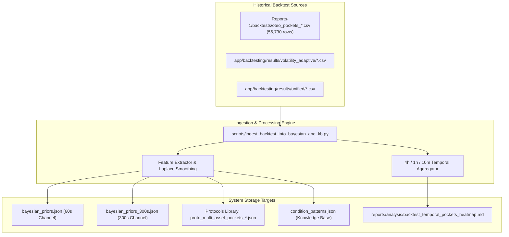

# Implementation Plan: Mining CLI Multi-Asset & Multi-Timeframe Backtest Data into Bayesian Priors & Knowledge Base

**Date:** 2026-08-18  
**Document Target:** `Dev_Docs/CLI_Multi_Timeframe_Backtest_Mining_and_Temporal_Pockets_Plan_26-08-18.md`  
**System Target:** OTC SNIPER v3 — Bayesian Engine, Knowledge Base & Temporal Microstructure Pockets  
**Status:** PROPOSED & READY FOR EXECUTION

---

## 1. Objectives & Scope

1. **Ingest Multi-Month Historical Backtest Results**: Extract and process **56,730+ trade simulation rows** from `Reports-1/backtests/oteo_pockets_backtest_*.csv` and `app/backtesting/results/`.
2. **Explicit Expiry Partitioning**:
   - **Short-Term Horizon Channel (15s – 60s)** $\rightarrow$ Populate `bayesian_priors.json`.
   - **Macro Horizon Channel (120s – 300s)** $\rightarrow$ Populate `bayesian_priors_300s.json`.
3. **Microstructure & Regime Feature Engineering**:
   - Encode `Vol:LOW|HIGH`, `Liq:LOW|HIGH`, `Manip:LOW|MED|HIGH`, and `adx_regime`.
4. **Temporal Slicing & Weekly Heatmap Generation**:
   - 4-hour macro session blocks (`utc_4hour_offset: 0..5`).
   - 1-hour timezone blocks (`utc_hour_offset: 0..23`).
   - 10-minute intra-hour intervals (`utc_10m_slice: 0..5` $\rightarrow$ `:00-:10`, `:10-:20`, `:20-:30`, `:30-:40`, `:40-:50`, `:50-:00`).
   - Day of Week (`dow: MON..FRI`).
5. **Knowledge Base Enrichment**:
   - Append high-confidence condition patterns ($N \ge 20, \text{WR} \ge 54.0\%$) into `reports/analysis/knowledge_base/condition_patterns.json`.
6. **Protocol Snapshots Creation**:
   - Save production-ready protocols in `app/data/ghost_trades/stats/protocols/` with `READY` health rating.

---

## 2. Architecture & File Mapping



---

## 3. Phased Execution Roadmap

### Phase 1: Ingestion Script Construction (`scripts/ingest_backtest_into_bayesian_and_kb.py`)
* Build CLI script with arguments: `--dry-run`, `--min-sample-size`, `--winrate-threshold`, `--export-protocols`.
* Parse CSV columns: `entry_time`, `asset`, `direction`, `expiry_seconds`, `outcome`, `pocket_state`, `vol_level`, `liq_level`, `manip_level`, `utc_hour_offset`, `utc_4hour_offset`, `adx_regime`.
* Calculate `utc_10m_slice = (minute // 10)` and `day_of_week`.

### Phase 2: Dual-Horizon Bayesian Priors Seeding
* Calculate feature likelihood frequencies for:
  - `oteo_band=<65 | 65-74 | 75-84 | 85-92 | 93+`
  - `regime=RANGE_BOUND | STRONG_MOMENTUM | TREND_PULLBACK | TREND_REVERSAL | BREAKOUT | CHOPPY`
  - `has_manip=MANIP_TRUE | MANIP_FALSE`
  - `pocket_vol=LOW | MEDIUM | HIGH`
  - `pocket_liq=LOW | MEDIUM | HIGH`
  - `pocket_manip=LOW | MEDIUM | HIGH`
  - `direction=CALL | PUT`
  - `utc_4h_block=0..5`
  - `utc_10m_slice=0..5`
* Atomically update `app/data/ghost_trades/stats/bayesian_priors.json` (for 60s) and `bayesian_priors_300s.json` (for 300s).
* Generate named protocol snapshots in `app/data/ghost_trades/stats/protocols/`.

### Phase 3: Knowledge Base Pattern Generation
* Cluster high-expectancy rule combinations:
  - Favorable conditions: Win Rate $\ge 54.0\%$ and $N \ge 20$.
  - Avoidance conditions: Win Rate $\le 45.0\%$ and $N \ge 20$.
* Merge into `reports/analysis/knowledge_base/condition_patterns.json` with transactional `.bak` backup.

### Phase 4: Temporal Heatmap Matrix Compilation
* Compute aggregate performance across:
  - Matrix A: **Day of Week $\times$ 4-Hour Macro Block**
  - Matrix B: **Hour of Day (0–23) $\times$ 10-Minute Intra-Hour Slice (0–5)**
* Output structured Markdown report with visual indicators:
  `reports/analysis/backtest_temporal_pockets_heatmap.md`.

---

## 4. Verification & Validation Protocol

1. **Unit Test Suite**:
   ```bash
   conda run -n QuFLX-v2 python -m pytest tests/test_bayesian_signal_filter.py tests/test_vps_phase4_prior_store.py tests/test_journal_stats_service.py -v
   ```
2. **Schema & Integrity Verification**:
   - Check JSON structure and valid Laplace probabilities across all feature keys.
   - Confirm protocol files in `app/data/ghost_trades/stats/protocols/` report `READY` health.
3. **Frontend Compatibility Check**:
   - Run `npm --prefix app/frontend run build` to verify protocol manager and journal interfaces load the enriched priors without syntax or render errors.
