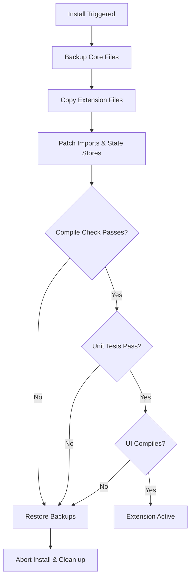

# OTC SNIPER v3 – Plugin Layer Architecture Specification

This document details the architectural specification for introducing a modular **Plugin and Extension Layer** in the OTC SNIPER v3 platform. 

The primary objective is to allow advanced indicators, specialized risk controls, and custom strategies (such as the **Hurst Exponent & Volatility Gates**) to be developed, packaged, and installed as self-contained modules without directly modifying or risking the stability of core Level 1/2 OTEO systems.

---

## 1. Core Objectives
1. **Decouple Experimental Code:** Prevent experimental mathematical calculations (e.g., rescaled range calculations) from introducing regressions or CPU latency to core paths.
2. **Standardize Interceptors (Hooks):** Provide clean, hook-based lifecycle callbacks in both the backend streaming pipeline and the backend trade execution manager.
3. **Pluggable Capital Protection:** Allow advanced gates to inspect and block/veto signals independently of the active strategy level.
4. **Clean Rollbacks:** Enforce a strict "atomic installation" protocol where any compile-time or testing failure results in a complete restore of original source files.

---

## 2. Backend Extension Lifecycle & Hooks

The backend plugin layer operates via an `ExtensionManager` registry class. The manager discovers active plugins from the `app/backend/services/extensions/` directory and exposes standard lifecycle hooks.

### 2.1 Extension Interface Definition
All backend extensions must inherit from the `BaseExtension` class:

```python
# app/backend/services/extensions/base.py
from typing import Any, Dict, Tuple

class BaseExtension:
    """Base class for all OTC SNIPER backend plugins."""
    
    def __init__(self, settings: Dict[str, Any]):
        self.settings = settings
        self.enabled = settings.get("enabled", False)

    def on_tick_processed(
        self, 
        asset: str, 
        price: float, 
        timestamp: float, 
        oteo_result: Dict[str, Any], 
        market_context: Dict[str, Any]
    ) -> Dict[str, Any]:
        """
        Intercepts ticks immediately after OTEO/Level 2/Level 3 calculation.
        Allows plugins to append telemetry data or modify the oteo_score before emission.
        """
        return oteo_result

    def on_candle_closed(
        self, 
        asset: str, 
        closed_candle: Any, 
        market_context: Dict[str, Any]
    ) -> Dict[str, Any]:
        """
        Lifecycle hook fired when a 60s bar closes. 
        Ideal for slow, CPU-heavy indicators (e.g., Hurst R/S) to avoid tick-by-tick lag.
        """
        return {}

    def on_consider_signal(
        self, 
        asset: str, 
        price: float, 
        oteo_result: Dict[str, Any], 
        config: Any
    ) -> Tuple[bool, str | None]:
        """
        Veto Gate hook evaluated inside the Auto-Ghost trade processor.
        Returns:
            - True, None: Allow execution.
            - False, "reason": Suppress trade execution and record reject reason.
        """
        return True, None
```

### 2.2 Integration Points in Backend Core
The hooks are triggered in the following files:

#### A. In `streaming.py` (Tick Enrichment & Candle Close)
Inside `StreamingService._process_tick_inner`:
```python
# 1. Immediately after L2/L3 policies are calculated
for ext in self.extension_manager.get_active_extensions():
    oteo_result = ext.on_tick_processed(asset, price, timestamp, oteo_result, market_context)

# 2. Inside the candle close block (every 60s)
if candle_closed:
    for ext in self.extension_manager.get_active_extensions():
        ext.on_candle_closed(asset, self._current_candle, market_context)
```

#### B. In `auto_ghost.py` (Trade Execution Veto Gates)
Inside `AutoGhostService.consider_signal`:
```python
# Evaluate registered plugin gates
for ext in self.extension_manager.get_active_extensions():
    allowed, reject_reason = ext.on_consider_signal(asset, price, oteo_result, self.config)
    if not allowed:
        logger.info(f"Auto-Ghost trade on {asset} blocked by extension {ext.__class__.__name__}: {reject_reason}")
        return self._reject(asset, reject_reason)
```

---

## 3. Frontend Extension Slots

To support user-friendly adjustments, the frontend must dynamically register controls. Since Zustand store properties are static, the platform exposes a **Config Ingestion Schema**.

```
┌─────────────────────────────────────────────────────────────┐
│                 Zustand store schema                        │
│  useSettingsStore.js ◄─── Injected state configuration      │
└──────────────┬──────────────────────────────────────────────┘
               │
               ▼ (Loads UI layout variables)
┌─────────────────────────────────────────────────────────────┐
│                 GhostTradingWidget.jsx                      │
│  Loads <HurstVolatilitySettings /> inside advanced tab       │
└─────────────────────────────────────────────────────────────┘
```

### 3.1 Zustand Hook Extensions
The package installer inserts configuration defaults into `app/frontend/src/stores/useSettingsStore.js`:
```javascript
const defaultSettings = {
  // Core parameters...
  
  // Extension Fields Injected:
  extension_hurst_enabled: true,
  extension_hurst_min_reversal: 0.45,
  extension_volatility_enabled: true,
  extension_volatility_min_trade: 0.15
};
```

---

## 4. Manifest & Package Specification

A plugin is packaged as a standard compressed directory. It must include a `manifest.json` describing metadata and placement locations.

### 4.1 manifest.json Schema Example
```json
{
  "name": "Hurst & Volatility Gates",
  "version": "1.0.0",
  "identifier": "hurst_volatility_gates",
  "description": "Appends Hurst Exponent memory classification and Normalized Volatility gates to the execution pipeline.",
  "backend": {
    "module_file": "backend/hurst_volatility.py",
    "target_destination": "app/backend/services/extensions/hurst_volatility.py",
    "hooks_required": ["on_tick_processed", "on_candle_closed", "on_consider_signal"]
  },
  "frontend": {
    "settings_component": "frontend/HurstVolatilitySettings.jsx",
    "target_destination": "app/frontend/src/components/extensions/HurstVolatilitySettings.jsx",
    "ui_mount_point": "app/frontend/src/components/trading/GhostTradingWidget.jsx",
    "ui_mount_anchor": "{/* EXTENSION_SETTINGS_SLOT */}"
  }
}
```

---

## 5. Automated Installation & Safety Protocol (`install.py`)

A packaging system is only as good as its safety rails. The Python script `install.py` packaged inside the extension enforces atomic installations:

### 5.1 Verification Checklist
The installer runs these checks sequentially:
1. **Pre-Checks:** Confirms that Vite and Conda/Python are accessible.
2. **Backup Phase:** Takes snapshot copies of all target source files.
3. **AST Ingestion:** Modifies backend python classes using Abstract Syntax Tree (AST) parsing or regex insertion markers (e.g. `# REGISTER_EXTENSIONS_HERE`).
4. **Compile Check:** Executes `python -m py_compile` to ensure Python syntax remains valid.
5. **Unit-Test Loop:** Triggers `pytest test_auto_ghost.py` to verify Level 1/2 OTEO math is not altered.
6. **Frontend Build Check:** Runs `npm --prefix app/frontend run build` to verify Webpack/Vite compiles successfully.



### 5.2 Rollback Function
```python
def rollback(backups: dict):
    print("WARNING: Installation failed verification checks. Restoring system state...")
    for original_path, backup_path in backups.items():
        if backup_path.exists():
            shutil.copy2(backup_path, original_path)
            print(f"Restored: {original_path.name}")
    print("Rollback complete. Core systems are unaffected.")
```

Using this architecture, the **Hurst Exponent & Volatility Gates** proposal can be deployed safely as an optional, download-ready ZIP package.
