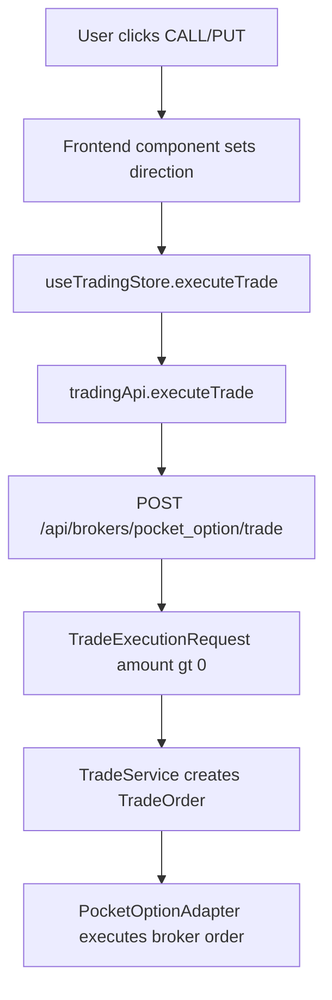
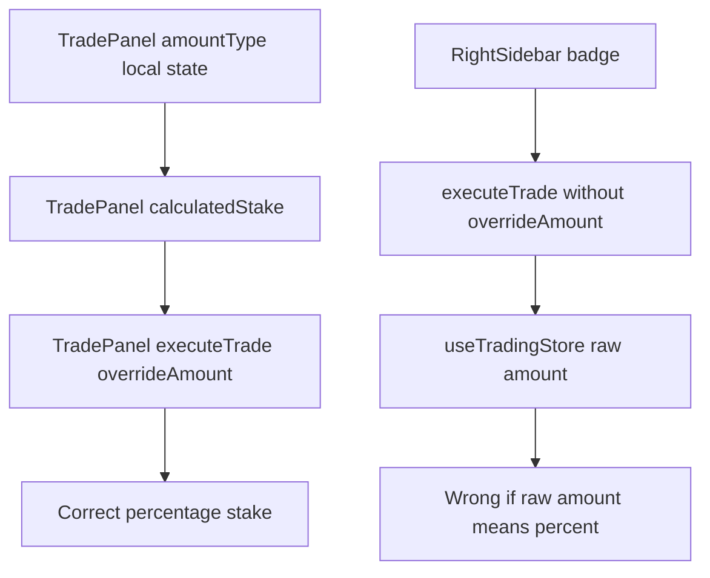
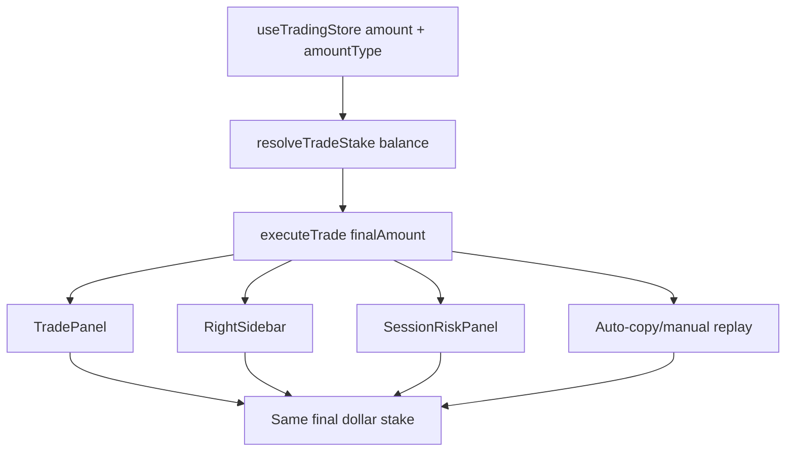

# OTC SNIPER v3 — Percentage Amount Fix Implementation Plan

**Date:** 2026-05-13  
**Status:** Plan — Awaiting explicit approval before implementation  
**Compiled by:** @Investigator, @Reviewer, @Optimizer  
**Implementation owner:** @Coder  
**Review protocol:** `.clinerules/PHASE_REVIEW_PROTOCOL.md`  
**Scope:** Fix percentage-based manual trade sizing so every execution surface resolves the same final dollar stake, including the `RightSidebar.jsx` Call/Put target badges.

---

## 1. Executive Summary

The current percentage trade-sizing behavior is **partially correct but not systemically correct**.

The main `TradePanel.jsx` CALL/PUT buttons correctly convert percentage input into a concrete dollar stake before calling `useTradingStore.executeTrade(...)`. However, the `RightSidebar.jsx` Call/Put target badges call `executeTrade('pocket_option', selectedAsset)` without passing a calculated stake. Because `amountType` is local state inside `TradePanel.jsx`, those sidebar badges have no way to know whether the raw `amount` in `useTradingStore` represents dollars or percent.

This creates a live execution mismatch:

```text
Example:
Balance = $1,000
TradePanel amount = 5
TradePanel amount type = %

Expected stake from every execution surface = $50.00
Current main TradePanel buttons = $50.00 ✅
Current RightSidebar badges = $5.00 ❌
Current SessionRiskPanel action cards = $5.00 ❌
```

The recommended fix is to move trade amount mode and stake resolution into the trading store as the single source of truth. This makes all no-override execution calls resolve the correct final dollar stake automatically.

---

## 2. Goal, Deliverables, Success Criteria, and Constraints

### Goal

Ensure percentage-based trade execution is **100% consistent** across all manual execution surfaces:

- Main `TradePanel.jsx` CALL/PUT buttons
- `RightSidebar.jsx` Call/Put target indicator badges
- `SessionRiskPanel.jsx` action cards
- Auto-copy/manual replay calls that use `useTradingStore.executeTrade(...)` without an override

### Deliverables

| Deliverable | Type | Description |
|---|---|---|
| Canonical amount mode | Frontend store change | Move `amountType` from local component state into `useTradingStore.js`. |
| Canonical stake resolver | Frontend store/helper change | Add one validated O(1) resolver that converts `$` or `%` into final dollar stake. |
| Execution path update | Frontend store change | Make `executeTrade(...)` resolve stake internally when `overrideAmount` is not provided. |
| UI updates | Frontend component changes | Update `TradePanel.jsx`, `RightSidebar.jsx`, and `SessionRiskPanel.jsx` to share the same sizing contract. |
| Cleanup | Frontend component cleanup | Remove unused imports/dead components discovered during review. |
| Validation | Build/manual checks | Run frontend build and verify payload amounts for dollar and percentage modes. |

### Success Criteria

- [ ] With balance `$1,000`, amount `5`, and amount type `%`, every manual execution surface submits `amount: 50`.
- [ ] With amount `20` and amount type `$`, every manual execution surface submits `amount: 20`.
- [ ] `RightSidebar.jsx` Call/Put target badges remain **indicator badges** for distance-to-target and distance-to-limit; their displayed values are not used as stake.
- [ ] Backend API contract remains unchanged: `TradeExecutionRequest.amount` is still a positive final dollar amount.
- [ ] Frontend build passes with zero errors.
- [ ] No silent validation failures are introduced; invalid amount mode fails fast.

### Constraints

- No backend percentage support should be added. The backend correctly expects a resolved dollar stake.
- No breaking API changes to `/api/brokers/{broker}/trade`.
- No change to risk target/limit display semantics.
- Follow `CORE_PRINCIPLES.md`, especially:
  - #1 Functional Simplicity
  - #3 Incremental Testing
  - #6 Strict Separation of Concerns
  - #8 Defensive Error Handling
  - #9 Fail Fast, Fail Loud, Fail Predictably

---

## 3. Architecture Context

### Current manual trade flow



### Current sizing flaw



### Target sizing flow



---

## 4. Current State Map

| Area | File | Current State | Assessment |
|---|---|---|---|
| Amount input | `app/frontend/src/components/trading/TradePanel.jsx` | Stores `amountType` in local `useState('$')`. | Works only inside this component. |
| Percentage conversion | `app/frontend/src/components/trading/TradePanel.jsx` | Calculates `balance * percent / 100` and passes as `overrideAmount`. | Locally correct. |
| Trade execution store | `app/frontend/src/stores/useTradingStore.js` | Uses `overrideAmount` when provided; otherwise uses raw `amount`. | Correct for dollar mode, incorrect for no-override percentage calls. |
| RightSidebar badges | `app/frontend/src/components/layout/RightSidebar.jsx` | Calls `executeTrade('pocket_option', selectedAsset)` with no override amount. | Bug: raw percent is treated as dollars. |
| SessionRiskPanel cards | `app/frontend/src/components/risk/SessionRiskPanel.jsx` | Calls `executeTrade('pocket_option', selectedAsset)` with no override amount. | Same bug as RightSidebar. |
| Backend request model | `app/backend/models/requests.py` | `amount: float = Field(gt=0)`. | Correct final-stake contract. |
| Broker order model | `app/backend/brokers/base.py` | `TradeOrder.amount: float`. | Correct final-stake contract. |

---

## 5. Forensic Evidence

### 5.1 `TradePanel.jsx` is locally correct

**File:** `app/frontend/src/components/trading/TradePanel.jsx`  
**Lines:** 38–45

```jsx
const calculatedStake = useMemo(() => {
  if (amountType === '$') return parsedAmount;
  if (amountType === '%') {
    const bal = Number(balance) || 0;
    return Number((bal * (parsedAmount / 100)).toFixed(2));
  }
  return 0;
}, [amountType, parsedAmount, balance]);
```

**File:** `app/frontend/src/components/trading/TradePanel.jsx`  
**Lines:** 54–58

```jsx
async function handleExecute(direction) {
  if (!sessionConnected || isExecuting || calculatedStake <= 0 || parsedDuration <= 0) return;
  setDirection(direction);
  await executeTrade(broker, selectedAsset, calculatedStake);
}
```

**Assessment:** The main trading panel correctly passes a calculated dollar stake.

---

### 5.2 `RightSidebar.jsx` bypasses percentage conversion

**File:** `app/frontend/src/components/layout/RightSidebar.jsx`  
**Lines:** 118–121

```jsx
onAction={() => {
  setDirection('call');
  executeTrade('pocket_option', selectedAsset);
}}
```

**File:** `app/frontend/src/components/layout/RightSidebar.jsx`  
**Lines:** 129–132

```jsx
onAction={() => {
  setDirection('put');
  executeTrade('pocket_option', selectedAsset);
}}
```

**Assessment:** These no-override calls are incorrect when the global raw amount represents a percentage.

---

### 5.3 `useTradingStore.js` falls back to raw amount

**File:** `app/frontend/src/stores/useTradingStore.js`  
**Lines:** 82–85

```js
executeTrade: async (broker, asset, overrideAmount = null) => {
  const { amount, direction, duration } = get();
  const finalAmount = overrideAmount !== null ? overrideAmount : amount;
  const validationError = validateTradeRequest(asset, finalAmount, duration);
```

**Assessment:** The store already has a useful override escape hatch, but it lacks canonical knowledge of amount type and balance-based stake resolution.

---

### 5.4 Backend expects final dollar amount and should remain unchanged

**File:** `app/backend/models/requests.py`  
**Lines:** 12–16

```python
class TradeExecutionRequest(BaseModel):
    asset_id: str = Field(min_length=1)
    direction: str = Field(min_length=1)
    amount: float = Field(gt=0)
    expiration: int = Field(gt=0)
```

**File:** `app/backend/services/trade_service.py`  
**Lines:** 279–284

```python
order = TradeOrder(
    asset_id=request.asset_id,
    direction=request.direction,
    amount=request.amount,
    expiration=request.expiration,
    broker=broker_type,
)
```

**Assessment:** The backend contract is correct. The bug is frontend stake resolution before payload submission.

---

## 6. @Reviewer Assessment

**Status:** ⚠️ Blocking logic issue for percentage execution consistency.

### Strengths

- Backend validation is clean and explicit: `amount` must be positive.
- Main `TradePanel.jsx` has a clear guard for connected session, execution state, stake, and duration.
- `useTradingStore.executeTrade(...)` centralizes API submission, trade error state, and toast feedback.
- Failed broker responses are already surfaced to the user.

### Issues

| Severity | Issue | File(s) | Recommendation |
|---|---|---|---|
| HIGH | RightSidebar percentage execution mismatch | `RightSidebar.jsx`, `useTradingStore.js` | Move stake resolution into `useTradingStore.js`. |
| HIGH | Amount mode is component-local state | `TradePanel.jsx` | Store `amountType` centrally. |
| MEDIUM | SessionRiskPanel has same no-override bug | `SessionRiskPanel.jsx` | Let store resolve final stake for no-override calls. |
| MEDIUM | Execution badges are always clickable | `RightSidebar.jsx`, `SessionRiskPanel.jsx` | Add disabled/fail-fast UI state where practical. |
| LOW | Dead code/unused imports | `TradePanel.jsx`, `RightSidebar.jsx` | Remove during cleanup phase. |

### @Reviewer recommendation to @Coder

@Coder should implement a store-level canonical sizing contract and then update all manual execution surfaces to consume it. This prevents future UI buttons from repeating the same percentage sizing bug.

---

## 7. @Optimizer Assessment

**Status:** ⚠️ No runtime performance bottleneck; structural duplication is the problem.

### Complexity

| Operation | Current Complexity | Target Complexity | Notes |
|---|---:|---:|---|
| Dollar amount resolution | O(1) | O(1) | No change. |
| Percentage amount resolution | O(1) | O(1) | No performance concern. |
| Store getter / helper call | O(1) | O(1) | Negligible. |

### Optimization finding

The current calculation is cheap, but its placement is inefficient from an architecture standpoint. The percentage calculation is trapped inside one component while execution exists in multiple components.

### @Optimizer recommendation to @Coder

Prefer a single store-level resolver over component-level repeated calculations. This preserves O(1) runtime behavior while eliminating drift risk.

---

## 8. Implementation Phases

### Phase 0 — Documentation and Approval Gate

**Status:** [~] Current phase — plan created, awaiting implementation approval  
**Owner:** @Investigator / @Reviewer / @Optimizer  
**Files:** `Dev_Docs/Percentage_Amount_Fix_Implementation_Plan_2026-05-13.md`

#### Tasks

- [x] Document root cause and blast radius.
- [x] Capture @Reviewer and @Optimizer assessment.
- [x] Define implementation phases and verification criteria.
- [ ] Await explicit approval before code changes.

---

### Phase A — Canonical Store-Level Sizing Contract

**Priority:** HIGHEST  
**Owner:** @Coder  
**Files:** `app/frontend/src/stores/useTradingStore.js`

#### A.1 — Add amount type to trading store

```js
amountType: '$', // '$' | '%'

setAmountType: (amountType) => {
  if (!['$', '%'].includes(amountType)) {
    throw new Error(`Invalid trade amount type: ${amountType}`);
  }
  set({ amountType });
},
```

#### A.2 — Add canonical stake resolver

```js
function resolveTradeStake({ amount, amountType, balance }) {
  const parsedAmount = Number(amount);
  if (!Number.isFinite(parsedAmount) || parsedAmount <= 0) return 0;

  if (amountType === '$') {
    return Number(parsedAmount.toFixed(2));
  }

  if (amountType === '%') {
    const parsedBalance = Number(balance);
    if (!Number.isFinite(parsedBalance) || parsedBalance <= 0) return 0;
    return Number((parsedBalance * (parsedAmount / 100)).toFixed(2));
  }

  throw new Error(`Invalid trade amount type: ${amountType}`);
}
```

#### A.3 — Resolve final amount inside `executeTrade(...)`

```js
executeTrade: async (broker, asset, overrideAmount = null) => {
  const { amount, amountType, direction, duration } = get();
  const finalAmount = overrideAmount !== null
    ? Number(overrideAmount)
    : resolveTradeStake({
        amount,
        amountType,
        balance: useOpsStore.getState().balance,
      });

  const validationError = validateTradeRequest(asset, finalAmount, duration);
  // existing flow continues...
}
```

#### Phase A Acceptance Criteria

- [ ] `useTradingStore` owns `amountType`.
- [ ] Invalid `amountType` fails fast.
- [ ] No-override `executeTrade(...)` resolves percentage amounts using live account balance.
- [ ] Override behavior remains backward-compatible.

---

### Phase B — Update `TradePanel.jsx` to Use Store Sizing

**Priority:** HIGH  
**Owner:** @Coder  
**Files:** `app/frontend/src/components/trading/TradePanel.jsx`

#### B.1 — Remove local `amountType` state

Replace:

```jsx
const [amountType, setAmountType] = useState('$');
```

With store-owned state:

```jsx
const {
  amount,
  amountType,
  duration,
  isExecuting,
  tradeError,
  setAmount,
  setAmountType,
  setDuration,
  setDirection,
  executeTrade,
} = useTradingStore();
```

#### B.2 — Keep the percentage preview

`TradePanel.jsx` should still display:

```text
= $calculatedStake
```

But that preview should use the same store-level resolver or the same resolver logic exported from the store module.

#### B.3 — Preserve explicit override or allow store resolution

Either option is acceptable:

1. Keep passing `calculatedStake` as override from `TradePanel`; or
2. Let `executeTrade(...)` resolve internally.

**Preferred:** Let `executeTrade(...)` resolve internally so the main panel uses the same path as RightSidebar and SessionRiskPanel.

#### Phase B Acceptance Criteria

- [ ] TradePanel dollar mode still executes exact dollar amount.
- [ ] TradePanel percent mode still previews exact resolved dollar stake.
- [ ] TradePanel percent mode still executes exact resolved dollar stake.
- [ ] No duplicate amount type state remains.

---

### Phase C — Update Secondary Execution Surfaces

**Priority:** HIGH  
**Owner:** @Coder  
**Files:**

- `app/frontend/src/components/layout/RightSidebar.jsx`
- `app/frontend/src/components/risk/SessionRiskPanel.jsx`

#### C.1 — RightSidebar Call/Put badges

Keep the display semantics:

```jsx
value={`$${Math.max(0, metrics.takeProfitTarget - currentBalance).toFixed(2)}`}
```

But rely on store-level sizing when executing:

```jsx
onAction={() => {
  setDirection('call');
  void executeTrade('pocket_option', selectedAsset);
}}
```

Because Phase A makes no-override execution safe, this call becomes correct for both `$` and `%` modes.

#### C.2 — SessionRiskPanel action cards

Same approach as RightSidebar. No component-level stake calculation should be duplicated.

#### C.3 — Add fail-fast disabled state where practical

Recommended props for action card components:

```jsx
disabled={!canExecuteTrade}
```

Recommended `canExecuteTrade` dependencies:

- session connected
- not already executing
- resolved stake > 0
- duration > 0
- selected asset exists

#### Phase C Acceptance Criteria

- [ ] RightSidebar CALL badge executes resolved percentage stake.
- [ ] RightSidebar PUT badge executes resolved percentage stake.
- [ ] SessionRiskPanel CALL action executes resolved percentage stake.
- [ ] SessionRiskPanel PUT action executes resolved percentage stake.
- [ ] Badge display values remain target/limit distances and are not treated as trade stake.

---

### Phase D — Cleanup and Maintainability Pass

**Priority:** MEDIUM  
**Owner:** @Coder / @Code_Simplifier  
**Files:**

- `app/frontend/src/components/trading/TradePanel.jsx`
- `app/frontend/src/components/layout/RightSidebar.jsx`

#### D.1 — Remove unused code

Known cleanup candidates:

| File | Cleanup |
|---|---|
| `TradePanel.jsx` | Remove unused `Ghost` import. |
| `TradePanel.jsx` | Remove unused `ghostAmount` read from `useSettingsStore()`. |
| `RightSidebar.jsx` | Remove unused `MetricCard` component if no longer referenced. |

#### D.2 — Keep components simple

Do not introduce a new React context or new UI library. The fix should remain within existing Zustand/store patterns.

#### Phase D Acceptance Criteria

- [ ] No unused imports in touched files.
- [ ] No unused local state for amount type.
- [ ] No dead UI component definitions in touched files.

---

### Phase E — Validation and Phase-Gate Review

**Priority:** HIGHEST after implementation  
**Owner:** @Tester / @Reviewer  
**Files:** all touched frontend files

#### E.1 — Build validation

```powershell
npm --prefix C:\v3\OTC_SNIPER\app\frontend run build
```

#### E.2 — Manual payload verification

Use browser DevTools Network tab or backend logs to confirm submitted payloads.

| Scenario | Balance | Amount Input | Amount Type | Expected Payload `amount` |
|---|---:|---:|---|---:|
| Dollar main panel | `$1,000` | `20` | `$` | `20` |
| Percent main panel | `$1,000` | `5` | `%` | `50` |
| Percent RightSidebar CALL | `$1,000` | `5` | `%` | `50` |
| Percent RightSidebar PUT | `$1,000` | `5` | `%` | `50` |
| Percent SessionRiskPanel CALL | `$1,000` | `5` | `%` | `50` |
| Percent SessionRiskPanel PUT | `$1,000` | `5` | `%` | `50` |

#### E.3 — Mandatory @Reviewer phase gate

Per `.clinerules/PHASE_REVIEW_PROTOCOL.md`, after implementation:

> `"Phase Percentage Amount Fix completed. Perform full incremental review."`

@Reviewer must verify:

- Correctness of amount resolution
- Readability and maintainability
- No silent failures
- Fail-fast validation for invalid amount type
- No regression to dollar mode
- Build/test status

---

## 9. Files Touched Summary

### Planned modifications

| File | Action | Purpose |
|---|---|---|
| `app/frontend/src/stores/useTradingStore.js` | MODIFY | Add `amountType`, `setAmountType`, canonical stake resolver, and internal no-override stake resolution. |
| `app/frontend/src/components/trading/TradePanel.jsx` | MODIFY | Use store-owned amount type and shared stake resolution; remove local amount mode state. |
| `app/frontend/src/components/layout/RightSidebar.jsx` | MODIFY | Ensure Call/Put badges execute store-resolved stake; add optional disabled state; remove dead `MetricCard`. |
| `app/frontend/src/components/risk/SessionRiskPanel.jsx` | MODIFY | Ensure action cards execute store-resolved stake. |

### Files explicitly not touched

| File | Reason |
|---|---|
| `app/backend/models/requests.py` | Backend already correctly validates final stake with `amount > 0`. |
| `app/backend/services/trade_service.py` | Trade service already passes final amount to `TradeOrder`. |
| `app/backend/brokers/base.py` | Broker abstraction already models amount as final stake. |
| `app/backend/brokers/pocket_option/adapter.py` | Adapter correctly receives final order amount. |
| `app/frontend/src/utils/riskMath.js` | Risk target/limit math is separate from trade-entry amount resolution. |

---

## 10. Risk Assessment

| Risk | Likelihood | Impact | Mitigation |
|---|---:|---:|---|
| Store-level change affects all manual trades | Medium | High | Keep override path backward-compatible and validate via dollar + percent scenarios. |
| Percent mode uses stale or zero balance | Medium | Medium | Resolver returns `0` for invalid balance, store validation blocks trade with user-facing error. |
| RightSidebar display values confused with stake | Low | High | Explicitly keep displayed values as target/limit distances; stake comes only from resolver. |
| Invalid amount type silently falls back | Low | Medium | Throw fail-fast error in setter/resolver for invalid amount type. |
| Build regression from component changes | Low | Medium | Run frontend build after implementation. |
| Future execution button bypasses sizing | Low after fix | High | Central store resolver makes no-override calls safe by default. |

---

## 11. Risk Forecast — What Breaks If Ignored

| If Ignored | Consequence |
|---|---|
| RightSidebar remains unpatched | Users can execute live trades at wrong stake size from the target badges. |
| Amount type remains local to TradePanel | Every future execution surface can repeat the same bug. |
| SessionRiskPanel remains unpatched | Risk Manager actions will still under-size or mis-size percent-mode trades. |
| No fail-fast sizing contract | Invalid amount state may reach API boundary as confusing trade rejection. |
| Analytics consume wrong stake | Trade history, P/L, risk runs, and win-rate analytics become unreliable. |

---

## 12. Verification Checklist

### Static / build verification

- [ ] Frontend build passes: `npm --prefix C:\v3\OTC_SNIPER\app\frontend run build`
- [ ] No unused imports in modified files.
- [ ] No duplicate amount mode state.
- [ ] No backend API contract changes.

### Functional verification

- [ ] `$` mode executes raw amount as dollar stake.
- [ ] `%` mode executes calculated dollar stake in `TradePanel.jsx`.
- [ ] `%` mode executes calculated dollar stake in `RightSidebar.jsx`.
- [ ] `%` mode executes calculated dollar stake in `SessionRiskPanel.jsx`.
- [ ] Invalid amount, invalid duration, missing asset, or disconnected session produces clear user-facing error.

### Regression verification

- [ ] Existing live/demo account flag behavior remains unchanged.
- [ ] Existing OTEO signal snapshot capture remains unchanged.
- [ ] Existing trade result Socket.IO handling remains unchanged.
- [ ] Risk target/limit display remains unchanged.

---

## 13. Phase Gate Protocol

Per `.clinerules/PHASE_REVIEW_PROTOCOL.md`:

| Phase | Reviewer Gate | Status |
|---|---|---|
| Phase 0 — Plan | @Reviewer/@Optimizer assessment captured in this document | [~] Plan created; awaiting approval |
| Phase A — Store sizing contract | @Reviewer reviews `useTradingStore.js` | [ ] Pending |
| Phase B — TradePanel update | @Reviewer reviews `TradePanel.jsx` | [ ] Pending |
| Phase C — Secondary surfaces | @Reviewer reviews `RightSidebar.jsx` + `SessionRiskPanel.jsx` | [ ] Pending |
| Phase D — Cleanup | @Code_Simplifier reviews dead code removal | [ ] Pending |
| Phase E — Validation | @Tester runs build/manual payload verification | [ ] Pending |

No implementation phase should be marked complete until review and validation are complete.

---

## 14. Final Recommendation

Proceed with the **store-level canonical sizing approach**.

This is the safest and simplest fix because it makes the default execution path correct. Once implemented, any component that calls:

```js
executeTrade('pocket_option', selectedAsset)
```

will execute the correct final dollar stake in both `$` and `%` modes, while explicit override calls remain supported for specialized cases.

**Recommended next command:** approve implementation and delegate @Coder to begin Phase A.

---

*Plan compiled: 2026-05-13*  
*Source: Read-only forensic assessment of `TradePanel.jsx`, `RightSidebar.jsx`, `SessionRiskPanel.jsx`, `useTradingStore.js`, frontend API flow, and backend trade request contract.*