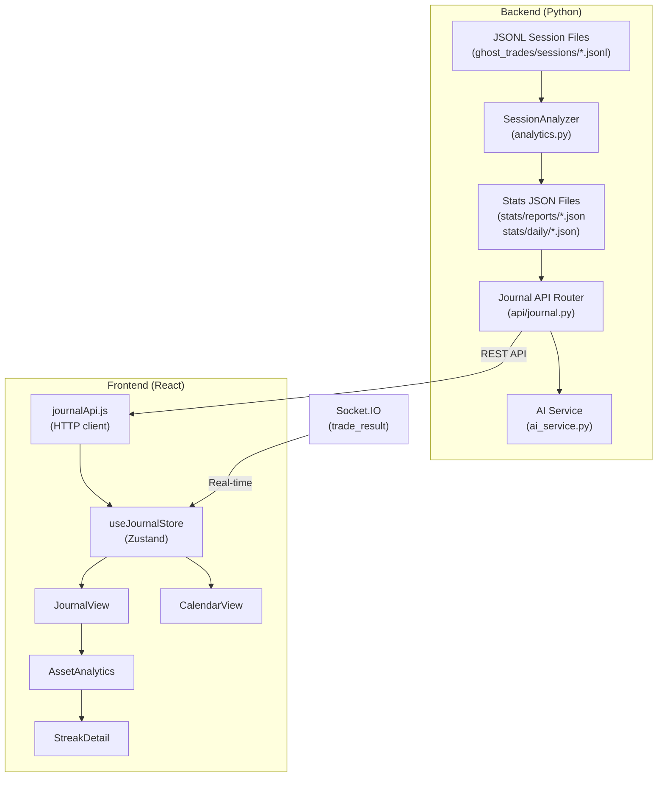

# Trading Journal — Full Implementation Plan

## Context

The `JournalView` needs a major upgrade to surface the rich data already being stored in the backend (66 ghost sessions, ~4,968 trades across `app/data/ghost_trades/sessions/`). The `stats/` directories in both `ghost_trades/` and `live_trades/` exist but are currently **empty and unused**.

---

## Answers to Your Questions

### What will the reports entail?

Each **Session Report** (auto-generated when a session ends or on demand) will be a structured JSON document containing:

```
SessionReport {
  session_id, kind (ghost/live), date_range,
  
  // Core metrics
  total_trades, wins, losses, voids, win_rate, net_pnl,
  avg_trade_pnl, best_trade, worst_trade, avg_payout_pct,
  session_duration_seconds,
  
  // Asset breakdown
  per_asset_stats: [{ asset, trades, wins, losses, win_rate, net_pnl, avg_oteo_score, manipulation_count }],
  
  // Streak data
  streaks: [{ type (win/loss), length, trades: [...], start_time, end_time }],
  max_win_streak, max_loss_streak,
  
  // OTEO efficiency
  oteo_buckets: [{ range, count, wins, win_rate }],
  
  // Risk metrics
  max_drawdown, peak_equity, equity_curve_points: [...],
  
  // AI analysis (optional, generated on request)
  ai_summary: null | string,
  ai_streak_explanations: [{ streak_index, explanation }]
}
```

Each **Daily Summary** (for the calendar) will be:

```
DailySummary {
  date,
  ghost_sessions: [{ session_id, trades, win_rate, pnl }],
  live_sessions: [{ session_id, trades, win_rate, pnl }],
  combined_pnl, combined_win_rate, total_trades,
  ai_analysis: null | string  // generated on demand
}
```

### Should we save to the `stats/` folders?

**Yes — this is exactly what they were scaffolded for.** Here's the recommended structure:

```
app/data/
├── ghost_trades/
│   ├── sessions/       ← raw JSONL (existing, 66 files)
│   └── stats/
│       ├── reports/    ← per-session report JSON files
│       │   └── auto_ghost_1777323498.json
│       └── daily/      ← daily summary JSON files
│           └── 2026-04-28.json
├── live_trades/
│   ├── sessions/       ← raw JSONL (existing, empty)
│   └── stats/
│       ├── reports/    ← per-session report JSON files
│       └── daily/      ← daily summary JSON files
```

> [!IMPORTANT]
> **Why persist stats?** Computing analytics across 4,968+ trades on every frontend page load is wasteful. Pre-computed reports enable instant journal rendering and historical calendar browsing without hammering the JSONL scanner. The raw sessions remain the source of truth; stats are re-generable caches.

---

## Recommendations

### Features I'd ADD

#### 1. **Confidence Calibration Panel** ⭐ HIGH VALUE
Track: "When the backend said HIGH confidence, how often did we actually win?" This directly measures OTEO accuracy. The data is already in every trade record (`confidence` + `outcome`). This is the single most actionable insight for strategy tuning.

```
HIGH  → 72% win rate (89 trades)
MEDIUM → 51% win rate (210 trades)  ← should we even trade these?
LOW   → 38% win rate (44 trades)
```

#### 2. **Time-of-Day Heatmap** ⭐ HIGH VALUE
Show win rate by hour-of-day. OTC assets have known liquidity patterns. The `entry_time` timestamp is already on every trade. This costs almost nothing to compute and reveals when to trade vs. when to stop.

#### 3. **Payout vs. Outcome Correlation**
Track whether higher-payout assets (`payout_pct`) actually produce better net results. The data is already there. Helps answer: "Is the 90% payout asset actually more profitable than the 85% one?"

#### 4. **Session-over-Session Trend**
A sparkline showing net PnL per session over time (your 66 sessions as data points). Instantly reveals whether the strategy is improving or degrading over the past weeks.

### Features I'd SIMPLIFY or REMOVE

#### 1. **"AI explanation for every streak" → make on-demand only**
Generating AI explanations for every win/loss streak on every session load would be expensive (API costs) and slow. **Recommendation:** Show the streak data immediately; add a "🤖 Explain" button per streak that calls the AI on demand. This keeps the journal fast and the AI costs controlled.

#### 2. **Calendar AI analysis → on-demand generation**
Same principle. Pre-generate daily summaries (stats-only, cheap). The AI narrative should be a "Generate Analysis" button, not auto-generated for every day.

---

## User Review Required

> [!IMPORTANT]
> **AI cost control:** Each streak explanation or daily analysis costs an API call to Grok. With 66 sessions × multiple streaks per session, auto-generating all explanations could hit dozens of API calls. Strongly recommend on-demand generation with a clear "Analyze" button.

> [!WARNING]  
> **Phase 1 is a prerequisite.** The current JournalView is fundamentally broken — `OTEOEfficiency` and `TradeHistoryTable` display hardcoded/empty data because the frontend never loads full trade records from the backend. All the new features depend on fixing this data pipeline first.

## Open Questions

1. **Stats persistence:** Should session reports auto-generate when the session ends (backend-driven), or on-demand when the user opens the journal (frontend-triggered)? 
   - **Recommended:** Backend auto-generates on session close + frontend can request regeneration.

2. **Calendar date range:** How far back should the calendar load? All 66 sessions span roughly a month. Should we cap at 90 days and archive older?

3. **Live trades:** There are currently 0 live trade session files. Should the Live Trade tab show a "No live trades yet" empty state, or should we populate it with mock data for development?

4. **Export scope:** Should export cover just the current session, or allow exporting cross-session reports (e.g., "Export all April 2026 ghost trades")?

---

## Proposed Changes — 5 Phases

### Phase 1 — Fix Data Pipeline (PREREQUISITE) 
*Fix the broken foundation before building new features*

---

#### Backend

##### [NEW] `app/backend/services/analytics.py`
- `SessionAnalyzer` class that processes raw JSONL session files into `SessionReport` objects
- Computes: per-asset stats, streaks, OTEO buckets, equity curve, manipulation counts, time-of-day distribution, confidence calibration
- `DailySummaryBuilder` that aggregates session reports into daily summaries
- Write reports to `stats/reports/` and `stats/daily/`

##### [NEW] `app/backend/api/journal.py`
- `GET /api/journal/sessions` → List all session files with metadata (id, kind, trade count, date range, net PnL)
- `GET /api/journal/sessions/{session_id}/report` → Return pre-computed session report (generate on first request if missing)
- `GET /api/journal/sessions/{session_id}/trades` → Return raw trades for a session (with optional filters: asset, outcome, confidence)
- `GET /api/journal/daily?from=YYYY-MM-DD&to=YYYY-MM-DD` → Return daily summaries for calendar
- `POST /api/journal/sessions/{session_id}/ai-explain-streak` → AI explanation for a specific streak
- `POST /api/journal/daily/{date}/ai-analysis` → AI daily analysis on demand

##### [MODIFY] `app/backend/services/trade_service.py`
- Add `oteo_score`, `confidence`, `entry_time`, `direction`, `entry_price`, `strategy_level` to the `trade_result` Socket.IO emission

##### [MODIFY] `app/backend/main.py`
- Mount the new `journal` router
- Optionally trigger report generation when Auto-Ghost session resets

---

#### Frontend

##### [NEW] `app/frontend/src/stores/useJournalStore.js`
- Zustand store for journal state
- `loadSessions()` → fetch session list
- `loadSessionReport(sessionId)` → fetch pre-computed report
- `loadDailySummaries(from, to)` → fetch calendar data
- `activeTab: 'ghost' | 'live'` — tab switcher state
- `selectedSessionId` — for session picker
- Real-time trade ingestion from Socket.IO events

##### [NEW] `app/frontend/src/api/journalApi.js`
- HTTP client functions for all journal endpoints

##### [MODIFY] `app/frontend/src/components/journal/JournalView.jsx`
- Replace `useRiskStore` dependency with `useJournalStore`
- Add Ghost/Live tab switcher
- Add session picker dropdown
- Load session report on mount

##### [MODIFY] `app/frontend/src/components/journal/TradeHistoryTable.jsx`
- Use real `asset`, `direction`, `oteo_score`, `confidence`, `entry_time`, `entry_price` from loaded TradeRecords
- Add Direction column, Confidence column
- Remove hardcoded fallbacks

##### [MODIFY] `app/frontend/src/components/journal/OTEOEfficiency.jsx`
- Will work correctly once trades have real `oteo_score` values

---

### Phase 2 — Asset Analytics
*Your 8 requested analytics panels*

##### [NEW] `app/frontend/src/components/journal/AssetAnalytics.jsx`
Main container with sub-panels:

| # | Panel | Data Source | Notes |
|---|-------|-------------|-------|
| 1 | Highest/Lowest Win Rate | `report.per_asset_stats` sorted by `win_rate` | Top 5 / Bottom 5 assets bar chart |
| 2 | Most Executions + Lowest Wins | `per_asset_stats` sorted by `trades DESC, win_rate ASC` | Highlights assets to AVOID |
| 3 | Most Executions + Highest Wins | `per_asset_stats` sorted by `trades DESC, win_rate DESC` | Highlights BEST assets |
| 4 | Least Manipulated Assets | `per_asset_stats` sorted by `manipulation_count ASC` | Cleanest markets |
| 5 | Most Manipulated Assets | `per_asset_stats` sorted by `manipulation_count DESC` | Most dangerous markets |
| 6 | Losing Streak Duration | `report.streaks.filter(loss)` | Trade count + "🤖 Explain" button |
| 7 | Winning Streak Duration | `report.streaks.filter(win)` | Trade count + "🤖 Explain" button |
| 8 | Total Session Duration | `report.session_duration_seconds` | Formatted as HH:MM:SS |

##### [NEW] `app/frontend/src/components/journal/StreakDetail.jsx`
- Expandable streak card showing: trades in the streak, assets involved, OTEO scores, manipulation flags
- "🤖 Explain This Streak" button → calls `POST /api/journal/sessions/{id}/ai-explain-streak`
- AI response rendered inline below the streak card

---

### Phase 3 — Live Trade Tab

##### [MODIFY] `app/frontend/src/components/journal/JournalView.jsx`
- Add tabbed navigation: **Ghost Trades** | **Live Trades**
- Both tabs share identical component structure (StatCards, AssetAnalytics, TradeHistoryTable, EquityCurve, etc.)
- Tab selection filters to `kind === 'ghost'` or `kind === 'live'`
- Session picker scoped to the active tab's trade kind

##### [MODIFY] `app/frontend/src/stores/useJournalStore.js`
- `activeTab` state ('ghost' | 'live')
- Session list filtered by kind

---

### Phase 4 — Calendar View

##### [NEW] `app/frontend/src/components/journal/CalendarView.jsx`
- Monthly grid (7 columns × 5-6 rows) showing each day
- Each day cell shows: trade count, net PnL (green/red), win rate dot
- Weekly view: horizontal list of 7 days with expanded detail
- Click a day → expand panel showing ghost + live session summaries for that date

##### [NEW] `app/frontend/src/components/journal/DayDetail.jsx`
- Shows all sessions that ran on the selected date
- Combined stats: total trades, win rate, net PnL
- "🤖 Generate Daily Analysis" button → calls `POST /api/journal/daily/{date}/ai-analysis`
- AI response includes: what went well, what went wrong, practical improvement tips
- Persisted to `stats/daily/{date}.json` so it's only generated once

##### [MODIFY] `app/frontend/src/components/journal/JournalView.jsx`
- Add third top-level view toggle: **Session** | **Calendar**

---

### Phase 5 — Filter & Export

##### [MODIFY] `app/frontend/src/components/journal/JournalView.jsx`
- Wire Filter button → popover with: asset, outcome, confidence, OTEO score range, date range
- Wire Export button → CSV download of filtered trades or full session report as JSON

---

## Architecture Diagram



---

## Verification Plan

### Per Phase
| Phase | Verification |
|-------|-------------|
| 1 | `npm run build` passes; open journal tab → trades load with correct asset/OTEO; refresh → data persists |
| 2 | All 8 asset analytics panels show real data; AI streak explanation loads on click |
| 3 | Switch to Live tab → shows empty state or real trades; identical UI to Ghost tab |
| 4 | Calendar renders month grid; click day → shows sessions; AI analysis generates on demand |
| 5 | Filter narrows trade list correctly; Export downloads valid CSV |

### Manual Verification
- Start backend + frontend dev mode
- Enable Auto-Ghost, wait for trades
- Verify journal populates from REST API (not just Socket.IO)
- Verify `stats/reports/` and `stats/daily/` files are created
- Verify browser refresh doesn't lose data
- Verify AI explanations render correctly on demand
