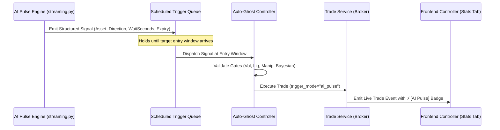

# Technical Assessment & Strategic Architecture Report
**Topic**: AI Advisory Decision Logic, Multi-Layer Memory Integrity, Breakout Regime Integration & AI Pulse Auto-Execution  
**Date**: 2026-08-16  
**Location**: `Reports-1/AI_Advisory_Memory_and_Pulse_Execution_Report_26-08-16.md`  
**Author**: Antigravity Quantitative AI Engineering Team  

---

## 1. Executive Summary

This report delivers a deep technical assessment of four core operational questions regarding the OTC SNIPER v3 system:
1. **AI Advisory Post-Execution Decisions**: Identifying the exact root cause of premature trade rejections driven by noisy, low-sample single-asset historical win rates.
2. **Breakout Regime Integration**: Explaining how the `BREAKOUT` market regime is calculated mathematically in the backend and resolving its omission from the Ghost Protocol frontend settings.
3. **AI Pulse Predictions & Auto-Execution**: Assessing why AI Pulse predictions are currently unrecorded, designing adaptive expiry support, and defining the architecture for automated Ghost Trader execution with distinct visual UI badging (`⚡ [AI Pulse]`).
4. **Smart, Continuous AI Memory & Knowledge Base Lifecycle**: Formalizing a non-destructive learning memory model where priors persist and update across sessions without being wiped or corrupted by unvetted single-trade noise.

---

## 2. Investigation 1: AI Advisory Decision Logic & Asset Bias Elimination

### A. The Forensic Root Cause
When a trade setup is evaluated in `auto_ghost.py` (`_query_ai_confirmation`), the system queries the Knowledge Base to provide historical context to the LLM (Grok 4.3 / Gemini):

```python
# app/backend/services/auto_ghost.py (Lines 888-898)
matched_patterns = kb_loader.query_top_patterns(
    asset=asset,  # <-- Searches strictly by specific ticker
    strategy_level=strategy_level,
    oteo_score=oteo_score,
    regime_label=regime_label,
    direction=direction,
)
patterns_context = format_patterns_for_prompt(matched_patterns)
```

Because `condition_patterns.json` previously accumulated single-trade outcomes ($N=1$, $\text{WR}=0.0\%$), the prompt sent to the LLM contained lines such as:
```text
Historical Context (Top Matching KB Patterns):
- Pattern GBPJPY_otc|level3|93+|TREND_REVERSAL|put: Sample=1, WinRate=0.0%, Expectancy=-$20.00
Should we execute this trade? Respond with CONFIRM or REJECT.
```
When the LLM parses `WinRate=0.0%`, it exhibits cognitive bias: it immediately outputs **`REJECT`**, ignoring the fact that the live OTEO score was 93+, indicators were aligned, and the sample size $N=1$ had zero statistical validity.

### B. The Flaw of Single-Asset Historical Bias
Asset behavior in OTC markets shifts dynamically. Relying on single-asset historical win rates over weeks or months introduces:
- **Sample Scarcity**: Any specific pair in a specific regime with a specific score band rarely has sufficient sample size ($N > 100$) in a single session.
- **Regime Drift**: A pair that performed poorly during high-spread news hours may perform exceptionally during quiet range-bound hours.

### C. The Solution: Shift to Quantitative Market Physics
The AI Advisory prompt must be stripped of low-sample single-asset historical snippets and refocused on real-time mathematical parameters:

```mermaid
flowchart TD
    subgraph RealTimeMetrics [Real-Time Market Parameters]
        Vol[Volatility Score & ATR Expansion]
        Liq[Liquidity Score & Tick Density]
        Manip[Manipulation Flags & Severity]
        Z[Z-Score Band & Structure Distance]
        Bayes[Active Bayesian Win Probability P(Win)]
        AdExp[Volatility-Adaptive Expiry: 60s vs 300s]
    end
    RealTimeMetrics --> LLMPrompt[Reformed AI Confirmation Prompt]
    LLMPrompt --> Decision{AI Advisor Verdict: CONFIRM or REJECT}
```

#### Key Prompt Parameters:
1. **Volatility & ATR Ratio**: Is volatility healthy, compressed, or violently expanding?
2. **Liquidity & Tick Health**: Are ticks dense and smooth, or gapping?
3. **Manipulation Detection**: Are broker tick spikes, spread anomalies, or spoofing patterns active?
4. **Z-Score & Structural Divergence**: Is price over-extended beyond standard deviation bands?
5. **Cross-Asset Bayesian Probability**: What is the Laplace-smoothed $P(\text{Win} \mid \text{Market Context, Horizon})$?
6. **Adaptive Expiry Fit**: Does the setup align with a rapid 60s momentum scalp or a 300s structural reversal?

---

## 3. Investigation 2: Breakout Regime Architecture

### A. Mathematical Calculation
In `app/backend/services/regime_classifier.py` (lines 80–97), the `BREAKOUT` (or `VOLATILE_BREAKOUT`) regime is computed dynamically:

1. **ATR Ratio Calculation**:
   $$\text{ATR Ratio} = \frac{\text{Current ATR}}{\text{Rolling Average ATR}}$$
2. **Structural Proximity**: Distance to nearest micro support/resistance is calculated in ATR units (`nearest_structure_atr`).
3. **Trigger Logic**:
   $$\text{Regime} = \text{BREAKOUT} \iff (\text{ATR Ratio} > 1.5) \land (\text{nearest\_structure\_atr} > 1.0)$$
   - Confidence is computed as:
     $$\text{Confidence} = \min(100.0, 50.0 + (\text{ATR Ratio} - 1.0) \times 30.0 + |\text{DI}^+ - \text{DI}^-|)$$

### B. Why it was Missing from Protocol Settings
While the backend classifier recognizes 6 distinct regimes (`RANGE_BOUND`, `TREND_PULLBACK`, `TREND_REVERSAL`, `STRONG_MOMENTUM`, `BREAKOUT`, `CHOPPY`), the frontend UI in `GhostTradingWidget.jsx` and `GhostSettings.jsx` hardcoded the chip array to:
```javascript
['RANGE_BOUND', 'TREND_REVERSAL', 'TREND_PULLBACK', 'STRONG_MOMENTUM', 'CHOPPY']
```
`BREAKOUT` was omitted from the selectable list.

### C. Resolution
Add `BREAKOUT` to the regime chip selector in `GhostTradingWidget.jsx`, `GhostSettings.jsx`, and `FavouredRegimesCard.jsx`, allowing users to explicitly allow or block Breakout trades in Ghost Protocol.

---

## 4. Investigation 3: AI Pulse Predictions & Automated Execution

### A. Current State of AI Pulse
In `app/backend/services/streaming.py` (`_run_ai_pulse_insight`), AI Pulse operates as a periodic market scanner (every 60s–120s). It queries the LLM with multi-asset tick health, indicators, and recent session PnL, emitting structured visual commentary over WebSocket:
```text
🟢 CALL: EURUSD | Target: 1.0850 | Wait: 2m | Expiry: 60s
🔥 FOCUS: EURUSD_otc (Range-Bound, Low Manip)
⚠️ AVOID: AUDNZD_otc (High Choppiness)
```
Because this was designed as visual UI commentary, it was never routed into `trade_service.execute_trade()`.

### B. Expiry-Adaptive AI Pulse
AI Pulse forecasts can be enhanced to output horizon recommendations:
- **Momentum Burst / Scalp**: Suggests `60s` expiration.
- **Macro Structural S/R Reversal**: Suggests `300s` (5-minute) expiration.

### C. Blueprint for Automated Ghost Execution of AI Pulse Setups



#### Implementation Specifications:
1. **Ghost Controller Toggle**: Add `auto_execute_ai_pulse: bool` in Ghost Protocol settings.
2. **Trade Context Tagging**:
   - `trigger_mode = "ai_pulse"`
   - `entry_context = { "source": "ai_pulse", "pulse_timestamp": 1786800000, "forecast_horizon": 300 }`
3. **UI Visual Badge**:
   - In Ghost Controller Active Trades & Stats tab, display a distinct glowing badge:  
     `<span class="badge-ai-pulse">⚡ AI Pulse</span>`
4. **Trading Journal Partitioning**:
   - Journal analytics allow filtering session results by trigger mode: `Standard Ghost` vs `AI Pulse`.

---

## 5. Investigation 4: Continuous Multi-Layer AI Memory Architecture

### A. Core Philosophy: Zero Session Resets
AI memory must **not** be wiped or reset between sessions. Instead, it operates on a structured, three-tier hierarchy that separates continuous statistical learning from immutable strategy rules:

```mermaid
flowchart TD
    subgraph Tier1 [Tier 1: Continuous Working Prior Stores]
        P60[bayesian_priors.json (60s)]
        P300[bayesian_priors_300s.json (300s)]
        Note1[Updates continuously with every live trade.\nNever wiped between sessions.]
    end

    subgraph Tier2 [Tier 2: Protocol Snapshot Library]
        ProtoLib[app/data/ghost_trades/stats/protocols/]
        PAlpha[60s Baseline READY (N=13,401)]
        PBeta[300s Baseline READY (N=970)]
        PGamma[Night Range-Bound Custom Snapshot]
        Note2[Named, immutable state snapshots.\nSwitch active working copy with 1 click.]
    end

    subgraph Tier3 [Tier 3: Master Pattern Knowledge Base]
        KB[condition_patterns.json]
        Staging[Trading Journal Staging Modal]
        Note3[Strictly requires human staging authorization.\nOnly admits statistically significant patterns N >= 20.]
    end

    Tier1 --> LiveExec[Live Ghost Sniper Execution]
    Tier2 -.->|Activate| Tier1
    Tier1 --> Staging
    Staging -->|Commit with .bak| KB
    Staging -->|Save Snapshot| Tier2
```

### B. Memory Layer Breakdown

| Layer | File / Storage Location | Update Frequency | Purpose & Safety Rule |
| :--- | :--- | :--- | :--- |
| **Tier 1: Working Bayesian Priors** | `bayesian_priors.json` (60s)<br>`bayesian_priors_300s.json` (300s) | Continuous (On every trade outcome) | Cross-asset statistical feature memory. Never reset. Provides mathematical probability $P(\text{Win} \mid \text{Context})$. |
| **Tier 2: Protocol Snapshot Library** | `app/data/ghost_trades/stats/protocols/<id>.json` | On user demand ("Save as Protocol") | Named, version-controlled strategy snapshots. Allows instant switching between market conditions without losing history. |
| **Tier 3: Condition Patterns KB** | `condition_patterns.json` | Staging Review Gate only | Long-term strategy adjustments (Level 3 Boost/Suppression). Protected against single-trade noise ($N \ge 20$ required). |

---

## 6. Action Plan & Next Steps

1. **AI Confirmation Prompt Overhaul**:
   - Remove low-sample single-asset historical snippets from `_query_ai_confirmation` in `auto_ghost.py`.
   - Feed real-time Volatility, Liquidity, Manipulation Severity, Z-Score, and Bayesian Win Probability.
2. **Breakout Regime UI Activation**:
   - Add `BREAKOUT` chip to `GhostTradingWidget.jsx`, `GhostSettings.jsx`, and `FavouredRegimesCard.jsx`.
3. **Phase 4 Execution**:
   - Complete KB Binding & Gating Hardening.
   - Implement the `⚡ [AI Pulse]` auto-execution hook, adaptive expiry routing, and UI badging.

---
*Report successfully compiled and persisted to `@Reports-1/AI_Advisory_Memory_and_Pulse_Execution_Report_26-08-16.md`.*
