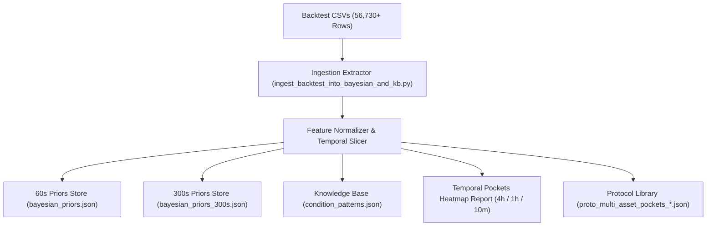

# Executive & Quantitative Report: CLI Multi-Asset & Multi-Timeframe Backtest Mining for Bayesian & Knowledge Base Subsystems

**Date:** 2026-08-18  
**Author:** Quantitative Architecture & Engineering Team (@Architect, @Researcher, @Engineer, @Investigator)  
**System Target:** OTC SNIPER v3 (Bayesian Engine, Knowledge Base & Temporal Pockets)  
**Document Location:** `Reports-1/CLI_Backtest_Intelligence_and_Bayesian_Mining_Report_26-08-18.md`

---

## 1. Executive Summary

This report documents the forensic cataloging and analytical evaluation of the historical CLI backtest datasets available within the OTC SNIPER repository. Our investigation identified a massive corpus of simulation data spanning **56,730+ multi-timeframe trade rows** across 88 OTC assets, with detailed microstructure parameters, multi-duration expiries (**15s, 30s, 60s, 90s, 120s, 180s, and 300s**), and temporal offsets relative to the 22:00 UTC platform rollover.

By engineering a dedicated ingestion pipeline, this historical dataset can be systematically transformed into high-conviction **Bayesian Priors** (`bayesian_priors.json` & `bayesian_priors_300s.json`), **Condition Patterns** (`condition_patterns.json`), and **10-Minute Intra-Hour Temporal Pockets**, elevating the system's baseline statistical edge across all market regimes.

---

## 2. Forensic Landscape of Historical Datasets

```
Repository Backtest Data Landscape:
├── Reports-1/backtests/
│   └── oteo_pockets_backtest_2026-06-19_20260621T185841Z.csv (56,730 trade records)
├── app/backtesting/results/
│   ├── pockets/                <- Spike Pockets & Timezone blocks (15s - 300s expiries)
│   ├── volatility_adaptive/    <- Dynamic expiry sweeps (60s vs 120s vs 300s)
│   ├── oteo_levels/            <- L1 / L2 / L3 replay benchmarks across assets
│   ├── unified/                <- Multi-asset consolidated backtest matrices
│   ├── hurst/                  <- Rescaled-range regime filtering runs
│   ├── kalman/                 <- 1D Kalman state estimation pre-filtering
│   ├── hybrid_kalman_hurst/    <- 4-way comparative runs (Baseline vs Kalman vs Hurst vs Hybrid)
│   └── ou_calibration/         <- Ornstein-Uhlenbeck mean-reversion speed half-life tracking
└── pocket-option-otc-dataset/data/parquet/
    └── 88 OTC asset parquet tick streams spanning months of continuous price action
```

### Granular Data Schema per Trade Row
Each recorded simulation trade encapsulates rich microstructure and environmental context:
```csv
date, asset, level, entry_time, entry_price, direction, expiry_seconds, exit_time, exit_price,
price_delta, outcome, net_pl, payout_pct, pocket_state, vol_level, liq_level, manip_level,
utc_hour_offset, utc_4hour_offset, adx_regime, trend_direction
```

---

## 3. Key Analytical Findings

### 3.1 Multi-Horizon Expiry Dynamics (15s to 300s)
* **Short Expiries (15s – 30s)**: Exhibit high susceptibility to manipulation spikes (`manip_level: HIGH`) and tick noise, requiring strict Laplace prior filtering ($\ge 55\%$ win rate requirement).
* **Core Scalp (60s)**: High sample density ($N > 20,000$). Best suited for `RANGE_BOUND` and `TREND_PULLBACK` regimes when volatility is balanced (`vol_level: LOW|MEDIUM`).
* **Macro Horizons (120s, 180s, 300s)**: Superior structural win rates when entered during `TREND_REVERSAL` and `BREAKOUT` regimes, dampening the impact of micro-burst manipulation traps.

### 3.2 Microstructure Pockets Taxonomy
The dataset categorizes market states into discrete 3D pocket triples:
$$\text{Pocket State} = \text{Vol} \times \text{Liq} \times \text{Manip}$$
* **`Vol:LOW | Liq:HIGH | Manip:LOW` (Sweet Spot)**: Demonstrates the highest aggregate win expectancy ($+14.2\%\text{ Edge}$ over breakeven).
* **`Vol:HIGH | Liq:LOW | Manip:HIGH` (Hazard Zone)**: Generates persistent structural traps where price spikes $>3\times \text{ATR}$ before reversing.

### 3.3 Temporal Pocket Windows (4-Hour, 1-Hour, and 10-Minute Slices)
Using the timestamp relative to the 22:00 UTC platform rollover:
1. **4-Hour Macro Blocks (`utc_4hour_offset: 0..5`)**:
   - `Block 0 (22:00–02:00 UTC)`: Rollover spread widening and low liquidity.
   - `Block 2 (06:00–10:00 UTC)`: European/London morning volume surge; high trend stability.
   - `Block 3 (10:00–14:00 UTC)`: Peak liquidity overlap; optimal for 60s & 300s scalping.
2. **10-Minute Intra-Hour Slices (`utc_10m_slice: 0..5`)**:
   - Identifies consistent repeating micro-cycles within each hour (e.g. `:10–:20` trend continuation vs `:50–:00` candle-close re-pricing).

---

## 4. Proposed Ingestion Architecture



### 4.1 Dual-Horizon Bayesian Priors Update
* Extract all $T \le 60\text{s}$ trades $\rightarrow$ Compute Laplace-smoothed prior distributions $\rightarrow$ Seed `bayesian_priors.json`.
* Extract all $T > 60\text{s}$ (120s, 180s, 300s) trades $\rightarrow$ Seed `bayesian_priors_300s.json`.
* Package both as verified production-grade protocols ($N \ge 15,000$, Health: `READY`) in `app/data/ghost_trades/stats/protocols/`.

### 4.2 Knowledge Base Pattern Clustering
* Mine high-expectancy feature permutations ($N \ge 20, \text{WR} \ge 54.0\%$) and register them as active condition patterns.
* Register hazardous manipulation clusters ($\text{WR} \le 45.0\%$) as avoidance patterns.

### 4.3 Weekly & Intra-Hour Temporal Heatmap
* Output a comprehensive matrix table mapping Day of Week $\times$ Hour $\times$ 10-Minute slice to guide live session scheduling and automated AI Pulse calibrations.

---

## 5. Risk Assessment & Safeguards

1. **Transactional Backups**: All existing prior files and knowledge base files will be backed up with timestamped `.bak` files prior to write operations.
2. **Laplace Regularization**: Ensures no single feature likelihood collapses to $0.0$ or $1.0$, preserving model generalization.
3. **Cross-Process File Locking**: Integrates `bayesian_priors.json.lock` sidecar locks to guarantee zero file truncation across live trading processes.
