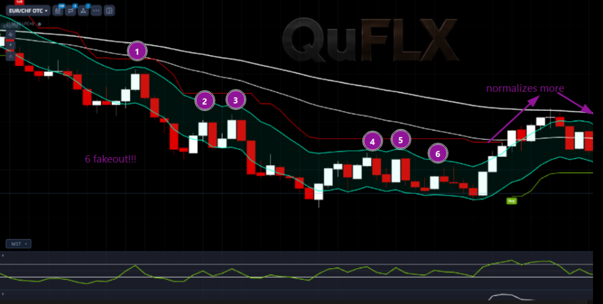
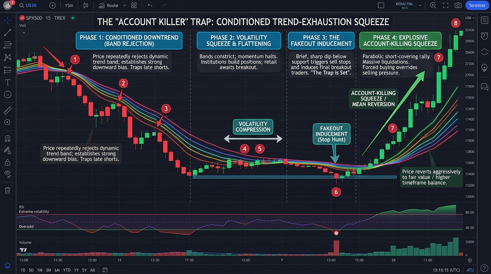
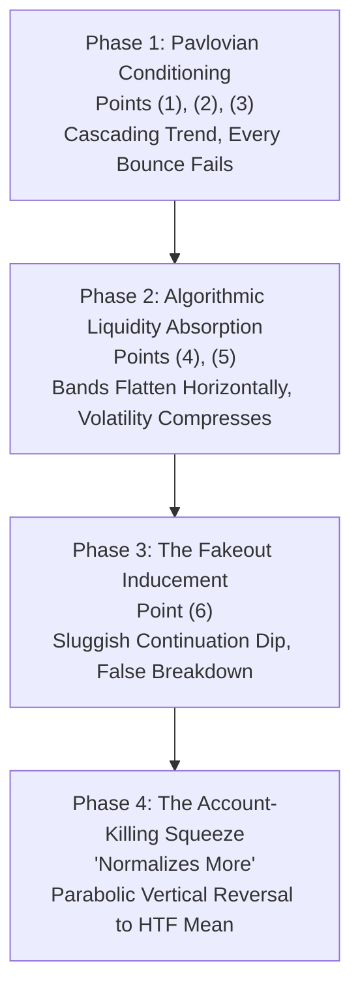
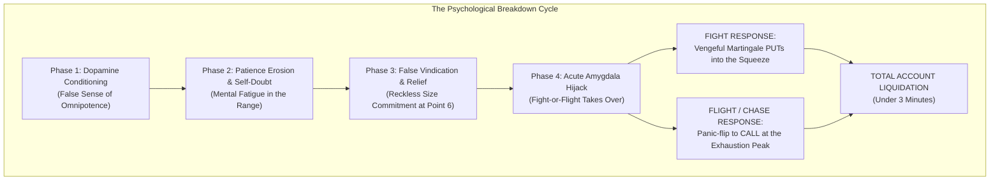

# Research: The "Account Killer" Manipulation (Conditioned Trend-Exhaustion Squeeze)

* **Date:** 2026-09-05  
* **Researcher:** @Researcher  
* **Domain:** Market Microstructure, Algorithmic Liquidity Traps, Binary Options Psychology  
* **Asset Context:** `EUR/CHF OTC` (30-Second Chart)  
* **Classification:** Conditioned Trend-Exhaustion Squeeze / Wyckoff Compression Micro-Spring Trap  

---

## 1. Executive Summary

The **"Account Killer"** is a deceptive OTC market-maker algorithmic manipulation pattern engineered to extract maximum retail capital by exploiting **Pavlovian trend conditioning**, **range compression**, and **Martingale psychology**.

In a fast timeframe (such as 30s or 60s binary options), retail traders and trend-following algorithms are first trained that every counter-trend pullback is a guaranteed winning **PUT** continuation. Once maximum short bias and leverage are accumulated during a low-volatility compression phase, the algorithm executes a **micro-fakeout** followed by an **explosive, non-retesting multi-candle vertical squeeze** back to the higher-timeframe baseline, liquidating short positions and wiping compounding accounts in under three minutes.

> [!IMPORTANT]
> **Temporal Scale & Extended Duration:**  
> While the lethal squeeze detonates in under 3 minutes, **the entire orchestrated movement often unfolds over 45 minutes to well over an hour**. The algorithm deliberately stretches the conditioning and compression stages across dozens or hundreds of candles to thoroughly erode an operator's patience, induce mental fatigue, and maximize accumulated self-doubt before springing the trap.

---

## 2. Visual Reference & Institutional Schematic

### Live OTC Market Capture (EUR/CHF OTC - 30s Chart)

### Institutional Lifecycle Diagram

---

## 3. The 4-Phase Microstructure Lifecycle

### Phase 1: Pavlovian Conditioning (Points 1, 2, 3)
* **Price Action:** The asset cascades in an aggressive downtrend below the dynamic envelope (green midline, red outer envelope) and the upper white baseline.
* **Microstructure Mechanism:**
  * At **(1)**: A green counter-trend pullback tests the band and aggressively dumps.
  * At **(2)**: A second pullback touches the green midline and dumps to a lower low.
  * At **(3)**: A third retest fails immediately, forming a long rejection wick and new local low.
* **Psychological & Algorithmic Result:** Traders and automated trend bots receive repetitive dopamine hits and positive reinforcement for shorting (**PUT**) every touch of the band. Counter-trend buyers are brutally punished.

### Phase 2: Algorithmic Liquidity Absorption & Volatility Compression (Points 4, 5)
* **Price Action:** The downward slope of the red and green dynamic bands abruptly arrests and turns **strictly horizontal**. Price stops printing lower lows and forms a tight, narrow consolidation corridor.
* **Microstructure Mechanism:**
  * At **(4)**: Price gently rises to the flat green midline and stalls.
  * At **(5)**: Another micro-test of the flat green midline fails to break through.
* **The Deception:** 
  * Retail traders perceive the horizontal band as a "descending resistance shelf" that is about to unleash the next leg down.
  * Late trend-followers and Martingale traders build up heavy PUT commitments, expecting a continuation breakdown.
  * In reality, the liquidity provider algorithm has halted downward velocity and is quietly absorbing buy-side orders beneath the floor.

### Phase 3: The Fakeout Inducement Trigger (Point 6 — "6 fakeout!!!")
* **Price Action:** Directly after point (5), the price prints 2–3 sluggish, micro-bodied candles drifting downward or poking slightly beneath the consolidation support.
* **The Trap Spring:**
  * This subtle downward movement acts as visual confirmation that "the resistance held and the dump is starting!"
  * Retail traders commit their **largest position sizes** here (often doubling down or entering size after waiting through the flat period).
  * Notice the small green **"Buy"** badge printed near the lows: proprietary algorithmic models and microstructure indicators registered an institutional imbalance, signaling the start of the reversal regime while retail sentiment was 95%+ short.

### Phase 4: The Account-Killing Mean-Reversion Squeeze ("Normalizes More")
* **Price Action:** Zero continuation occurs. Instead, the market unleashes **5 to 7 consecutive, full-bodied green bullish candles with virtually no wicks**.
* **Microstructure Mechanism:**
  * Price shreds through the green midline in candle 1.
  * Slices through the red dynamic ceiling in candles 2–3.
  * Accelerates directly toward the higher-timeframe white baseline (*"normalizes more"*).
* **Account Destruction Mechanics:**
  1. **Zero Retest / Zero Pullback:** In binary options (30s–120s expiries), trades cannot "wait for a pullback" to exit breakeven. Every single short entered at (4), (5), and (6) expires out-of-the-money (OTM).
  2. **The Martingale Abyss:** Traders who lose at (6) double down on candle 1 ("it's overbought!"), double down again on candle 2 ("it must reject the red band!"), and again on candle 3. An entire trading balance is wiped out in under 3 minutes.

---

## 4. Neurobiology & Emotional Destruction: The "Fight-or-Flight" Amygdala Hijack

Beyond pure chart geometry, the **"Account Killer"** is explicitly engineered to attack human neurochemistry, cognitive biases, and autonomic nervous system survival reflexes. In the high-frequency binary options environment (30s–60s candles), this pattern induces an acute **Amygdala Hijack** that systematically disables rational risk management in inexperienced operators.

### 1. The Dopamine Trap (False Sense of Mastery)
During Points **(1)**, **(2)**, and **(3)**, every impulse to short is immediately rewarded. The brain releases dopamine, reinforcing a subconscious belief that the operator has "mastered" this session's flow. Overconfidence sets in; risk per trade begins to creep upward.

### 2. The Slow Bleed of Patience & Accumulation of Self-Doubt (Points 4 & 5)
When the market abruptly flatlines into a shelf, the sensory stimulation stops. This compression phase is not always a matter of a few seconds—**the entire setup and shelf accumulation can grind sideways for 30, 45, or well over 60 minutes** (spanning dozens to over a hundred 30s candles). For an inexperienced trader, **prolonged stillness is agonizing**:
* **Sensory Deprivation & Impatience:** The human brain is conditioned for constant action. Watching sideways price action drag on for 30 to 60+ minutes without a clear directional resolution creates an overwhelming, itching urge to force a trade.
* **Festering Self-Doubt:** As the minutes turn into an hour, internal dialogue spirals: *"Did the trend die? Did I miss the big move? Why isn't it dropping? Is my strategy broken?"* Mental stamina is completely exhausted through this prolonged war of attrition.

### 3. False Vindication: The Trap is Sprung (Point 6 — The Fakeout)
When the subtle micro-continuation dip appears at **(6)**, the psychological effect is overwhelming:
* **The Relief Flood:** The brain experiences a massive surge of relief: *"Thank God, I was right! The support broke, the dump is starting!"*
* **Lowering the Shield:** Relief causes the operator to drop all defensive risk rules. Feeling completely vindicated after waiting through the agonizing shelf, the trader commits **maximum position size** (often 2x to 5x standard sizing) to make up for "lost time."

### 4. The Amygdala Hijack & Autonomic Nervous System Chaos (Phase 4 Squeeze)
When the price violently reverses into giant, wickless green bars instead of following through, the brain perceives an **existential threat**. The prefrontal cortex (responsible for math, risk limits, and probabilistic thinking) goes offline, and the primitive survival brain takes complete control:

#### A. The "FIGHT" Response (Vengeance Martingale Suicide)
* **Cognitive State:** The trader refuses to accept being wrong. An intense spike of adrenaline and cortisol turns the trade into an ego-driven battle between the human and the screen.
* **Internal Dialogue:** *"This is impossible! It's just a freak spike! It is way overbought on the 30s chart, it HAS to pull back right now!"*
* **Action:** The trader presses **PUT** on candle 1... loses. Doubles down on candle 2... loses. Triples down on candle 3... loses. Within 120–180 seconds, 4 consecutive Martingale steps completely wipe the account balance.

#### B. The "FLIGHT & CHASE" Response (The Double-Whammy Liquidation)
* **Cognitive State:** Panic, desperation, and terror. The operator realizes their heavy short is going to zero, abandons all strategy, and desperately tries to "get their money back" by chasing the surging green train.
* **Action:** The trader flips direction and hammers **CALL** at candle 5 or 6—right as the squeeze collides with the higher-timeframe white baseline (*"normalizes more"*). As soon as they enter CALL at the very peak, the squeeze exhausts, price pulls back into a red consolidation, and they are liquidated on the long side as well.

---

## 5. Quantitative & Algorithmic Detection Signatures

To programmatically protect automated strategies (like **Auto Ghost** and **AI Pulse**) from this trap, the following quantitative features must be tracked:

| Signal / Metric | Normal Trend State | Account Killer Pre-Squeeze State | Action / Gate Rule |
| :--- | :--- | :--- | :--- |
| **Band Slope ($\frac{d\text{Band}}{dt}$)** | Negative ($\le -0.00015$) | Flat / Zero ($\approx 0.00000$ for $\ge 3$ bars) | **VETO PUT**: Trend continuation is invalid when bands are horizontal. |
| **HTF Mean Deviation ($Z$-score)** | Moderately extended ($-1.0$ to $-2.0$) | Critically extended ($Z < -2.5$ for $> 12$ bars) | **VETO PUT**: Probability of mean-reversion snap exceeds $85\%$. |
| **Tick Flow Ratio ($\frac{\text{UpTicks}}{\text{TotalTicks}}$)** | Below $0.40$ (down-tick dominance) | Divergent: Price flat, but tick flow rising $> 0.55$ | **ALARM**: Microstructure accumulation underway. |
| **Candle Compression Ratio ($\frac{\text{ATR}_3}{\text{ATR}_{14}}$)** | $> 1.0$ (active expansion) | $< 0.50$ (extreme compression at points 4, 5, 6) | **LOCKOUT**: Volatility squeeze imminent; freeze continuation orders. |

---

## 6. Algorithmic Guardrail Rules for Auto-Ghost

1. **The 3-Candle Flatline Law:**
   > *If the dynamic regression band or envelope slope flattens within $\pm 5\%$ of zero for $\ge 3$ consecutive 30s/60s candles following an extended move, immediately lock out all trend-continuation signals in that direction.*
2. **Exhaustion Distance Cap:**
   > *When the distance between the close price and the higher-timeframe moving average (white baseline) exceeds $3 \times \text{ATR}_{20}$ and candle bodies compress, classify the regime as `EXHAUSTION_COMPRESSION`. Restrict execution exclusively to mean-reversion CALL setups or stand down.*
3. **Consecutive Squeeze Guard:**
   > *If a signal fails at a flatline boundary and the next candle opens green with $>80\%$ body-to-wick ratio, enforce an immediate 180-second per-asset cooldown to prevent Martingale or revenge trade cascade.*

---

## 7. Summary Checklist for Operators

* [x] **Did the asset have 3+ clean bounces already?** (If yes, you are late; the conditioning phase is maturing).
* [x] **Have the channel bands flattened out into a shelf?** (If yes, the trend has ended; do not short the shelf).
* [x] **Is price sluggishly drifting into a tiny fake breakdown?** (This is the trap spring; do not take the bait).
* [x] **Is price severely dislocated from the HTF baseline?** (A snap back to the white line is mathematically pending).
