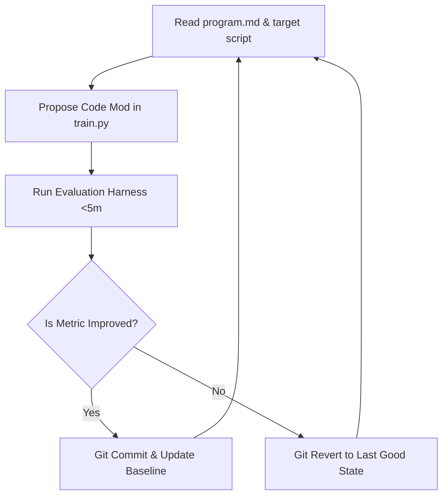

# Research: Autoresearch (Git-Based Self-Improving Code Loop) Integration Analysis
**Date:** 2026-06-27  
**Author:** @Researcher / @Investigator  
**Target Systems:** `OTC_SNIPER` (Real-Time Streaming Engine) & `Backtest_App` (Strategy Simulator)

---

## 1. Executive Summary

Andrej Karpathy's `autoresearch` project (released in March 2026) is a minimalist, agentic framework that automates machine learning and algorithmic optimization. Rather than tuning simple hyperparameters (like a grid search), it gives an LLM the freedom to autonomously modify source code inside a "sandbox" script, run evaluations in time-boxed budgets (typically $\le 5$ minutes), measure performance, and use Git as a version-control "ratchet" (committing changes if performance improves, and reverting if they fail).

This document evaluates the viability, benefits, risks, and implementation strategies of adapting this architecture for the **OTC_SNIPER** real-time streaming application and the **Backtest_App** standalone strategy optimization platform.

---

## 2. The Autoresearch Core Architecture

The system operates as a closed loop consisting of three main files:
1. **`prepare.py` (Immutable):** Manages the data pipeline, downloads tick files, formats the dataset, and runs the final evaluations (providing the ground-truth validation metric). The agent is locked out of editing this file to prevent cheating or metric corruption.
2. **`train.py` (Mutable):** The target file. The agent edits this file (modifying indicators, optimizer types, math formulas, layers, or gator thresholds).
3. **`program.md` (Human Instructions):** A markdown file where a human describes the optimization goal, target metrics, constraints, and algorithmic boundaries.

### The Ratchet Loop


---

## 3. Applicability Analysis

### A. The Backtest_App (High Viability & High Value) ✅
The standalone backtester is the **perfect fit** for an `autoresearch` implementation. Quant researchers spend significant time modifying indicator formulas, testing new combinations of filters (Kalman vs. Hurst), adjusting adaptive expiry equations, and defining support/resistance logic.

#### Potential Integration Points
* **Indicator Mathematical Discovery:** The agent can modify files like `scripts/backtest_hurst.py` or strategy configs to discover non-linear combinations of Kalman pre-filters and raw tick Hurst exponents. For example, instead of running a static sweep, the agent can write custom mathematical equations to compute dynamic expiries:
  $$\text{Expiry} = C \cdot \frac{1 - H}{V^{\alpha}} + \beta \cdot \text{Spread}$$
  and find the optimal scaling values for $C$, $\alpha$, and $\beta$ through successive code changes.
* **Crossover and Divergence Rules:** The agent can write custom logic to detect market manipulation and apply structural exclusion windows (e.g., vetoing entries when certain liquidity/volume/manipulation signatures are found in the Spike Pockets logs).
* **Fit for Time Budget:** The backtester is extremely fast. A full weekly backtest sweep on `EURUSD_otc` tick logs runs in **1.3 minutes** due to recent bisect optimizations. This easily fits into the required $\le 5$ minute budget, allowing the agent to run 100+ experiments overnight.

---

### B. The OTC_SNIPER Real-Time Streaming App (Low Viability & High Risk) ❌
Applying autonomous code modifications to the live FastAPI, Socket.IO, and broker adapters streaming pipeline is **highly discouraged and dangerous**.

#### Why it is not helpful:
* **Account Blow-up Risk:** An LLM agent modifying live code could accidentally introduce logic errors (e.g., reversing buy/sell directions, placing wrong trade sizes, or breaking safety checks) that pass compilation but fail in live market conditions.
* **Lack of Deterministic Evaluation:** Live markets do not have a static, repeatable validation dataset. An evaluation on live streaming data cannot be replicated, meaning a code change that "wins" in one 5-minute slice might just be lucky, leading to immediate reversion or degradation.
* **Stateful Complexity:** The streaming app has database connections, browser-based session authentications, and WebSockets. Autoresearch relies on stateless, quick-start, quick-finish execution loops.

---

## 4. Pro's and Con's Matrix

| Perspective | Pro's (Benefits) | Con's (Drawbacks & Risks) |
|---|---|---|
| **Algorithmic Search** | **Beyond Hyperparameters:** Can invent new mathematical formulas and conditional branching logic that standard tuning tools (like Optuna or grid search) cannot generate. | **Curve Fitting / Overfitting:** An LLM will aggressively optimize code to fit the noise of the training tick dataset, leading to poor out-of-sample forward expectancy. |
| **Audit & Version Control** | **Self-Documenting Git History:** Every successful improvement generates a git commit detailing the exact code delta and metric improvement, creating a clean research trail. | **Wasted API Tokens & Cost:** The agent will generate hundreds of failing mutations (syntax errors, compilation failures, metric drops), accumulating substantial LLM token expenses. |
| **Execution Speed** | **Fast Local Backtesting:** With tick files stored locally in `app/data/tick_logs/` and binary search indexing, evaluations are fast and cheap (no cloud cluster needed). | **No Safety Isolation:** Running arbitrary, LLM-generated Python code on a developer machine presents a security risk unless executed in a Docker sandbox. |
| **Development Velocity** | **Unattended Research:** Enables the engineering team to outline a hypothesis in `program.md` before going to sleep and wake up to an optimized strategy script. | **State/Refactoring Friction:** If the underlying codebase undergoes a major refactoring (e.g., changes to helper signatures), the agent's historical code assumptions break. |

---

## 5. Architectural Blueprint for the Backtester

To implement a safe prototype of this loop for our `Backtest_App`, we would introduce an isolated directory `scripts/autoresearch/`:

```
scripts/autoresearch/
├── run_loop.py            # Orchestrator (loads LLM, manages git branches, parses results)
├── target_strategy.py     # Mutable file (contains only the logic rules / formulas)
├── evaluation_harness.py  # Immutable file (loads JSONL ticks, runs strategy, saves results.json)
└── program.md             # Human-written prompt defining instructions & metrics
```

### Proposed Objective Function for the Agent
To prevent the agent from optimizing win-rate by making only 1 trade (extreme sparsity) or losing money through excessive trading, the evaluation harness should output a composite **Fitness Score**:
$$\text{Fitness} = \text{Win Rate} \times \ln(\text{Trade Count}) \times (1 - \text{Max Drawdown})$$
*Condition:* If $\text{Trade Count} < 30$ or $\text{Win Rate} < 52.08\%$, $\text{Fitness} = 0$.

---

## 6. Conclusions & Recommendations

1. **Implement on Backtest_App Only:** We should build a prototype of the `autoresearch` loop to search for **Volatility-Adaptive Expiries** and **Hybrid Kalman-Hurst** parameters/formulas in our offline simulator.
2. **Do Not Deploy to Live Streaming:** Keep the live `OTC_SNIPER` codebase fully deterministic, manually vetted, and protected by unit tests.
3. **Sandbox the Loop:** Ensure any automated script modifications run inside a Docker container or separate environment to prevent local file deletions or system failures.
4. **Use Out-of-Sample Validation:** The evaluation harness must test proposed code changes on a *validation* tick set (e.g., Monday-Wednesday) and verify improvements on an *out-of-sample test* set (e.g., Thursday-Friday) to prevent overfitting.
