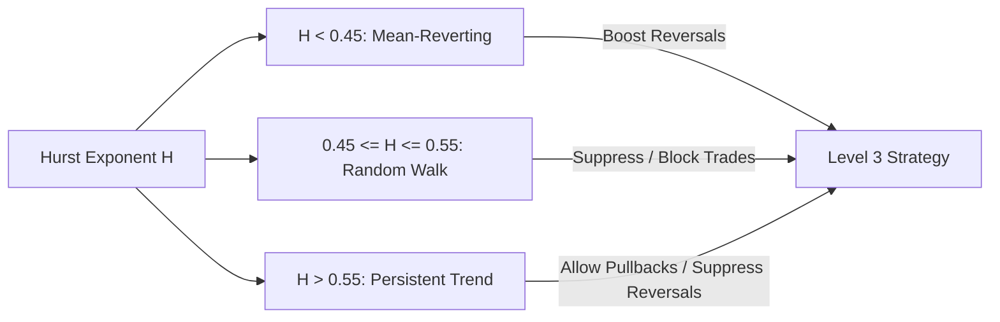

# Research Paper – Hurst Exponent & Volatility Gates Integration Assessment – 2026-06-17

## 1. Executive Summary
This paper assesses the integration of the **Hurst Exponent (H)** and **Volatility Gates** into the OTC SNIPER v3 system. Currently, the platform relies on ADX strength and CCI extremes to determine market regimes and validate entry signals. While effective, these indicators fail to distinguish between random market noise (Brownian walks) and true mean-reverting ranges. The integration of Hurst analysis and normalized volatility scores provides a mathematically rigorous way to identify exploitable market memory. By adopting a soft-influence approach instead of rigid hard gates, the system can enhance the win-rates of the Auto-Ghost trader without suffering from signal starvation or execution latency.

---

## 2. Core Concepts & Mental Model

### The Hurst Exponent ($H$)
The Hurst exponent measures the long-term memory of a time series. It quantifies the relative tendency of a series either to regress strongly to the mean or to cluster in a direction.
* **$H < 0.5$ (Anti-persistent / Mean-reverting):** The market has a strong tendency to reverse. A high price tick is likely to be followed by a low price tick, and vice versa. This is the optimal environment for OTEO reversal setups.
* **$H = 0.5$ (Random Walk / Brownian Motion):** The price moves randomly with no statistical memory. Trading in this zone is equivalent to coin-flipping and carries high risk.
* **$H > 0.5$ (Persistent / Trending):** The price moves in trends. A positive change is likely to be followed by another positive change. Reversal strategies will fail here (the "falling knife" problem).



### Volatility Score ($V$)
A normalized indicator (0.0 to 1.0) reflecting the current intensity of market movement. Rather than looking only at absolute price ranges (ATR), it combines:
1. **Relative ATR:** ATR divided by price (standardizes volatility across different assets).
2. **Tick Return Variance:** Standard deviation of log returns between successive ticks (captures micro-variance).
3. **Tick Frequency:** Average interval between ticks (reflects market liquidity and active participation).

---

## 3. Comparison to Current Working State

The table below contrasts our current Level 2 & Level 3 engine with the proposed enhancements:

| Feature Dimension | Current Working State (v3) | Proposed Hurst & Volatility Gates | System Improvement / Impact |
| :--- | :--- | :--- | :--- |
| **Trend Characterization** | Uses ADX value (<20, <28, >28) and ADX slope to classify trends. ADX is lagging and only measures trend strength. | Uses Rescaled Range (R/S) analysis on tick history to directly measure market persistence ($H$). | Avoids entering counter-trend setups during high-momentum trends ($H > 0.65$) that ADX hasn't yet registered as strong. |
| **Noise vs. Range Bound** | Uses low ADX ($\le 20$) + S/R structure + CCI cycling to identify `RANGE_BOUND` vs. `CHOPPY`. | Uses $H < 0.45$ for ranges and $H \approx 0.50$ for noise/random chop. | Eliminates false range signals in noisy, directionless random walks, suppressing high-risk trades. |
| **Volatility Context** | Calculates raw ATR. Uses ATR proximity for support/resistance gates. Low tick frequency classifies as `dead` or `low`. | Calculates a unified, normalized Volatility Index (0.0–1.0) combining range, frequency, and standard deviation. | Provides a clean, standardized metric that can be used directly in Ghost Controller settings and UI badges. |
| **Expiry Selection** | Fixed static expiry (default: 60s) configured manually in the Ghost Controller. | Adaptive Expiry Engine: High Vol → shorter expiry (30s); Low Vol → longer expiry (2–3m). | Aligns the duration of the option contract with the velocity of price mean-reversion, maximizing win probability. |
| **Settings Controls** | Manual/AI Pulse adjustments for Z-score boundaries, allowed regimes, and manipulation thresholds. | Adds Hurst and Volatility sliders to the "Advanced Gates" settings. | Enhances AI Pulse's ability to recommend fine-tuned thresholds based on live session win/loss clustering. |

---

## 4. Assessment of Benefits (Expert Opinion)

Integrating these features will yield three major benefits:

1. **Resolution of the "Chop/Whip" Loss Pattern:** The offline trade analyzer reports that a significant portion of Auto-Ghost losses occur in high-frequency choppy conditions. By filtering out regimes where $H \in [0.47, 0.53]$ (random walk), we directly address this failure mode.
2. **True Statistical Expiry Tuning:** A common issue in short-expiry OTC trading is that a trade is correct in direction but fails because the expiry was too short (price didn't have time to revert) or too long (price reverted but then drifted away). Volatility-adaptive expiries resolve this by scaling duration based on tick velocity.
3. **Low Complexity Integration:** The proposed implementations can be added as non-disruptive, pure mathematical functions within `MarketContextEngine` and `RegimeClassifier` without refactoring the core asynchronous streaming loop.

---

## 5. Mitigating Complexity and Over-Filtering

To prevent the system from becoming overly restricted (signal starvation) or bogged down computationally, the following design guidelines are recommended:

### A. Avoid "Hard Gate" Proliferation (Confluence-Based Scoring)
Adding more boolean gates to the Auto-Ghost controller will result in over-filtering.
* **Bad Design:** `if (Hurst > 0.45) reject_signal()`
* **Good Design:** Treat $H$ as a **confluence multiplier** on the Level 2/3 OTEO score.
  * If an OTEO reversal score is 60 and $H < 0.40$ (strong mean reversion), boost the score by $+15$ to make it actionable.
  * If $H \in [0.48, 0.52]$, apply a penalty of $-15$, dropping it below the actionable floor.
  * Limit hard gates *only* to extreme conditions: block all signals if volatility is classified as `EXTREME` or if the market is `DEAD` (low tick frequency).

### B. Perform Calculations on Candle Close
Calculating R/S analysis on a 400-tick buffer on *every incoming tick* (up to 30 ticks/sec across multiple assets) is CPU-heavy and introduces latency in the main thread.
* **Optimization:** Calculate the Hurst Exponent and Volatility Score **once per closed candle** (every 60 seconds) in `MarketContextEngine`. Cache the results and expose them to the tick-by-tick signal evaluator. Volatility and market memory do not change significantly from tick to tick.

---

## 6. Gotchas & Pitfalls (Real Examples)

1. **Non-Uniform Tick Distribution:** Rescaled range analysis assumes equal time intervals. If an asset has gaps (e.g. no ticks for 5 seconds), raw tick-based R/S calculation will skew the Hurst exponent.
   * *Mitigation:* Perform R/S analysis on a tick buffer, but validate that the tick frequency is healthy ($>15$ ticks per minute) before trusting the Hurst value.
2. **Broker Expiry Limitations:** Pocket Option and other binary brokers do not accept arbitrary expiries (e.g., you cannot trade a 43-second contract).
   * *Mitigation:* Clamp the Adaptive Expiry output to standard broker increments: `30s`, `60s`, `2m`, `3m`, `5m`.

---

## 7. Performance & Latency Considerations

* **Buffer Footprint:** Keeping a rolling buffer of 300 ticks per asset for R/S analysis requires negligible memory (e.g., $300 \times 16 \text{ bytes} \approx 4.8 \text{ KB}$ per asset).
* **Execution Overhead:** A standard python implementation of R/S analysis using numpy takes approximately $0.15 \text{ ms}$. If cached on candle close, the average CPU load is practically zero.

---

## 8. Code Patterns & Examples

### A. Lightweight Rescaled Range (R/S) Hurst Calculation
Here is the recommended clean implementation to add to `app/backend/services/market_context.py`:

```python
import numpy as np

def calculate_hurst(prices: list[float] | np.ndarray) -> float:
    """
    Calculate Hurst Exponent using simplified Rescaled Range (R/S) analysis.
    Optimized for execution speed on 200-400 tick buffers.
    """
    if len(prices) < 100:
        return 0.5  # Default to random walk if insufficient data
        
    prices = np.asarray(prices)
    # Calculate log returns
    returns = np.diff(np.log(prices))
    N = len(returns)
    
    # We split the series into sub-intervals of length n
    # For speed and stability, we use 4-5 interval sizes
    max_chunk = N
    min_chunk = 10
    chunks = np.unique(np.logspace(np.log10(min_chunk), np.log10(max_chunk), num=6, dtype=int))
    
    rs_values = []
    n_values = []
    
    for n in chunks:
        if n < min_chunk or n > max_chunk:
            continue
        # Split returns into non-overlapping sub-series of length n
        num_subseries = N // n
        if num_subseries == 0:
            continue
            
        rs_sub = []
        for i in range(num_subseries):
            sub = returns[i * n : (i + 1) * n]
            mean = np.mean(sub)
            # Cumulative deviation from mean
            y = np.cumsum(sub - mean)
            r = np.max(y) - np.min(y)  # Range
            s = np.std(sub, ddof=1)    # Standard deviation
            if s > 0:
                rs_sub.append(r / s)
                
        if rs_sub:
            rs_values.append(np.mean(rs_sub))
            n_values.append(n)
            
    if len(rs_values) < 2:
        return 0.5
        
    # Fit line log(R/S) vs log(n)
    h, _ = np.polyfit(np.log(n_values), np.log(rs_values), 1)
    # Clamp to theoretical limits [0.0, 1.0]
    return float(np.clip(h, 0.0, 1.0))
```

### B. Normalized Volatility Score
Calculation to combine standard deviation, price range, and tick intervals:

```python
def calculate_volatility_score(
    atr: float, 
    price: float, 
    returns_std: float, 
    tick_frequency: float,
    max_atr_ratio: float = 0.005,  # 0.5% of price
    max_returns_std: float = 0.002
) -> float:
    """
    Calculate a normalized 0.0-1.0 volatility score.
    """
    if price <= 0 or atr <= 0:
        return 0.0
        
    # 1. ATR relative to price
    atr_ratio = atr / price
    norm_atr = min(1.0, atr_ratio / max_atr_ratio)
    
    # 2. Tick returns variance
    norm_std = min(1.0, returns_std / max_returns_std)
    
    # 3. Frequency factor (dampens volatility score if tick stream is slow)
    # 30 ticks/min is healthy threshold
    frequency_multiplier = min(1.0, tick_frequency / 30.0)
    
    # Composite score
    composite = (norm_atr * 0.5) + (norm_std * 0.5)
    return float(np.clip(composite * frequency_multiplier, 0.0, 1.0))
```

---

## 9. Glossary of Key Terms
* **Rescaled Range (R/S) Analysis:** A statistical method used to determine the presence of long-term trend or cycle correlation in a time series.
* **Persistent Series:** A time series that exhibits positive autocorrelation; past upward moves increase the probability of future upward moves.
* **Anti-Persistent Series:** A time series that exhibits negative autocorrelation; past increases make future decreases more likely.
* **Signal Starvation:** A condition in automated trading systems where multiple restrictive filters block all entries, leaving the system inactive.
