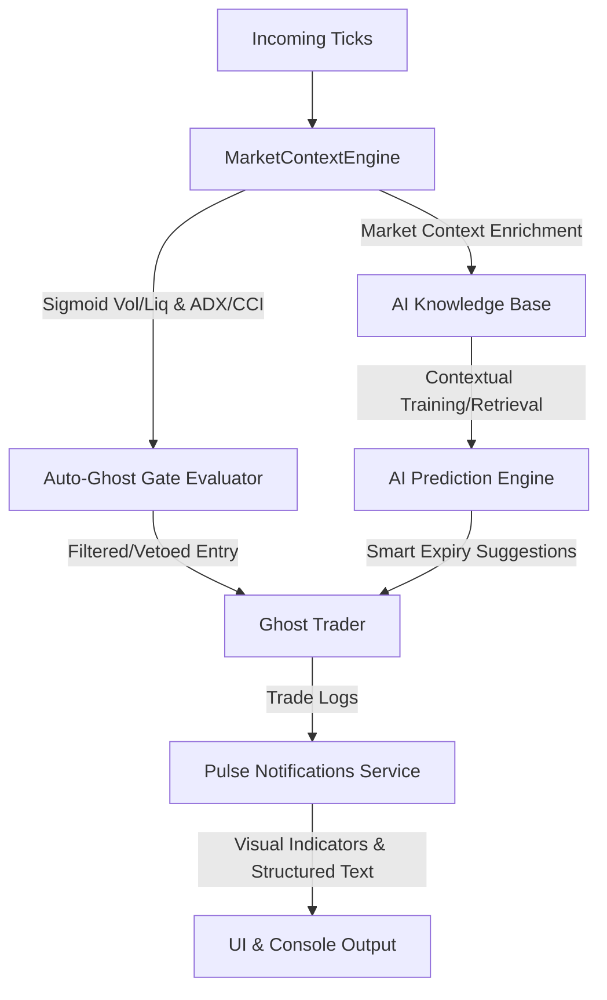

# Implementation Plan: AI Risk Gates, KB Integration & Pulse Notification Enhancements

This document outlines the high-level system design and phased implementation plan to add advanced risk gating (Volatility, Liquidity, ADX, CCI), integrate gate contexts into the AI Knowledge Base, and improve the formatting of AI Pulse Notifications.

---

## 🏰 High-Level Design Overview (Delegated to @Architect)

---

## 📋 Phased Implementation Plan

### Phase 1: Risk Gates Integration (Volatility, Liquidity, ADX, CCI)
* **Priority:** CRITICAL
* **Estimated Effort:** 4-6 hours
* **Target Files:**
  * [market_context.py](file:///c:/v3/OTC_SNIPER/app/backend/services/market_context.py) (Expose gates metrics)
  * [auto_ghost.py](file:///c:/v3/OTC_SNIPER/app/backend/services/auto_ghost.py) (Add gate evaluation logic)
  * [unified_engine.py](file:///c:/v3/OTC_SNIPER/app/backend/services/backtesting/unified_engine.py) (Align gates in backtester)
* **Design & Logic:**
  * **Volatility Gate:** Restricts trade execution if the composite `volatility_score` exceeds a configured ceiling or if the asset-specific ADX regime matches a veto state (e.g., USDCHF under `strong` ADX).
  * **Liquidity Gate:** Ensures tick frequency sits in the optimal sigmoid range (e.g., 30% - 70%).
  * **ADX & CCI Gates:** ADX slope/direction filtering to avoid "falling knife" counter-trend setups, and CCI extreme state exhaustion check.
* **Risks:** Over-filtering (signal starvation) if gates are too rigid.
  * *Mitigation:* Expose config parameters (`min_liquidity`, `max_volatility`, `allowed_adx_regimes`) in settings and default to soft vetoes (score penalties) rather than hard blocks where appropriate.
* **Test Points:**
  * Backtest using `run_full_backtest_report.py` to confirm that adding these gates improves win rate on the top 5 assets without reducing trade count by more than 30%.
* **"Done When":** The Ghost Trader successfully rejects trades violating the gates, and the backtester shows a positive win-rate delta.

---

### Phase 2: AI Knowledge Base Integration & Expiry Optimization
* **Priority:** HIGH
* **Estimated Effort:** 5-7 hours
* **Target Files:**
  * `app/backend/services/knowledge_base.py` (or similar KB path, e.g., vector database or local index)
  * `app/backend/services/oteo.py`
  * [streaming.py](file:///c:/v3/OTC_SNIPER/app/backend/services/streaming.py)
* **Design & Logic:**
  * Save gate contexts (Hurst, Sigmoid Liquidity, Volatility, ADX Regime) along with trade outcomes into the KB.
  * Integrate the **Adaptive Expiry Formula** `Expiry = C * (1 - H) / V` directly into the AI Entry Suggestion pipeline so that expiries are dynamically selected based on current market memory ($H$) and velocity ($V$).
* **Risks:** KB read/write latency on tick updates.
  * *Mitigation:* Perform KB updates and retrieval asynchronously or on closed candles rather than per tick.
* **Test Points:**
  * Verify that AI entry suggestions return the calculated adaptive expiry, and that the chosen expiry maps to broker-friendly intervals (30s, 60s, 2m, 5m).
* **"Done When":** Expiry suggestions dynamically adjust to volatility/hurst changes in live streaming and backtests.

---

### Phase 3: AI Pulse Notifications UI Formatting
* **Priority:** MEDIUM
* **Estimated Effort:** 2-3 hours
* **Target Files:**
  * `app/backend/services/streaming.py` (notification payload)
  * `app/frontend/src/components/layout/TopBar.jsx` / notification components
* **Design & Logic:**
  * Use distinct line breaks, color indicators, and emojis for Direction:
    * Bearish: 🔴 Bearish Reversal | Sell Pressure
    * Bullish: 🟢 Bullish Reversal | Buy Pressure
    * Neutral: 🔵 Range-Bound / Quiet
  * Structurally separate "Focus Areas" (e.g., Support structure proximity) from "Avoid Areas" (e.g., High manipulation).
* **Test Points:**
  * Visual verification of the Socket.IO notifications in frontend UI and terminal logs.
* **"Done When":** Pulse notifications are clean, readable, and structured.

---

### Phase 4: Dynamic & Scalable Asset Profiling Pipeline
* **Priority:** MEDIUM
* **Estimated Effort:** 4-5 hours
* **Target Files:**
  * [analyze_trades_ghost_only.py](file:///c:/v3/OTC_SNIPER/analyze_trades_ghost_only.py)
  * `app/backend/services/profiler.py` (New Service)
  * `app/data/settings/asset_profiles.json` (Dynamic Configuration)
* **Design & Logic:**
  * **Anti-Drift / Rolling Window Architecture:** Rather than static profiling, the new `Profiler` service will analyze a rolling sliding window of the last 14 to 30 days (or last $N$ trades) of session logs. This allows the system to automatically adapt to broker algorithm updates and changing market regimes.
  * **Daily Refresh Loop:** A background cron task will execute every 24 hours to parse `sessions/*.jsonl`, re-calculate volatility/liquidity/manipulation sensitivity matrixes, and update `asset_profiles.json`.
  * **Runtime Gate Feed:** The Ghost Trader reads this JSON configuration dynamically at runtime. If an asset's rolling win-rate under manipulation falls below the breakeven threshold, a dynamic soft penalty is applied to OTEO scores.
* **Risks:** Concept drift during sudden market transitions before the 24h refresh runs.
  * *Mitigation:* Use soft score adjustments rather than binary hard blocks, allowing high-conviction OTEO signals to override stale profile parameters.
* **Test Points:**
  * Verify that `Profiler` generates a valid `asset_profiles.json` file.
  * Test that the Ghost Trader dynamically updates its gate thresholds immediately when the JSON profile changes.
* **"Done When":** Dynamic profiles automatically refresh daily, and the trading engine consumes them at runtime with zero manual configuration.

---

## 🙋 User Review Required

> [!IMPORTANT]
> **Adaptive Expiry Clamping**: Since brokers only accept specific expiry increments (30s, 60s, 2m, 3m, 5m), the AI-suggested adaptive expiry must be rounded to the nearest broker-supported expiry.
> Do you agree with this clamping method, or should we restrict entries only when the exact calculated expiry is close to a standard one?

> [!WARNING]
> **Veto Logic Severity**: Should the new Vol/Liq/ADX/CCI gates act as **Hard Vetoes** (blocking trades completely) or **Soft Adjustments** (subtracting points from the OTEO score)?
> *Recommendation:* Use Soft Adjustments by default (which aligns with Phase 5 guidelines to prevent signal starvation), and use Hard Vetoes only for extreme conditions (e.g., Tick frequency < 5/min).
