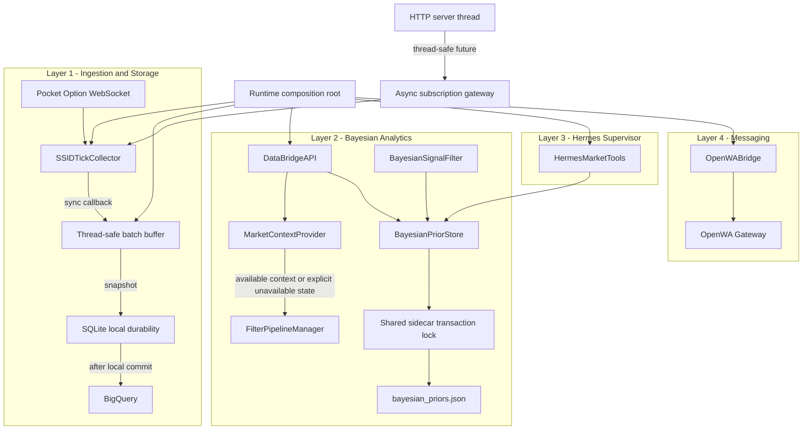

# Data Agent DaaS Remediation Plan — 2026-08-03

**Status:** CLOSED — Phases 0–5 implemented; final multi-agent review complete (⚠️ non-blocking residuals)  
**Closed:** 2026-08-04  
**Branch:** `data-agent` (not merged to main at close)  
**Source diagnostic:** `data-agent/reports/Diagnostic_report_2026.08..03.md`  
**Supersedes for execution:** `data-agent/dev-docs/PHASED_PLAN.md`  
**Scope:** `data-agent/` and the shared Bayesian-prior integration in `app/`  
**Constraint:** Preserve the existing 4-layer architecture and public REST response shapes where practical.  
**Final regression:** 97 passed (Phases 1–5 + baseline) in `QuFLX-v2`  
**Final multi-agent verdict:** @Reviewer ⚠️ · @Debugger ⚠️ · @Optimizer ⚠️ · @Code_Simplifier ⚠️ — F1–F13 addressed; residuals are optional follow-ups (auth exposure, UI mock KPIs, subscribe timeout cancel, buffer high-water).

---

## Executive Summary

The diagnostic correctly identifies serious integrity, configuration, API, UI, and operational defects. Phase 0 source validation also found that several remedies in the original plan were unsafe or internally contradictory.

The corrected sequence is:

1. establish a deterministic composition root and safe cross-thread runtime commands;
2. make tick buffering locally durable and non-blocking;
3. remove fictional/fail-open filter data and connect validated trade feedback;
4. serialize the complete Bayesian read-modify-write transaction across processes;
5. repair the UI and add independent container health checks.

No production source was changed during Phase 0. The relevant Python baseline is **38/38 tests passing**.

---

## Goals, Deliverables, and Success Criteria

### Goal

Resolve findings F1-F13 without breaking raw-tick integrity, the four-layer boundary, existing consumers, or local fallback operation.

### Deliverables

- Runtime composition and configuration fixes.
- Lossless, thread-safe, non-blocking tick persistence.
- Honest market-context availability and fail-closed gate behavior.
- Validated Bayesian trade-feedback integration.
- Cross-process transactional prior updates.
- UI subscription/payout fixes.
- Data-agent Docker health checks.
- Focused unit, integration, concurrency, UI, and Compose verification.
- A mandatory @Reviewer report after every implementation phase.

### Success Criteria

- No acknowledged tick is discarded after SQLite failure.
- No filter passes because context is missing or fabricated.
- A successful trade-record response means the prior transaction committed.
- Concurrent prior updates preserve all increments and always expose valid JSON.
- Importing `vps_server.py` creates no clients, databases, threads, or services.
- Live asset subscription crosses safely from the HTTP thread to the asyncio loop.
- UI blank/custom subscription paths do not crash or invent payout metadata.
- Docker reports the data-agent healthy without requiring OpenWA to be ready.
- Existing and new tests pass in `QuFLX-v2`.

### Constraints

- No breaking changes without explicit approval.
- Raw tick payloads remain unmutated at the API boundary.
- Shared writes use atomic replacement and explicit cross-process coordination.
- No silent exception handling or success response after failed persistence.
- `.env` remains untracked; only `.env.example` and documentation are source-controlled.
- Every code change is followed immediately by focused tests.
- No next phase starts until the user explicitly approves the prior @Reviewer gate.

---

## Architecture Context



### Boundary Decisions

1. **SQLite is the local durability boundary.** A batch is counted as flushed only after the local transaction commits.
2. **Context is a dependency, not a fabricated dictionary.** Until a real analytics producer exists, requested context-dependent gates return explicit unavailable vetoes.
3. **The prior file has one transaction protocol.** Atomic rename is retained, but the lock covers read, mutation, temporary write, fsync, replace, and state refresh.
4. **`vps_server.py` is a composition root.** Imports define types/functions only; execution constructs resources after environment loading.
5. **Manipulation severity is authoritative.** `has_manipulation` is descriptive metadata; a veto occurs only when severity exceeds the configured threshold.
6. **OpenWA is an optional downstream adapter.** Data-agent liveness/readiness does not depend on undocumented behavior of the third-party image.

---

## Phase 0 — Investigation and Architecture Correction [x]

### Completed Evidence Gate

| Area | Evidence | Decision |
|---|---|---|
| Tick callback ownership | `ssid_collector.py:166-189,195-214` dispatches callbacks synchronously from the collector coroutine | The reported same-loop list-copy/clear race is not demonstrated; future cross-thread safety still requires a real synchronization primitive. |
| Tick loss | `gcp_sink.py:150-172,187` clears before SQLite and increments metrics after logged failure | Local persistence failure must requeue the exact snapshot and return failure. |
| Context source | `api_bridge.py:75-83,101-115`; no other producer under `data-agent/src` | Do not move stubs; introduce an explicit provider and unavailable state. |
| Fail-open gates | `bayesian_filter.py:21-27`, `volatility_filter.py:18-27`, `liquidity_filter.py:18-27`, `manipulation_filter.py:17-24` | Every requested gate fails closed on missing/invalid required context. |
| Prior transactions | `prior_updater.py:42-104`; `bayesian_signal_filter.py:59-93,246-267` | Atomic replacement alone does not prevent lost updates. |
| Runtime construction | `vps_server.py:53-75,152-171` | Move all service construction after environment loading. |
| Dynamic subscribe | `api_bridge.py:137-145`; `ssid_collector.py:153-164` | Use the live async collector method through a thread-safe command gateway. |
| Environment | Active `.env` lacks `TARGET_ASSETS` and OpenWA URL; `.env.example` has assets but no OpenWA URL | Standardize `OPENWA_API_URL`; keep active secret configuration as an operator step. |
| UI | `App.jsx:47-60,111-132,285-292` | Fix `.trim()`, response handling, unknown payout, and selected payout. |
| Docker | `docker-compose.vps.yml:3-29`; `Dockerfile.vps:1-19` | Add data-agent health only; do not claim OpenWA service-health dependency without a verified image contract. |

### Phase 0 Baseline

```powershell
$env:PYTHONDONTWRITEBYTECODE='1'
conda run -n QuFLX-v2 python -m pytest -p no:cacheprovider -o pythonpath=. `
  tests/test_vps_data_agent_full_suite.py `
  tests/test_vps_tick_collector.py `
  tests/test_bayesian_prior_updater.py `
  tests/test_bayesian_signal_filter.py -q
```

Expected baseline: `38 passed`.

---

## Phase 1 — Runtime Composition, Configuration, and Command Boundary [x]

**Findings:** F4, F5, F9, plus the discovered live-subscription boundary defect.  
**Primary specialist:** @Coder  
**Supporting specialists:** @Backend-Specialist, @Tester

### Task 1.1 — Introduce a Runtime Service Container

Refactor `data-agent/src/vps_server.py` so module import has no resource side effects.

```python
@dataclass
class AgentServices:
    sink: GCPTickSink
    collector: SSIDTickCollector
    updater: BayesianPriorUpdater
    tools: HermesMarketTools
    wa_bridge: OpenWABridge
    bridge_api: DataBridgeAPI

def build_services(settings: AgentSettings, loop: asyncio.AbstractEventLoop) -> AgentServices:
    ...

def main() -> None:
    load_env_file()
    settings = AgentSettings.from_env()
    ...
```

Requirements:

- Validate numeric settings and comma-separated assets before constructing services.
- Share the same updater/store instance with Hermes and `DataBridgeAPI`.
- Start the asyncio loop before exposing runtime commands that require it.
- Keep `/api/status` backward-compatible.

### Task 1.2 — Add a Safe Subscription Command Gateway

The HTTP server runs in a separate thread. It must not mutate `collector.assets` directly.

```python
future = asyncio.run_coroutine_threadsafe(
    collector.add_asset(asset),
    owner_loop,
)
subscribed = future.result(timeout=SUBSCRIBE_TIMEOUT_SECONDS)
```

Requirements:

- Validate and normalize the asset before scheduling.
- Return success only after `add_asset()` completes.
- Convert timeout, closed-loop, and WebSocket errors into structured API errors.
- Make repeated subscriptions idempotent.

### Task 1.3 — Standardize Environment Configuration

Source-controlled changes:

- Add `OPENWA_API_URL=http://localhost:8080` to `data-agent/.env.example`.
- Keep `TARGET_ASSETS` documented in `.env.example`.
- Replace stale `OPENWA_SERVER_URL` references in data-agent technical documentation.
- Document `TARGET_ASSETS`, `OPENWA_API_URL`, and fallback behavior.

Operator-only action:

- Add `TARGET_ASSETS` and, when needed, `OPENWA_API_URL` to the untracked active `.env`.
- Never print or commit `PO_SSID`, API keys, or credentials.

### Phase 1 Verification

- [ ] Import test proves no DB/client/thread/service construction.
- [ ] Environment parsing test uses exactly the configured asset set.
- [ ] Invalid port/assets fail fast with a meaningful error.
- [ ] Hermes and API bridge share one updater/store object.
- [ ] HTTP-thread subscription invokes `add_asset()` on the owner loop.
- [ ] Duplicate subscription is idempotent.
- [ ] Existing relevant tests remain green.

### Phase 1 Gate

After implementation and tests:

> `Phase 1 completed. Perform full incremental review.`

@Reviewer checks readability, OWASP concerns, maintainability, separation of concerns, fail-fast validation, explicit errors, and regressions. Stop after:

> `Review complete. Awaiting explicit command to proceed.`

---

## Phase 2 — Lossless Tick Buffering and Non-Blocking Persistence [x]

**Findings:** F1, F12, plus the discovered clear-before-persist loss path.  
**Primary specialist:** @Coder  
**Supporting specialists:** @Backend-Specialist, @Optimizer, @Tester

### Task 2.1 — Use a Thread-Safe Snapshot Buffer

Use a short-held `threading.Lock` for synchronous ingress and an atomic batch swap.

```python
def push_tick(self, tick: dict[str, Any]) -> None:
    buffered = BufferedTick.create(tick)
    with self._buffer_lock:
        self._buffer.append(buffered)

def _take_snapshot(self) -> list[BufferedTick]:
    with self._buffer_lock:
        batch, self._buffer = self._buffer, []
    return batch
```

Contract:

- The lock protects only in-memory append/swap operations.
- Ticks appended after the swap belong to the next batch.
- No filesystem or network I/O occurs while holding the lock.
- Each buffered item receives a stable local ingestion ID without mutating the raw API payload.

### Task 2.2 — Persist Locally Before Acknowledgement

Move blocking SQLite work to `asyncio.to_thread()`.

```python
batch = self._take_snapshot()
try:
    await asyncio.to_thread(self._write_batch_to_sqlite, batch)
except Exception:
    self._restore_snapshot_before_newer_ticks(batch)
    raise
```

Requirements:

- Add/migrate a unique local ingestion ID so retry after ambiguous failure is idempotent.
- Use one SQLite transaction per batch.
- On failure, restore the original snapshot ahead of newer ticks.
- Do not attempt GCP delivery until local persistence succeeds.
- Do not increment `total_flushed` on failure.
- Expose failure/retry metrics without claiming lost batches were flushed.

### Task 2.3 — Make Flush Lifecycle Predictable

- Serialize concurrent flush calls with a dedicated async flush mutex; this mutex does not protect ingress.
- On shutdown, stop producers, await in-flight flush, and retry the final local flush according to a bounded policy.
- Propagate terminal persistence failure so shutdown is visibly unsuccessful.
- BigQuery failure leaves the locally persisted batch available for later synchronization.

### Phase 2 Verification

- [ ] Concurrent threads push N unique ticks; SQLite contains exactly N unique rows.
- [ ] Ticks arriving after snapshot remain in the next batch.
- [ ] Injected SQLite failure restores the batch and leaves `total_flushed` unchanged.
- [ ] Retry after an ambiguous failure creates no duplicate local rows.
- [ ] Event-loop heartbeat probe continues during a slow SQLite write.
- [ ] Stop performs a final durable flush or raises a visible error.

### Phase 2 Gate

> `Phase 2 completed. Perform full incremental review.`

Stop after the @Reviewer report and wait for explicit user approval.

---

## Phase 3 — Honest Filter Context and Validated Trade Feedback [x]

**Findings:** F2, F3, F7, F8.  
**Primary specialist:** @Coder  
**Supporting specialists:** @Architect, @Backend-Specialist, @Tester

### Task 3.1 — Define a Market Context Provider Contract

```python
class MarketContextProvider(Protocol):
    def get_context(self, tick: Mapping[str, Any], asset: str) -> ContextResult:
        ...

@dataclass(frozen=True)
class ContextResult:
    available: bool
    source: str
    values: Mapping[str, Any]
    reason: str | None = None
```

Initial production behavior:

- Tick-provided analytic fields may be used only when explicitly present and valid.
- Otherwise return `available=False`, `source="unavailable"`, and a reason.
- Do not derive undocumented scores or return hardcoded market values.
- A future live analytics provider can be injected without changing the REST endpoint.

### Task 3.2 — Make Every Requested Gate Fail Closed

- Bayesian: missing/invalid posterior returns `bayesian_context_unavailable`.
- Volatility: missing/invalid score returns `volatility_context_unavailable`.
- Liquidity: missing/invalid score returns `liquidity_context_unavailable`.
- Manipulation: missing/invalid severity returns `manipulation_context_unavailable`.
- Unknown gate names return an explicit validation error instead of silently passing.

Keep the existing `filter_evaluation` shape and add context provenance fields without removing current keys.

### Task 3.3 — Make Manipulation Severity Authoritative

```python
if manipulation_severity > severity_threshold:
    return False, severity_reason
return True, None
```

`has_manipulation` remains explanatory metadata and may be included in the reason when a severity veto occurs. A flag alone below threshold does not veto.

### Task 3.4 — Wire and Validate Trade Outcomes

Inject the shared updater/store into `DataBridgeAPI`.

Validation contract:

- `asset`: required non-empty string.
- `won`: required JSON boolean, not truthy coercion.
- `features`: required/optional according to final API decision, but if present must be a bounded list of normalized strings.
- Reject unknown/oversized payloads before persistence.
- Return `recorded: true` only after the prior transaction commits.
- Return structured 4xx for validation errors and 5xx for persistence errors.

### Phase 3 Verification

- [ ] No hardcoded market scores remain in production API paths.
- [ ] Missing context vetoes every requested context-dependent gate.
- [ ] Injected context varies per tick and produces the expected volatility veto.
- [ ] Unknown gate name returns a clear client error.
- [ ] Manipulation truth table covers flag/severity combinations.
- [ ] Five validated wins increase total wins by exactly five.
- [ ] `won: "false"` is rejected rather than counted as a win.
- [ ] Failed persistence never returns `recorded: true`.

### Phase 3 Gate

> `Phase 3 completed. Perform full incremental review.`

Stop after the @Reviewer report and wait for explicit user approval.

---

## Phase 4 — Cross-Process Bayesian Prior Transactions [x]

**Finding:** F6.  
**Primary specialist:** @Coder  
**Supporting specialists:** @Architect, @Backend-Specialist, @Tester

### Task 4.1 — Introduce One Prior Store Contract

Create a small shared infrastructure module usable by both processes. It owns:

- schema validation and normalization;
- the sidecar lock path (`bayesian_priors.json.lock`);
- cross-platform exclusive lock acquisition with timeout;
- latest-file read under lock;
- mutation under lock;
- temporary write, flush, `fsync`, atomic replace, and unlock;
- structured lock/persistence errors.

```text
acquire lock
  -> read latest JSON
  -> validate schema
  -> apply update
  -> write temp in same directory
  -> flush + fsync temp
  -> atomic replace target
  -> refresh caller state
release lock
```

### Task 4.2 — Migrate Both Writers

- `BayesianPriorUpdater.update_priors_from_trades()` delegates the whole transaction.
- `BayesianSignalFilter.on_trade_outcome()` does not mutate stale in-memory state before acquiring the process lock.
- The app refreshes its in-memory counters from the committed result.
- Readers either use the store read lock or rely on atomic replacement with bounded retry for platform-specific sharing violations; choose one behavior and test it on Windows and Linux paths.

### Task 4.3 — Validate Prior Inputs and Corruption Behavior

- Validate totals and feature counts as non-negative integers.
- Reject malformed feature entries and impossible totals.
- Preserve the last valid file if mutation or serialization fails.
- Do not silently replace corrupt existing data with empty priors.

### Phase 4 Verification

- [ ] Two process workers perform 100 updates each; all 200 increments persist.
- [ ] Concurrent readers observe zero JSON parse errors.
- [ ] Forced serializer/replace failure preserves the previous valid file.
- [ ] Lock timeout returns an explicit error.
- [ ] App in-memory counters match the committed file after every update.
- [ ] Existing Bayesian probability and feature-boundary tests remain green.

### Phase 4 Gate

> `Phase 4 completed. Perform full incremental review.`

Stop after the @Reviewer report and wait for explicit user approval.

---

## Phase 5 — UI Integrity and Operational Health [x]

**Findings:** F10, F11, F13.  
**Primary specialist:** @Coder  
**Required design handoff:** @UI-Designer before React edits  
**Supporting specialists:** @Frontend-Specialist, @Tester, @Optimizer

### Task 5.1 — Repair Custom Subscription UX

- Replace `.strip()` with `.trim()`.
- Disable/ignore blank submissions without a runtime error.
- Check `response.ok` and the returned API status before changing UI state.
- Show a user-friendly error for validation, timeout, and offline failures.
- Add a custom catalog entry only after confirmed subscription.
- Custom assets with unknown payout use `null`/unknown metadata, not an invented `90`.

### Task 5.2 — Render Selected Payout from Catalog

- Resolve the selected asset once from `assetCatalog`.
- Render known payouts dynamically.
- Render `—% Payout` for unknown/custom payouts.
- Preserve accessible focus and status feedback.

### Task 5.3 — Add Data-Agent Liveness and Readiness

Add explicit endpoints while preserving `/api/status`:

- `/api/health/live`: HTTP process is responsive.
- `/api/health/ready`: required internal services were constructed; collector readiness is conditional on whether `PO_SSID` is configured.

Docker health checks the data-agent endpoint using Python stdlib. OpenWA remains an independently recoverable optional adapter. Do **not** change `depends_on` to `condition: service_healthy` until the exact third-party image health command is verified.

### Phase 5 Verification

- [ ] Blank custom input does nothing and emits no console error.
- [ ] Whitespace input subscribes the trimmed symbol.
- [ ] API failure leaves selection/catalog unchanged and shows a friendly message.
- [ ] BTCUSD renders 85%; EURUSD OTC renders 92%; unknown asset renders `—%`.
- [ ] UI production build passes.
- [ ] Compose configuration validates.
- [ ] Data-agent becomes healthy within the configured start period.
- [ ] Stopping the telemetry handler makes the container unhealthy.
- [ ] OpenWA unavailability does not make the data-agent process fail liveness.

### Phase 5 Gate

> `Phase 5 completed. Perform full incremental review.`

Stop after the @Reviewer report and wait for explicit user approval.

---

## Incremental Test Strategy

| ID | Phase | Type | Assertion |
|---|---:|---|---|
| T1.1 | 1 | Import | Importing `vps_server` has no resource side effects. |
| T1.2 | 1 | Env | Configured assets and OpenWA URL are parsed after env loading. |
| T1.3 | 1 | Thread/async | HTTP-thread subscription completes on the collector loop. |
| T2.1 | 2 | Concurrency | N multi-threaded pushes persist as N unique rows. |
| T2.2 | 2 | Fault injection | SQLite failure restores the exact batch and metrics do not advance. |
| T2.3 | 2 | Performance | Slow SQLite write does not stall an event-loop heartbeat. |
| T3.1 | 3 | Unit | Missing context fails closed for every requested gate. |
| T3.2 | 3 | Integration | Injected volatility 95 produces a volatility veto. |
| T3.3 | 3 | API | Invalid trade payload is rejected; committed wins update totals. |
| T4.1 | 4 | Multiprocess | Concurrent writers preserve every update. |
| T4.2 | 4 | Fault injection | Failed replacement preserves valid priors. |
| T5.1 | 5 | UI/browser | Custom add and dynamic payout behavior work without console errors. |
| T5.2 | 5 | Build | `npm --prefix data-agent/ui run build` succeeds. |
| T5.3 | 5 | Docker | Compose validates and the data-agent health state transitions correctly. |

Tests are added before or with each behavior change and run immediately after that change. A full relevant regression run occurs at every phase gate.

---

## Verification Checklist

### Runtime and Configuration

- [ ] No import-time service construction.
- [ ] Environment is loaded and validated before use.
- [ ] Dynamic subscription uses the owner event loop.
- [ ] Active `.env` remains untracked and secrets remain redacted.

### Tick Integrity

- [ ] Thread-safe snapshot semantics are proven.
- [ ] Local durability precedes flush acknowledgement.
- [ ] Failed batches are retryable and idempotent.
- [ ] SQLite work is off the event loop.

### Filters and Feedback

- [ ] No fictional context exists in production paths.
- [ ] Missing context fails closed with explicit reasons.
- [ ] Manipulation semantics match threshold acceptance tests.
- [ ] Trade responses reflect committed persistence.

### Bayesian Store

- [ ] Full cross-process transactions are locked.
- [ ] No lost updates or partial JSON under stress.
- [ ] Corrupt input fails loudly without destroying the last valid file.

### UI and Operations

- [ ] Custom subscription handles trim, API failure, and unknown payout.
- [ ] Selected payout is dynamic.
- [ ] Liveness/readiness and Docker health checks work independently of OpenWA.

---

## Files Touched Summary

| File | Planned responsibility |
|---|---|
| `data-agent/src/vps_server.py` | Composition root, validated startup, HTTP wiring, health endpoints. |
| `data-agent/src/api_bridge.py` | Context provider, validated trade feedback, subscription gateway contract. |
| `data-agent/src/tick_collector/gcp_sink.py` | Thread-safe snapshots, durable retry, non-blocking SQLite. |
| `data-agent/src/tick_collector/ssid_collector.py` | Idempotent live subscription and explicit errors if needed. |
| `data-agent/src/filters/pipeline_manager.py` | Unknown-gate validation and context propagation. |
| `data-agent/src/filters/bayesian_filter.py` | Fail-closed missing/invalid posterior. |
| `data-agent/src/filters/volatility_filter.py` | Fail-closed missing/invalid volatility. |
| `data-agent/src/filters/liquidity_filter.py` | Fail-closed missing/invalid liquidity. |
| `data-agent/src/filters/manipulation_filter.py` | Severity-authoritative, fail-closed logic. |
| Shared prior-store module (final path approved in Phase 4) | Cross-process transactional persistence. |
| `data-agent/src/bayesian/prior_updater.py` | Delegate to shared prior transaction. |
| `app/backend/services/extensions/bayesian_signal_filter.py` | Delegate online outcomes to shared prior transaction. |
| `data-agent/.env.example` | Canonical non-secret environment names. |
| Data-agent memory/technical docs | Correct stale env and runtime claims. |
| `data-agent/ui/src/App.jsx` | Subscription and payout fixes. |
| `data-agent/Dockerfile.vps` | Data-agent health check. |
| `data-agent/docker-compose.vps.yml` | Data-agent health configuration only. |
| `tests/test_vps_*.py` and focused Bayesian tests | Backend regression, concurrency, and fault-injection coverage. |
| Data-agent UI tests or browser verification artifact | Frontend behavior coverage. |

The shared prior-store location is an explicit Phase 4 architecture checkpoint. It must be importable by both runtimes without making the standalone data-agent depend on application service internals.

---

## Risk Assessment

| Risk | Severity | Mitigation |
|---|---|---|
| Retry after ambiguous SQLite commit creates duplicates | HIGH | Stable ingestion ID plus unique local constraint and idempotent insert. |
| Buffer restore reorders ticks | HIGH | Restore failed snapshot ahead of ticks received after snapshot. |
| Fail-closed filters reduce current pass volume to zero | HIGH | This is intentional until real context exists; expose clear unavailable reasons and injectable providers. |
| Cross-platform lock behavior differs | HIGH | Sidecar file, bounded lock timeout, Windows and Linux test paths, no target-file locking. |
| In-memory Bayesian state becomes stale | HIGH | Refresh state from every committed transaction result. |
| Import refactor breaks global handler access | MEDIUM | Inject a service container into the handler/server factory and preserve endpoint shapes. |
| HTTP thread waits indefinitely for async command | MEDIUM | Bounded future timeout and structured failure response. |
| SQLite migration affects existing database | MEDIUM | Idempotent schema migration and backup/rollback verification. |
| UI test tooling expansion adds complexity | MEDIUM | Prefer the smallest existing-compatible test setup; otherwise use controlled browser verification plus build. |
| OpenWA image has no stable health contract | MEDIUM | Keep data-agent health independent; verify upstream image before adding service-health dependency. |
| Active `.env` contains secrets | CRITICAL | Operator-only edit, never read full file into reports, never commit. |

---

## Final Multi-Agent Validation

After all implementation phases and phase-gate approvals:

> `Full Implementation Plan complete. Perform final multi-agent review.`

Required order:

1. @Reviewer — correctness, security, and plan alignment.
2. @Debugger — runtime behavior, edge cases, and silent failures.
3. @Optimizer — event-loop, locking, I/O, and unnecessary overhead.
4. @Code_Simplifier — functional simplicity, duplication, and readability.

The @Team-Leader compiles the four verdicts and awaits final user approval before closing the plan.

---

## Approval Gate

**CLOSED 2026-08-04.** User approved implementation through Phase 5 and final multi-agent review; plan closed with explicit command `Approved – close remediation`.

No further phase gates remain under this plan. Optional residuals (auth on public exposure, UI live metrics, subscribe-timeout cancel, `batch_size` high-water) are post-plan follow-ups, not open remediation phases.
