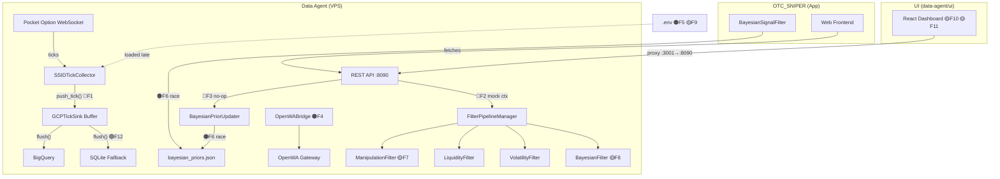

# 🔬 Data Agent DaaS — End-to-End Architectural Diagnostic

**Date:** 2026-08-03  
**Scope:** Read-only forensic analysis of `data-agent/` and its streaming/Bayesian integration with `OTC_SNIPER`  
**Files examined:** 25 source files across 7 modules

---

## Executive Summary

The `data-agent` microservice is architecturally sound at the macro level — 4-layer design with clean separation between ingestion, analytics, AI reasoning, and messaging. However, this diagnostic uncovered **13 findings** across logic bugs, race conditions, environmental misalignments, and hot-path bottlenecks, including several that would cause silent data loss or incorrect behavior in production.

> [!CAUTION]
> 3 findings are **CRITICAL** and will cause runtime failures or data corruption under production load.

---

## Finding Index

| # | Severity | Category | Module | Summary |
|---|----------|----------|--------|---------|
| 1 | 🔴 CRITICAL | Race Condition | `gcp_sink.py` | Sync `push_tick()` + async `flush()` buffer is not thread-safe |
| 2 | 🔴 CRITICAL | Logic Bug | `api_bridge.py` | Hardcoded mock `market_context` makes all filter evaluations fictional |
| 3 | 🔴 CRITICAL | Logic Bug | `api_bridge.py:L130-135` | `record_trade_outcome()` is a no-op — never updates Bayesian priors |
| 4 | 🟠 HIGH | Env Misalignment | `docker-compose.vps.yml` ↔ `.env` | `OPENWA_SERVER_URL` vs `OPENWA_API_URL` env var name mismatch |
| 5 | 🟠 HIGH | Env Misalignment | `.env` | `TARGET_ASSETS` missing from `.env` — not loaded into module-level globals |
| 6 | 🟠 HIGH | Race Condition | Shared File | `bayesian_priors.json` concurrent write from two different processes |
| 7 | 🟡 MEDIUM | Logic Bug | `manipulation_filter.py:L21` | OR-gate fires veto even when severity is below threshold |
| 8 | 🟡 MEDIUM | Logic Bug | `bayesian_filter.py:L24` | Silent fallback default `0.95` masks missing data as high-confidence |
| 9 | 🟡 MEDIUM | Startup Bug | `vps_server.py:L54-60` | Module-level construction runs before `.env` is loaded |
| 10 | 🟡 MEDIUM | UI Bug | `App.jsx:L112` | `customAssetInput.strip()` — JS strings have no `.strip()` method |
| 11 | 🟡 MEDIUM | UI Bug | `App.jsx:L290-292` | Hardcoded "92% Payout" badge ignores actual asset payout |
| 12 | 🟢 LOW | Latency | `gcp_sink.py` | Synchronous SQLite I/O blocks the asyncio event loop |
| 13 | 🟢 LOW | Design | Architecture | No health-check / readiness probe for Docker orchestration |

---

## Detailed Findings

---

### 🔴 Finding 1 — Thread-Safety Race in GCP Tick Buffer

**File:** [gcp_sink.py](file:///c:/v3/OTC_SNIPER/data-agent/src/tick_collector/gcp_sink.py)  
**Lines:** [L58](file:///c:/v3/OTC_SNIPER/data-agent/src/tick_collector/gcp_sink.py#L58), [L106-108](file:///c:/v3/OTC_SNIPER/data-agent/src/tick_collector/gcp_sink.py#L106-L108), [L150-157](file:///c:/v3/OTC_SNIPER/data-agent/src/tick_collector/gcp_sink.py#L150-L157)

**Bug:**  
`GCPTickSink._buffer` is a plain `list`. The `push_tick()` method (L106-108) appends synchronously from a callback invoked by `SSIDTickCollector._dispatch_tick()`, which itself runs in the asyncio event loop. Meanwhile, `flush()` (L150-157) uses an `asyncio.Lock` to guard the buffer drain.

However, `push_tick()` is a **synchronous** method — it never acquires the `asyncio.Lock`. If `flush()` is draining the buffer (copy + clear on L156-157) at the exact moment a new tick callback fires `push_tick()`, the tick is silently lost because `list.append()` and `list.clear()` are not atomic together under the lock.

Additionally, the `_buffer` is protected by `asyncio.Lock()`, which is NOT thread-safe across OS threads. If `push_tick()` is ever called from a non-asyncio thread (e.g., via `threading.Thread`), the lock provides zero protection.

```python
# L106-108: No lock acquisition
def push_tick(self, tick: Dict[str, Any]) -> None:
    self._buffer.append(tick)  # ← Unprotected write

# L150-157: Uses asyncio.Lock
async def flush(self) -> None:
    async with self._lock:       # ← asyncio.Lock, not threading.Lock
        if not self._buffer:
            return
        batch = list(self._buffer)
        self._buffer.clear()     # ← Race: push_tick() can fire between copy and clear
```

**Impact:** Silent tick data loss under high-throughput streaming (>100 ticks/sec).

---

### 🔴 Finding 2 — Hardcoded Mock Market Context in Filter Pipeline

**File:** [api_bridge.py](file:///c:/v3/OTC_SNIPER/data-agent/src/api_bridge.py)  
**Lines:** [L76-83](file:///c:/v3/OTC_SNIPER/data-agent/src/api_bridge.py#L76-L83)

**Bug:**  
The `get_filtered_ticks()` method constructs a **hardcoded mock** `market_ctx` dict for every tick evaluation:

```python
market_ctx = {
    "volatility_score": 45.0,       # ← Always 45
    "liquidity_score": 55.0,        # ← Always 55
    "bayesian_posterior_prob": 0.92, # ← Always 0.92
    "has_manipulation": False,      # ← Always False
    "manipulation_severity": 0.02   # ← Always 0.02
}
```

This means the `/api/v1/ticks/filtered` endpoint — the primary DaaS API for consumers — will **always** produce identical filter evaluations regardless of actual market conditions. Every tick passes every gate because:
- `volatility_score=45.0` is within `[30, 85]` bounds ✅
- `liquidity_score=55.0` is within `[30, 70]` bounds ✅
- `bayesian_posterior_prob=0.92` exceeds `0.90` threshold ✅
- `manipulation_severity=0.02` is below `0.15` threshold ✅

**Impact:** The entire filter pipeline is decorative — it cannot reject any tick. Consumers receiving "PASSED ALL GATES" are being given false confidence signals.

---

### 🔴 Finding 3 — Trade Outcome Recorder is a No-Op

**File:** [api_bridge.py](file:///c:/v3/OTC_SNIPER/data-agent/src/api_bridge.py)  
**Lines:** [L130-135](file:///c:/v3/OTC_SNIPER/data-agent/src/api_bridge.py#L130-L135)

**Bug:**  
The `POST /api/v1/trades/record` endpoint (`record_trade_outcome()`) logs the trade outcome but **never actually updates** the `BayesianPriorUpdater`:

```python
def record_trade_outcome(self, trade_data: Dict[str, Any]) -> Dict[str, Any]:
    asset = trade_data.get("asset", "UNKNOWN")
    won = trade_data.get("won", False)
    logger.info(f"Recorded trade outcome for {asset}: {'WIN' if won else 'LOSS'}")
    return {"status": "ok", "recorded": True, ...}  # ← Returns success but writes nothing
```

The `DataBridgeAPI` class has no reference to `BayesianPriorUpdater`. The `BayesianPriorUpdater.update_priors_from_trades()` method exists but is never called from any API endpoint.

**Impact:** The advertised "multi-app collective intelligence" feedback loop is broken. Trade outcomes from external apps are silently discarded. The Bayesian priors never evolve through the DaaS API.

---

### 🟠 Finding 4 — OpenWA Env Var Name Mismatch

**Files:**
- [.env](file:///c:/v3/OTC_SNIPER/data-agent/.env#L7): `OPENWA_SERVER_URL=http://localhost:3000`
- [.env.example](file:///c:/v3/OTC_SNIPER/data-agent/.env.example#L7): `OPENWA_SERVER_URL=http://localhost:3000`
- [openwa_bridge.py](file:///c:/v3/OTC_SNIPER/data-agent/src/whatsapp/openwa_bridge.py#L30): reads `OPENWA_API_URL` (default `http://localhost:8080`)
- [docker-compose.vps.yml](file:///c:/v3/OTC_SNIPER/data-agent/docker-compose.vps.yml#L25): sets `OPENWA_API_URL=http://openwa-gateway:8080`

**Bug:**  
The `.env` file defines `OPENWA_SERVER_URL`, but the `OpenWABridge` class reads `OPENWA_API_URL`. These are different environment variable names. The `.env` value is **never consumed** by the bridge. The bridge falls back to its hardcoded default `http://localhost:8080`.

The Docker Compose file correctly uses `OPENWA_API_URL`, so containerized deployment works. But local development reads from `.env` and gets the wrong port (`3000` vs `8080`) under the wrong variable name (`OPENWA_SERVER_URL` vs `OPENWA_API_URL`).

**Impact:** WhatsApp bridge silently ignores the `.env` configuration in local development. Messages route to `localhost:8080` instead of `localhost:3000`.

---

### 🟠 Finding 5 — TARGET_ASSETS Missing from .env

**Files:**
- [.env](file:///c:/v3/OTC_SNIPER/data-agent/.env): No `TARGET_ASSETS` line
- [.env.example](file:///c:/v3/OTC_SNIPER/data-agent/.env.example#L4): `TARGET_ASSETS=EURUSD_otc,...` (present)
- [vps_server.py](file:///c:/v3/OTC_SNIPER/data-agent/src/vps_server.py#L55-L57): Module-level `os.getenv("TARGET_ASSETS")`

**Bug:**  
The active `.env` file does not contain `TARGET_ASSETS`. When `vps_server.py` runs, `os.getenv("TARGET_ASSETS")` returns `None`, causing `assets_list = None`. The `SSIDTickCollector` then falls back to its hardcoded default set: `{"EURUSD_otc", "GBPUSD_otc", "USDJPY_otc"}`, missing 5 of the 8 intended production assets (`AUDCAD_otc`, `USDCHF_otc`, `ZARUSD_otc`, `NGNUSD_otc`, `USDARS_otc`).

**Impact:** 5 of 8 production assets silently not subscribed on VPS deployment.

---

### 🟠 Finding 6 — Shared File Race: bayesian_priors.json

**Files:**
- [prior_updater.py](file:///c:/v3/OTC_SNIPER/data-agent/src/bayesian/prior_updater.py#L95-L105): `save_priors_atomically()` via tempfile + rename
- [bayesian_signal_filter.py](file:///c:/v3/OTC_SNIPER/app/backend/services/extensions/bayesian_signal_filter.py#L80-L93): `_save_priors()` via direct `open(..., "w")`

**Bug:**  
Both `BayesianPriorUpdater` (data-agent) and `BayesianSignalFilter` (OTC_SNIPER app) write to the **same file**: `app/data/ghost_trades/stats/bayesian_priors.json`.

- `BayesianPriorUpdater` uses atomic tempfile+rename (safe individually).
- `BayesianSignalFilter` uses direct `open("w")` with `json.dump()` (non-atomic).

Neither system coordinates with the other. If both write simultaneously:
- The OTC_SNIPER app's direct `open("w")` could truncate the file while the data-agent is reading it.
- The data-agent's `Path.replace()` could overwrite the app's freshly-written data.

The Docker volume mount in `docker-compose.vps.yml:L32` (`../app/data/ghost_trades/stats:/app/app/data/ghost_trades/stats`) confirms both processes share this file in production.

**Impact:** Bayesian prior data corruption under concurrent write scenarios. Last-writer-wins with potential partial truncation.

---

### 🟡 Finding 7 — Manipulation Filter OR-Gate Logic Error

**File:** [manipulation_filter.py](file:///c:/v3/OTC_SNIPER/data-agent/src/filters/manipulation_filter.py#L21-L22)

**Bug:**

```python
if has_manip or manip_severity > self.severity_threshold:
    return False, f"manipulation_veto (severity {manip_severity:.3f} > {self.severity_threshold})"
```

The `has_manipulation` boolean is sourced from the market context. When `has_manipulation=True` but `manipulation_severity=0.02` (well below the `0.15` threshold), the filter still vetoes because of the `or` gate. The veto message then misleadingly reports `severity 0.020 > 0.15`, which is factually false.

This is a semantic logic error: either the boolean should be authoritative (ignoring severity), or severity should be authoritative (ignoring the boolean), but the OR combination creates an inconsistent veto rationale.

**Impact:** False-positive manipulation vetoes with misleading veto reason strings. Confusing for downstream consumers and debugging.

---

### 🟡 Finding 8 — Bayesian Filter Silent Default Masks Missing Data

**File:** [bayesian_filter.py](file:///c:/v3/OTC_SNIPER/data-agent/src/filters/bayesian_filter.py#L23-L24)

**Bug:**

```python
if posterior_prob is None:
    posterior_prob = tick_data.get("bayesian_posterior_prob", 0.95)  # ← default 0.95
```

When no `bayesian_posterior_prob` is found in either `market_context` or `tick_data`, the filter defaults to `0.95`, which **exceeds** the `0.90` confidence threshold. This means the absence of Bayesian data is treated as a strong positive signal, causing the filter to always pass ticks with missing probability data.

**Impact:** Missing data silently passes the Bayesian gate — the opposite of safe behavior.

---

### 🟡 Finding 9 — Module-Level Construction Before .env Load

**File:** [vps_server.py](file:///c:/v3/OTC_SNIPER/data-agent/src/vps_server.py#L54-L60)

**Bug:**  
Lines 54-60 instantiate all global service objects at **module import time**:

```python
sink = GCPTickSink()                    # L54: reads GCP_PROJECT_ID
raw_assets = os.getenv("TARGET_ASSETS") # L55: reads TARGET_ASSETS
collector = SSIDTickCollector(ssid=os.getenv("PO_SSID", "demo_ssid_placeholder"), ...)  # L57
```

But `load_env_file()` is called at L171, inside `if __name__ == "__main__":`. This means:
1. If the `.env` hasn't been loaded by the OS shell, `PO_SSID`, `GCP_PROJECT_ID`, and `TARGET_ASSETS` are `None` or default.
2. Lines 182-184 attempt to fix this for `PO_SSID` by re-assigning `collector.ssid`, but `GCPTickSink` is already initialized with the wrong project ID, and `TARGET_ASSETS` resolution at L55 already used `None`.

**Impact:** Environment configuration from `.env` file is partially ignored for `GCPTickSink` and `TARGET_ASSETS` globals.

---

### 🟡 Finding 10 — JS `.strip()` Method Does Not Exist

**File:** [App.jsx](file:///c:/v3/OTC_SNIPER/data-agent/ui/src/App.jsx#L112)

**Bug:**

```jsx
if (!customAssetInput.strip()) return;  // ← .strip() is Python, not JS
```

JavaScript strings do not have a `.strip()` method. This will throw a `TypeError: customAssetInput.strip is not a function` at runtime when the user clicks "Add" with any input. The correct method is `.trim()`.

**Impact:** The "Add Custom Stream" feature in the UI is completely broken — clicking the button crashes.

---

### 🟡 Finding 11 — Hardcoded Payout Badge

**File:** [App.jsx](file:///c:/v3/OTC_SNIPER/data-agent/ui/src/App.jsx#L290-L292)

**Bug:**  
The asset info header always displays `92% Payout` regardless of the selected asset's actual payout:

```jsx
<span ...>92% Payout</span>  // ← Hardcoded, ignores assetCatalog[].payout
```

Assets like `BTCUSD` (85%) and `USDJPY_otc` (90%) show incorrect payout information.

**Impact:** Misleading payout display for non-92% assets.

---

### 🟢 Finding 12 — Synchronous SQLite I/O on Asyncio Event Loop

**File:** [gcp_sink.py](file:///c:/v3/OTC_SNIPER/data-agent/src/tick_collector/gcp_sink.py#L161-L170)

**Bug:**  
Inside the `flush()` coroutine, SQLite `connect()` + `executemany()` + `commit()` are blocking I/O operations executed directly on the asyncio event loop:

```python
async def flush(self) -> None:
    ...
    with sqlite3.connect(self.local_db_path) as conn:  # ← Blocking I/O
        conn.executemany(...)                           # ← Blocks event loop
        conn.commit()                                   # ← Blocks event loop
```

This blocks the entire event loop during disk writes, stalling WebSocket message processing and heartbeat responses, potentially causing connection timeouts on the Pocket Option WebSocket.

**Impact:** Event loop stalls during flush cycles. Under heavy tick volume (>100 batch), stalls could exceed the 10s WebSocket ping timeout and trigger reconnection.

---

### 🟢 Finding 13 — No Docker Health Check / Readiness Probe

**Files:** [Dockerfile.vps](file:///c:/v3/OTC_SNIPER/data-agent/Dockerfile.vps), [docker-compose.vps.yml](file:///c:/v3/OTC_SNIPER/data-agent/docker-compose.vps.yml)

**Issue:**  
Neither the Dockerfile nor docker-compose defines a `HEALTHCHECK` instruction or a `healthcheck:` block. The `vps-data-agent` service `depends_on: openwa-gateway` but has no health condition, meaning it starts immediately after the gateway container starts — not after it's ready.

The telemetry server exposes `/api/status` which could serve as a health endpoint but isn't wired into Docker orchestration.

**Impact:** Container orchestrators (Docker Compose, K8s) cannot detect when the data agent is actually ready or has entered a failure state. Restart policies operate blindly.

---

## Architecture Diagram with Findings Mapped



---

## Priority Remediation Roadmap

### Phase 1 — Critical Fixes (Immediate)

| Finding | Fix |
|---------|-----|
| **F1** Thread-safety | Replace `asyncio.Lock` with `threading.Lock` in `GCPTickSink`, wrap `push_tick()` under the same lock, or use `asyncio.Queue` instead of a plain list |
| **F2** Mock context | Wire `FilterPipelineManager` to actual market context from `GCPTickSink` + live volatility calculations, or remove the endpoint until real data is available |
| **F3** No-op recorder | Inject `BayesianPriorUpdater` into `DataBridgeAPI.__init__()` and call `update_priors_from_trades()` inside `record_trade_outcome()` |

### Phase 2 — High-Severity Fixes

| Finding | Fix |
|---------|-----|
| **F4** Env var mismatch | Rename `.env` key from `OPENWA_SERVER_URL` to `OPENWA_API_URL`, or add an alias in `OpenWABridge.__init__()` |
| **F5** Missing TARGET_ASSETS | Add `TARGET_ASSETS=...` line to the active `.env` file |
| **F6** Shared file race | Implement file locking (`fcntl.flock` / `msvcrt.locking`) on both writers, or migrate to a SQLite-based priors store |

### Phase 3 — Medium-Severity Fixes

| Finding | Fix |
|---------|-----|
| **F7** Manipulation OR-gate | Change logic to: `if has_manip and manip_severity > threshold:` or separate the two conditions into distinct veto reasons |
| **F8** Default 0.95 | Change default to `0.0` (fail-closed) or raise a veto when posterior probability is missing |
| **F9** Late env load | Move `load_env_file()` call before module-level object construction, or defer construction into a `main()` function |
| **F10** `.strip()` → `.trim()` | Replace `customAssetInput.strip()` with `customAssetInput.trim()` |
| **F11** Hardcoded payout | Look up payout from `assetCatalog` by `selectedAsset` |

### Phase 4 — Low-Severity Improvements

| Finding | Fix |
|---------|-----|
| **F12** Blocking SQLite | Use `asyncio.to_thread()` or `aiosqlite` for database operations |
| **F13** No health check | Add `HEALTHCHECK CMD curl -f http://localhost:8090/api/status || exit 1` to Dockerfile |

---

> [!IMPORTANT]
> **No code was mutated during this diagnostic.** All findings are based on static read-only analysis of the source files, environment configuration, and architectural documentation.
