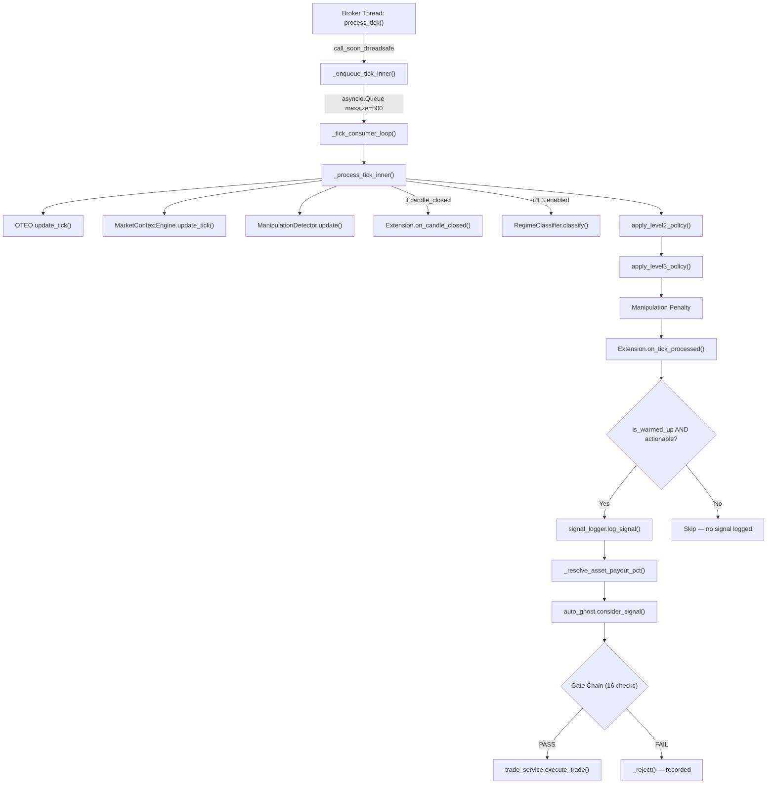

# OTC SNIPER — Ghost Trader Pipeline Executive Diagnostic Review

> **Review Date:** 2026-06-20  
> **Review Scope:** `auto_ghost.py`, `streaming.py`, `market_context.py`, `oteo.py`, `extensions/*`  
> **Review Mode:** Read-Only (zero modifications)

---

## 1. Executive Summary

The Ghost Trader pipeline is **architecturally sound and production-viable**. The signal path from tick ingestion through OTEO scoring, Level 2/3 enrichment, extension hooks, to `consider_signal()` execution is well-structured with clear separation of concerns. The 11 recent latency optimizations (deque conversions, buffered I/O, async payout resolution) have materially improved throughput.

However, this review identifies **8 potential signal-loss pathways**, **5 latency hotspots**, and **3 code quality concerns** that, if left unaddressed, could cause ghost trades to silently fail or miss windows under real market conditions.

### Health Rating

| Area | Rating | Notes |
|------|--------|-------|
| Signal Integrity | 🟡 **Good** | 2 silent drop paths identified |
| Execution Reliability | 🟢 **Strong** | Defensive reject tracking is excellent |
| Latency & Throughput | 🟡 **Good** | Hot-path numpy recalculations remain |
| Error Containment | 🟡 **Good** | Fire-and-forget tasks lack supervision |
| Extension Safety | 🟡 **Good** | Veto chain is robust; startup discovery has a gap |

---

## 2. Detailed Diagnostic Log (Debugger Perspective)

### 2.1 Complete Signal-to-Execution Path Trace



### 2.2 Identified Signal-Loss Points

#### 🔴 SLP-1: Queue Overflow Silent Drop
**File:** [streaming.py](file:///c:/v3/OTC_SNIPER/app/backend/services/streaming.py#L337-L348)  
**Severity:** Medium  
When the tick queue is full (500), `_enqueue_tick_inner` discards the **oldest** tick and records a drop via `perf_monitor.record_drop()`. However, the dropped tick is never re-queued and no notification reaches the frontend. If processing stalls (e.g., during a slow `_resolve_asset_payout_pct` call), recent ticks are retained but the oldest context ticks are lost, which can cause OTEO to miss transitions.

**Impact:** Under sustained high-frequency bursts (>500 ticks pending), the OTEO baseline can shift because early-window ticks are lost.

---

#### 🔴 SLP-2: Payout Resolution Failure → Signal Dropped
**File:** [streaming.py](file:///c:/v3/OTC_SNIPER/app/backend/services/streaming.py#L547)  
**When:** `_resolve_asset_payout_pct()` returns `None`  
**Path:** [auto_ghost.py:498-500](file:///c:/v3/OTC_SNIPER/app/backend/services/auto_ghost.py#L498-L500)  

If the payout check fails (adapter exception, broker unreachable), `payout_pct` is `None`. The `consider_signal` gate at line 498–500 silently rejects with `payout_unavailable`. This is **correct behavior**, but the user receives no frontend indication that trades are being blocked by a payout outage.

**Impact:** Prolonged broker API failures silently suppress all ghost trading without user awareness.

---

#### 🟡 SLP-3: OTEO Warmup Gate — 50-Tick Blind Spot
**File:** [oteo.py](file:///c:/v3/OTC_SNIPER/app/backend/services/oteo.py#L89-L90)  
**When:** New asset focused with fewer than 50 valid ticks  

OTEO returns a bare `float(50.0)` during warmup. In `_process_tick_inner`, the `is_warmed_up = isinstance(oteo_result, dict)` check at [streaming.py:413](file:///c:/v3/OTC_SNIPER/app/backend/services/streaming.py#L413) correctly prevents signal emission. However, pre-seeding with the 900s stale filter may still leave significant gaps if the asset had low tick frequency historically.

**Impact:** Asset focus switches in low-liquidity periods can result in 1–5 minute blind spots.

---

#### 🟡 SLP-4: Extension Veto Chain — Exception Swallowed
**File:** [auto_ghost.py:576-589](file:///c:/v3/OTC_SNIPER/app/backend/services/auto_ghost.py#L576-L589)  
**When:** An extension's `on_consider_signal()` throws an exception  

The `except Exception` at line 588 logs the error but **does not veto the trade**. This means a broken extension fails open (trade proceeds), which is the safer default — but it also means the extension's safety gate is silently bypassed.

**Impact:** If the premium Hurst gate crashes, trades proceed without Hurst validation.

---

#### 🟡 SLP-5: `asyncio.create_task` Without Exception Handling
**Files:**  
- [auto_ghost.py:429](file:///c:/v3/OTC_SNIPER/app/backend/services/auto_ghost.py#L429) — `_run_trade_count_suggestions()`
- [auto_ghost.py:622](file:///c:/v3/OTC_SNIPER/app/backend/services/auto_ghost.py#L622) — `_run_ai_advisory()`

Both tasks are fire-and-forget via `asyncio.create_task()` with no `add_done_callback`. If either raises an unhandled exception, the error surfaces only as a `Task exception was never retrieved` warning in logs. The `_release_asset` task at line 692 correctly uses `add_done_callback`, but the advisory tasks do not.

**Impact:** Silent advisory failures won't block trading, but swallowed exceptions make debugging session anomalies harder.

---

#### 🟡 SLP-6: `_session_trades` List Pop(0) is O(N)
**File:** [auto_ghost.py:347-348](file:///c:/v3/OTC_SNIPER/app/backend/services/auto_ghost.py#L347-L348)

```python
if len(self._session_trades) > 200:
    self._session_trades.pop(0)
```

`list.pop(0)` on a 200-element list is an O(N) operation requiring a full memory shift. This is called on every trade outcome. While 200 elements is small, this contradicts the project's own optimization philosophy (see OPT-1 and OPT-7 which converted similar patterns to `deque`).

**Impact:** Negligible for current scale, but an inconsistency.

---

#### 🟡 SLP-7: Duplicate `now = unix_time()` Call
**File:** [auto_ghost.py:335 and 349](file:///c:/v3/OTC_SNIPER/app/backend/services/auto_ghost.py#L335-L349)

`now = unix_time()` is called at line 335 and again identically at line 349. The second call is dead code — `now` is already assigned and used throughout the method.

**Impact:** Cosmetic/waste — no functional issue but indicates copy-paste residue.

---

#### 🟢 SLP-8: Regime Data Absent When Level 3 Disabled
**File:** [streaming.py:491-497](file:///c:/v3/OTC_SNIPER/app/backend/services/streaming.py#L491-L497)  
**When:** Level 3 is disabled  

When `level3_enabled` is `False`, no `regime_label` is injected into the payload. The Auto-Ghost regime gate at [auto_ghost.py:548-554](file:///c:/v3/OTC_SNIPER/app/backend/services/auto_ghost.py#L548-L554) correctly handles this: if `regime_gate_enabled` is true but `regime_label` is `None`, the signal is rejected with `missing_regime_label`.

**Impact:** This is **correctly handled** — but the user should be warned in the frontend that regime gates are useless when Level 3 is off.

---

### 2.3 Gate Chain Audit (16 Gates in `consider_signal`)

| # | Gate | Lines | Silent? | Notes |
|---|------|-------|---------|-------|
| 1 | `enabled` check | 450-451 | ✅ Recorded | — |
| 2 | `session_halted` | 453-454 | ✅ Recorded | — |
| 3 | `max_session_trades` | 455-456 | ✅ Recorded | — |
| 4 | `drawdown_cooldown` | 457-458 | ✅ Recorded | — |
| 5 | Timeframe limit | 461-471 | ✅ Recorded + Logged | — |
| 6 | Not CALL/PUT | 473-474 | ✅ Recorded | Most frequent reject |
| 7 | Not actionable | 475-476 | ✅ Recorded | — |
| 8 | Min confidence | 480-488 | ✅ Recorded + Logged | — |
| 9 | Max confidence | 489-497 | ✅ Recorded + Logged | — |
| 10 | Payout unavailable | 498-500 | ⚠️ f-string used | Uses `f""` not `%s` format |
| 11 | Payout below min | 501-508 | ✅ Recorded + Logged | — |
| 12 | Manipulation block | 509-517 | ✅ Recorded + Logged | — |
| 13 | Z-Score gates | 520-543 | ✅ Recorded + Logged | Non-numeric z_score handled |
| 14 | Regime gates | 546-558 | ⚠️ f-string used | Uses `f""` not `%s` format |
| 15 | Hurst filter | 560-574 | ✅ Recorded + Logged | Dual fallback for hurst source |
| 16 | Plugin veto | 576-589 | ✅ Recorded + Logged | Exception fails open |

> [!NOTE]
> All 16 gates properly call `_reject()` which records the reject reason and clears pending signals. The reject tracking system (`_reject_counts`, `_last_reject_reason_by_asset`) is well-designed and exposed in the status payload. This is excellent observability.

---

## 3. Performance & Latency Audit (Optimizer Perspective)

### 3.1 Hot-Path Analysis

The critical hot path is `_process_tick_inner()` — called once per tick per asset. Every microsecond here compounds.

#### ⚠️ HOT-1: `list(self._closed_candles)` on Every Candle Close
**File:** [market_context.py:307](file:///c:/v3/OTC_SNIPER/app/backend/services/market_context.py#L307)  
**Frequency:** Every candle close (every ~60 seconds per asset)

```python
candles = list(self._closed_candles)
```

This copies up to 240 `Candle` objects into a new list. The `_compute_adx` and `_compute_cci` functions then iterate this list linearly. While the deque optimization (OPT-7) was applied, the `list()` copy still allocates on each call.

**Cost:** ~240 * sizeof(Candle) ≈ 11.5 KB allocation per candle close, per asset.
**Recommendation:** Consider caching `_closed_candles_list` and only rebuilding on append.

---

#### ⚠️ HOT-2: `_compute_adx()` Full Recomputation
**File:** [market_context.py:108-171](file:///c:/v3/OTC_SNIPER/app/backend/services/market_context.py#L108-L171)  
**Frequency:** Every candle close

ADX is recomputed from scratch over the full candle history on every close. The Wilder smoothing loop runs O(N) where N = number of candles. With 240 candles, this is ~240 iterations including TR/+DI/-DI calculations.

**Cost:** ~240 iterations * 10 float ops ≈ 2,400 float operations per candle close per asset.
**Recommendation:** Maintain running smoothed TR/+DI/-DI state across candle closes instead of recomputing from the beginning.

---

#### ⚠️ HOT-3: `calculate_single_scale_hurst()` on Every Context Rebuild
**File:** [market_context.py:368](file:///c:/v3/OTC_SNIPER/app/backend/services/market_context.py#L368)  
**Frequency:** Every candle close

```python
hurst_val = calculate_single_scale_hurst(list(self._tick_prices), window=300)
```

This copies up to 400 prices into a list, then creates a NumPy array, computes log returns, cumsum, min/max, std. This is a moderate cost (~0.1ms) but is redundant when the Adaptive Edge or Noise Filter extensions are installed — they override the Hurst value in `on_tick_processed()` and `on_candle_closed()` anyway.

**Recommendation:** Gate this calculation behind `not has_premium_extension` to avoid wasted computation when extensions override it.

---

#### 🟡 HOT-4: `_last_confirmed_pivot()` Full Scan
**File:** [market_context.py:90-105](file:///c:/v3/OTC_SNIPER/app/backend/services/market_context.py#L90-L105)  
**Frequency:** Every candle close (called 4 times: micro support/resistance, macro support/resistance)

Each call iterates `O(lookback)` candles with a sliding window of `2*span+1`. Total cost: 4 × O(lookback) where lookback is 18 or 60.

**Cost:** ~156 iterations per candle close per asset (4 × avg(18,60)/2 windows). Acceptable but not trivial.

---

#### 🟡 HOT-5: Extension Tick-Processed Loops
**File:** [streaming.py:441-445](file:///c:/v3/OTC_SNIPER/app/backend/services/streaming.py#L441-L445)  
**Frequency:** Every tick

Both `HurstAdaptiveExpiry` and `HurstAiNoise` append to their own `deque(maxlen=1000)` price buffers in `on_tick_processed()`. This means each tick triggers 2 deque appends + 2 dict lookups. This is O(1) and well-optimized.

**Status:** ✅ No issue — included for completeness.

---

### 3.2 Async Blocking Hazard Analysis

| Location | Call | Blocking? | Notes |
|----------|------|-----------|-------|
| [streaming.py:311](file:///c:/v3/OTC_SNIPER/app/backend/services/streaming.py#L311) | `asyncio.to_thread(_resolve_payout_pct)` | ✅ Non-blocking | Offloaded to thread pool |
| [streaming.py:501](file:///c:/v3/OTC_SNIPER/app/backend/services/streaming.py#L501) | `sio.emit("market_data")` | ⚠️ Depends on SIO backend | If using async SIO, this is fine |
| [auto_ghost.py:818](file:///c:/v3/OTC_SNIPER/app/backend/services/auto_ghost.py#L818) | `asyncio.wait_for(ai_service.chat(), timeout=4.0)` | ✅ Bounded | 4s hard timeout prevents stalls |
| [auto_ghost.py:682](file:///c:/v3/OTC_SNIPER/app/backend/services/auto_ghost.py#L682) | `trade_service.execute_trade()` | ⚠️ Depends on impl | If `execute_trade` does sync I/O, this blocks the tick consumer |
| [streaming.py:515-520](file:///c:/v3/OTC_SNIPER/app/backend/services/streaming.py#L515-L520) | `tick_logger.write_tick()` | ✅ Async aiofiles | — |

> [!WARNING]
> **Critical Path Concern:** The `consider_signal()` → `execute_trade()` call at [streaming.py:548](file:///c:/v3/OTC_SNIPER/app/backend/services/streaming.py#L548) is **awaited directly in the tick consumer loop**. If `execute_trade()` blocks (e.g., disk write, network call), it stalls processing of subsequent ticks. Consider wrapping the `consider_signal()` call in `asyncio.create_task()` to decouple trade execution from tick processing.

---

## 4. Code Quality & Compliance Audit (Reviewer Perspective)

### 4.1 Principle Adherence

| Principle | Status | Evidence |
|-----------|--------|----------|
| Functional Simplicity | ✅ | Single-responsibility functions throughout |
| Sequential Logic | ✅ | Gate chain is linear and deterministic |
| Defensive Error Handling | 🟡 | Extension errors swallowed; fire-and-forget tasks |
| Strict Separation of Concerns | ✅ | OTEO / MarketContext / Manipulation / Extensions cleanly separated |
| Fail Fast, Fail Loud | ⚠️ | `_run_ai_advisory` catches all exceptions silently |

### 4.2 Code Quality Findings

#### CQ-1: Mixed Logging Styles
**Files:** Multiple locations in `auto_ghost.py`
**Issue:** Lines 499, 550, 553, 557, 884 use f-string formatting in logger calls instead of the `%s` lazy formatting pattern used everywhere else.

```python
# Bad (evaluated even if log level is suppressed):
logger.warning(f"Auto-Ghost skipped {asset}: payout unavailable")

# Good (deferred formatting):
logger.warning("Auto-Ghost skipped %s: payout unavailable", asset)
```

**Impact:** Minor CPU waste when log level is above WARNING.

---

#### CQ-2: `has_premium_hurst` / `has_elite_hurst` Caching Gap
**File:** [auto_ghost.py:244-266](file:///c:/v3/OTC_SNIPER/app/backend/services/auto_ghost.py#L244-L266)

These properties use `hasattr(self, "_has_premium_hurst")` to cache. However:
1. If `extension_manager` is `None` at first access, `False` is returned directly **without caching** the result.
2. If extensions are dynamically added/removed later, the cached value becomes stale.

```python
@property
def has_premium_hurst(self) -> bool:
    if not hasattr(self, "_has_premium_hurst"):
        if getattr(self, "extension_manager", None) is not None:
            self._has_premium_hurst = any(...)
        else:
            return False  # ← Not cached! Re-evaluated every call
    return self._has_premium_hurst
```

**Impact:** If `extension_manager` is set late (after `__init__`), the property works correctly on later calls. But if it's `None` at first call and set later, subsequent calls will correctly detect it via `hasattr`. The real issue is that dynamic plugin changes won't invalidate the cache.

---

#### CQ-3: Extension Manager Instantiation with Empty Settings
**File:** [manager.py:41](file:///c:/v3/OTC_SNIPER/app/backend/services/extensions/manager.py#L41)

```python
instance = attr(settings={})
```

All extensions are instantiated with an empty `settings` dict. The extensions then apply their own defaults, which is fine — but `HurstAdaptiveExpiry` and `HurstAiNoise` both read from `config` during `on_consider_signal()` to get runtime-updated thresholds (`getattr(config, "hurst_min_scale_cutoff", ...)`), effectively ignoring the settings they were initialized with.

**Impact:** The `settings` dict passed at init is vestigial for runtime behavior. Not a bug, but adds confusion.

---

#### CQ-4: `HurstAdaptiveExpiry.on_consider_signal` Mutates `oteo_result`
**File:** [hurst_adaptive_expiry.py:188](file:///c:/v3/OTC_SNIPER/app/backend/services/extensions/hurst_adaptive_expiry.py#L188)

```python
oteo_result["override_expiration_seconds"] = expiry
```

This mutates the `oteo_result` dictionary passed as a parameter within a gate check. The `on_consider_signal` contract (per `BaseExtension`) is a boolean veto gate, not a mutation hook. The mutation happens to work because the same dict is later used at [auto_ghost.py:668](file:///c:/v3/OTC_SNIPER/app/backend/services/auto_ghost.py#L668):

```python
expiration=oteo_result.get("override_expiration_seconds") or self.config.expiration_seconds,
```

**Impact:** Functional but violates the Separation of Concerns principle. A mutation in a veto gate is unexpected and fragile.

---

### 4.3 Error Boundary Coverage

| Boundary | Covered? | Details |
|----------|----------|---------|
| Tick queue full | ✅ | Oldest dropped, counter incremented |
| NaN/Inf prices | ✅ | `ManipulationDetector.update()` and `OTEO.seed_tick()` guard |
| Extension crash in `on_tick_processed` | ✅ | Try/except with logging |
| Extension crash in `on_candle_closed` | ✅ | Try/except with logging |
| Extension crash in `on_consider_signal` | ✅ | Try/except, fails open |
| AI service down | ✅ | Returns `(True, "AI_DISABLED")`, auto-confirms |
| AI timeout | ✅ | 4s `wait_for` with logged error |
| Payout adapter crash | ✅ | Returns `None`, signal rejected |
| Socket.IO emission failure | ❌ | No try/except around `sio.emit` calls |

---

## 5. Actionable Recommendations

### Priority 1 — Signal Integrity (Address First)

| # | Finding | Recommendation | Effort |
|---|---------|----------------|--------|
| R-1 | SLP-2: Payout outage silently blocks all trading | Emit a frontend `notification` of type `warning` when payout resolution fails for >3 consecutive attempts per asset. Add a visual "⚠ Payout Unavailable" indicator. | Low |
| R-2 | SLP-5: Fire-and-forget AI tasks swallow exceptions | Add `add_done_callback(lambda t: ...)` to `_run_ai_advisory` and `_run_trade_count_suggestions` tasks, matching the pattern already used at line 693. | Low |
| R-3 | CQ-4: Mutation in veto gate | Move `override_expiration_seconds` injection from `on_consider_signal` to `on_tick_processed` (or add a dedicated `on_before_execute` hook). | Medium |

### Priority 2 — Performance (Optimize Next)

| # | Finding | Recommendation | Effort |
|---|---------|----------------|--------|
| R-4 | HOT-2: ADX full recomputation | Maintain running EMA state for TR/+DI/-DI across candle closes using incremental Wilder smoothing. Eliminates O(N) loop. | Medium |
| R-5 | HOT-3: Redundant Hurst calculation | Guard `calculate_single_scale_hurst()` behind a check for installed premium extensions. If `HurstAdaptiveExpiry` or `HurstAiNoise` is active, skip the baseline calculation since they override. | Low |
| R-6 | SLP-6: `_session_trades.pop(0)` is O(N) | Convert `_session_trades` from `list` to `deque(maxlen=200)` for O(1) eviction, consistent with OPT-1 and OPT-7. | Low |
| R-7 | Consider-signal in tick consumer | Wrap `auto_ghost.consider_signal()` in `asyncio.create_task()` to prevent trade execution blocking the tick consumer loop. Add a done callback for error logging. | Medium |

### Priority 3 — Code Quality (Polish)

| # | Finding | Recommendation | Effort |
|---|---------|----------------|--------|
| R-8 | CQ-1: Mixed f-string/lazy logging | Convert the 5 f-string logger calls to `%s`-style lazy formatting. | Low |
| R-9 | SLP-7: Duplicate `now = unix_time()` | Remove the redundant second call at line 349. | Trivial |
| R-10 | CQ-2: Plugin cache invalidation | Add a `clear_plugin_cache()` method called from `ExtensionManager.discover_extensions()` that deletes `_has_premium_hurst` and `_has_elite_hurst` attributes. | Low |
| R-11 | Socket.IO emission error boundary | Wrap `sio.emit()` calls in `_process_tick_inner` with try/except to prevent emission failures from crashing the tick consumer. | Low |

---

## Appendix A: File Reference Index

| File | Lines | Role |
|------|-------|------|
| [auto_ghost.py](file:///c:/v3/OTC_SNIPER/app/backend/services/auto_ghost.py) | 957 | Signal gate chain, trade execution, AI advisory |
| [streaming.py](file:///c:/v3/OTC_SNIPER/app/backend/services/streaming.py) | 762 | Tick ingestion, enrichment pipeline, Socket.IO emission |
| [market_context.py](file:///c:/v3/OTC_SNIPER/app/backend/services/market_context.py) | 704 | Candle aggregation, ADX/CCI/Hurst, S/R detection |
| [oteo.py](file:///c:/v3/OTC_SNIPER/app/backend/services/oteo.py) | 158 | Core OTEO oscillator scoring |
| [manipulation.py](file:///c:/v3/OTC_SNIPER/app/backend/services/manipulation.py) | 73 | Push & Snap / Pinning detection |
| [extensions/manager.py](file:///c:/v3/OTC_SNIPER/app/backend/services/extensions/manager.py) | 50 | Dynamic plugin discovery |
| [extensions/base.py](file:///c:/v3/OTC_SNIPER/app/backend/services/extensions/base.py) | 52 | Extension base class / hook contract |
| [extensions/hurst_adaptive_expiry.py](file:///c:/v3/OTC_SNIPER/app/backend/services/extensions/hurst_adaptive_expiry.py) | 192 | Premium: vectorized Hurst + regime FSM + adaptive expiry |
| [extensions/hurst_ai_noise.py](file:///c:/v3/OTC_SNIPER/app/backend/services/extensions/hurst_ai_noise.py) | 150 | Elite: microstructure noise filter + AI confidence veto |
| [signal_logger.py](file:///c:/v3/OTC_SNIPER/app/backend/services/signal_logger.py) | 97 | Buffered async JSONL signal logging |
| [perf_monitor.py](file:///c:/v3/OTC_SNIPER/app/backend/services/perf_monitor.py) | 119 | Event loop lag + tick throughput telemetry |

---

> **End of Diagnostic Review.**  
> This document was generated from a read-only analysis of the live codebase. No files were modified.
